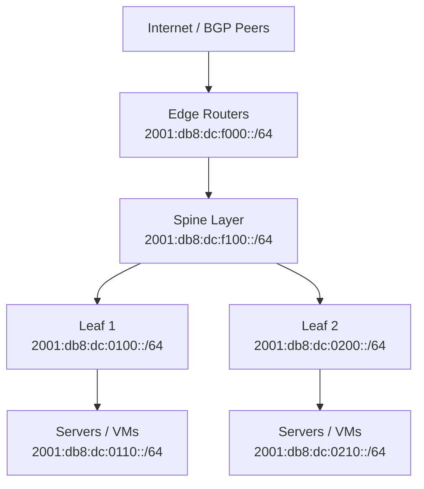

# How to Plan an IPv6 Address Scheme for a Data Center

Author: [nawazdhandala](https://www.github.com/nawazdhandala)

Tags: IPv6, Data Center, Networking, Address Planning, BGP

Description: Design an IPv6 addressing scheme for a data center with separate prefixes for infrastructure, services, management, and customer-facing applications.

## Introduction

Data centers have unique IPv6 addressing requirements: high-density server environments, multiple tiers (edge, spine, leaf), management networks, and potentially customer-facing services all need structured, scalable addressing. This guide presents a practical IPv6 address scheme for a modern data center.

## Data Center Network Tiers



## Addressing Scheme Design

Using the prefix `2001:db8:dc::/48`:

```text
Subnet field (16 bits): TTSS
  TT = Tier/Zone (2 hex digits)
  SS = Segment within tier (2 hex digits)

Zone assignments:
  00xx = Core infrastructure
  01xx-0fxx = Server racks (Pod 1-15)
  10xx-1fxx = Storage networks
  20xx-2fxx = DMZ / public-facing
  30xx-3fxx = Management / OOB
  f0xx = Point-to-point/router links
  ffxx = Loopbacks
```

## Detailed Subnet Assignments

```text
Infrastructure (Core):
  2001:db8:dc:0001::/64  → Management VLAN
  2001:db8:dc:0002::/64  → NTP / DNS servers
  2001:db8:dc:0003::/64  → Jump hosts / bastion

Server Pods (Pod 1 = 0100-01ff):
  2001:db8:dc:0110::/64  → Pod 1, Row A (compute)
  2001:db8:dc:0120::/64  → Pod 1, Row B (compute)
  2001:db8:dc:0130::/64  → Pod 1, Row C (storage)
  2001:db8:dc:0140::/64  → Pod 1 management

Server Pods (Pod 2 = 0200-02ff):
  2001:db8:dc:0210::/64  → Pod 2, Row A
  2001:db8:dc:0220::/64  → Pod 2, Row B

DMZ / Public Services:
  2001:db8:dc:2010::/64  → Web tier
  2001:db8:dc:2020::/64  → API gateway
  2001:db8:dc:2030::/64  → Load balancers

Management / OOB:
  2001:db8:dc:3010::/64  → IPMI / iDRAC / iLO
  2001:db8:dc:3020::/64  → Network device management
  2001:db8:dc:3030::/64  → Monitoring servers

P2P Router Links (using /127 per RFC 6164):
  2001:db8:dc:f001::/127 → Edge1 <-> Spine1
  2001:db8:dc:f001::2/127 → Edge1 <-> Spine2
  2001:db8:dc:f002::/127 → Edge2 <-> Spine1

Loopbacks (using /128):
  2001:db8:dc:ff01::1/128 → Edge Router 1 loopback
  2001:db8:dc:ff01::2/128 → Edge Router 2 loopback
  2001:db8:dc:ff02::1/128 → Spine 1 loopback
```

## Linux Server Configuration

```bash
# Configure a server in Pod 1, Row A

sudo ip -6 addr add 2001:db8:dc:0110::15/64 dev eth0

# Set default gateway (Leaf 1 router)
sudo ip -6 route add default via 2001:db8:dc:0110::1

# Add static DNS
echo "nameserver 2001:db8:dc:0002::53" | sudo tee -a /etc/resolv.conf

# Verify connectivity
ping6 -c 3 2001:db8:dc:0002::1  # DNS server
ping6 -c 3 2001:db8::1           # Default gateway
```

## Docker / Container Platform Addressing

```yaml
# Kubernetes node CIDR allocation from data center prefix
# Pod network: assign a /64 per node from the DC block
# Node 1 pods: 2001:db8:dc:0110::/64
# Node 2 pods: 2001:db8:dc:0120::/64

# Docker daemon config with IPv6
# /etc/docker/daemon.json
{
  "ipv6": true,
  "fixed-cidr-v6": "2001:db8:dc:0110::/64",
  "ip6tables": true
}
```

## BGP Announcement Strategy

```bash
# Announce the full DC block to upstream providers
# 2001:db8:dc::/48  → announced from both edge routers

# Internal route summarization:
# Leaf 1 announces: 2001:db8:dc:0100::/56 (Pod 1)
# Leaf 2 announces: 2001:db8:dc:0200::/56 (Pod 2)
# Edge routers see summaries, not individual /64s
```

## Conclusion

A well-structured data center IPv6 addressing scheme uses the 16-bit subnet field to encode tier (edge/spine/leaf), pod, and row information. Point-to-point links use /127 prefixes, loopbacks use /128, and all server subnets use /64. This structure enables efficient route summarization per pod and per tier, reducing BGP table size and simplifying prefix-based access control lists.
