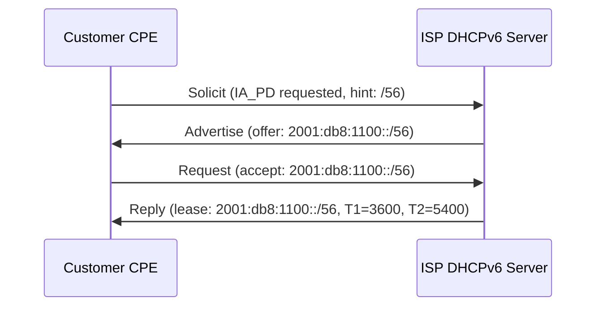

# How to Allocate IPv6 Prefixes to Customer Networks

Author: [nawazdhandala](https://www.github.com/nawazdhandala)

Tags: IPv6, ISP, DHCPv6-PD, Prefix Delegation, Networking

Description: Learn the operational process of allocating IPv6 prefixes to customer networks using DHCPv6 Prefix Delegation, static assignment, and IPAM tracking.

## Introduction

Allocating IPv6 prefixes to customers is a core ISP operation. Unlike IPv4 where NAT allowed a single IP to serve many devices, IPv6 gives each customer their own routable prefix. The primary mechanism for automated prefix delivery is DHCPv6 Prefix Delegation (DHCPv6-PD, RFC 3633). Understanding how to allocate, track, and revoke prefixes is essential for ISP operations.

## Allocation Methods

### 1. DHCPv6 Prefix Delegation (Automated)

The CPE router requests a prefix from the ISP's DHCPv6 server using DHCPv6-PD:



### 2. Static Assignment

For business customers with stable requirements:

```bash
# Document static assignment in IPAM

# Customer: ACME Corp
# Prefix: 2001:db8:2001::/48
# Assigned: 2026-03-20
# Expires: never (static)
# Contact: noc@acme.example.com
```

## ISC KEA DHCPv6-PD Configuration

```json
{
  "Dhcp6": {
    "interfaces-config": {
      "interfaces": ["eth0"]
    },
    "lease-database": {
      "type": "memfile",
      "persist": true,
      "name": "/var/lib/kea/dhcp6.leases"
    },
    "preferred-lifetime": 7200,
    "valid-lifetime": 14400,
    "subnet6": [
      {
        "subnet": "2001:db8:1000::/36",
        "pools": [],
        "pd-pools": [
          {
            "prefix": "2001:db8:1000::",
            "prefix-len": 36,
            "delegated-len": 56
          }
        ],
        "option-data": [
          {
            "name": "dns-servers",
            "data": "2001:db8::53, 2001:db8::54"
          }
        ]
      }
    ]
  }
}
```

## ISC DHCP (dhcpd) Configuration for PD

```bash
# /etc/dhcp/dhcpd6.conf

# Residential /56 pool
subnet6 2001:db8:1000::/36 {
  # Prefix delegation pool
  prefix6 2001:db8:1000:: 2001:db8:1fff:: /56;

  # Lease timers
  default-lease-time 7200;
  max-lease-time 14400;

  # DNS options
  option dhcp6.name-servers 2001:db8::53;
  option dhcp6.domain-search "example.com";
}
```

## CPE Router: Requesting a Prefix

On a Linux CPE using `wide-dhcpv6-client`:

```bash
# /etc/wide-dhcpv6/dhcp6c.conf
interface eth0 {
    send ia-pd 1;  # Request prefix delegation
};

id-assoc pd 1 {
    # Assign the delegated prefix to the LAN interface
    prefix-interface eth1 {
        sla-id 1;        # Subnet ID for this interface
        sla-len 8;       # /56 + 8 bits = /64 subnet
        ifid 1;          # Interface ID for the gateway
    };
};
```

```bash
# Start DHCPv6 client for prefix delegation
sudo dhcp6c -c /etc/wide-dhcpv6/dhcp6c.conf eth0

# Check received prefix
ip -6 addr show dev eth1  # Should show a delegated /64
ip -6 route show          # Should show the delegated prefix route
```

## IPAM Tracking with Python

```python
import ipaddress
from datetime import datetime, timedelta
from dataclasses import dataclass, field
from typing import Optional

@dataclass
class PrefixAllocation:
    prefix: ipaddress.IPv6Network
    customer_id: str
    allocated_at: datetime
    expires_at: Optional[datetime]
    assignment_type: str  # 'static' or 'dynamic'

class PrefixPool:
    """Simple prefix pool manager."""

    def __init__(self, pool_prefix: str, delegation_size: int):
        self.pool = ipaddress.IPv6Network(pool_prefix)
        self.delegation_size = delegation_size
        self.allocations: dict[str, PrefixAllocation] = {}
        self._allocated_count = 0

    def allocate(self, customer_id: str, lease_hours=24) -> PrefixAllocation:
        """Allocate the next available prefix from the pool."""
        subnets = list(self.pool.subnets(new_prefix=self.delegation_size))
        if self._allocated_count >= len(subnets):
            raise RuntimeError("Pool exhausted")

        prefix = subnets[self._allocated_count]
        self._allocated_count += 1

        alloc = PrefixAllocation(
            prefix=prefix,
            customer_id=customer_id,
            allocated_at=datetime.now(),
            expires_at=datetime.now() + timedelta(hours=lease_hours),
            assignment_type="dynamic",
        )
        self.allocations[customer_id] = alloc
        return alloc

# Example
pool = PrefixPool("2001:db8:1000::/36", delegation_size=56)
for cust_id in ["CUST-001", "CUST-002", "CUST-003"]:
    alloc = pool.allocate(cust_id)
    print(f"{cust_id}: {alloc.prefix}")
```

## Conclusion

Allocating IPv6 prefixes to customers involves automated delegation via DHCPv6-PD for residential users and static assignment for business customers. Track all allocations in an IPAM system with customer metadata, allocation timestamps, and expiry information. DHCPv6-PD makes the process transparent to end users - their CPE router requests a prefix and automatically configures the LAN with proper /64 subnets.
