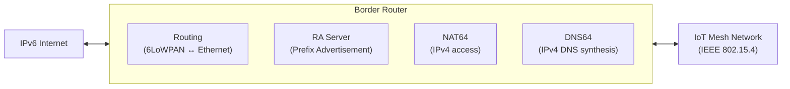

# How to Configure IPv6 Border Routers for IoT Networks

Author: [nawazdhandala](https://www.github.com/nawazdhandala)

Tags: IPv6, IoT, Border Router, 6LoWPAN, Thread, Networking

Description: Configure IPv6 border routers that connect IoT mesh networks to the broader IPv6 internet, providing prefix advertisement, NAT64, and DNS64 services.

## Introduction

An IPv6 Border Router (BR) for IoT is the gateway between the constrained IoT network (using IEEE 802.15.4, Thread, or other low-power protocols) and the broader IPv6 network. It advertises IPv6 prefixes into the mesh, handles routing between the mesh and the infrastructure network, and may provide NAT64/DNS64 services for reaching IPv4 hosts.

## Border Router Functions



## Setting Up a Linux Border Router

```bash
# Prerequisites: 802.15.4 USB radio (e.g., atusb or cc2531)
# Install required packages
sudo apt-get install wpan-tools radvd

# Configure the 802.15.4 interface
sudo iwpan phy phy0 set channel 0 26
sudo iwpan dev wpan0 set pan_id 0xabcd
sudo iwpan dev wpan0 set short_addr 0xffff   # Border router typically uses 0xffff

# Create 6LoWPAN interface
sudo ip link add link wpan0 name lowpan0 type lowpan
sudo ip link set wpan0 up
sudo ip link set lowpan0 up

# Assign border router's IPv6 address on the mesh interface
sudo ip -6 addr add 2001:db8:mesh:1::1/64 dev lowpan0

# Enable IPv6 forwarding between eth0 (infrastructure) and lowpan0 (mesh)
sudo sysctl -w net.ipv6.conf.all.forwarding=1
```

## Advertising the IPv6 Prefix into the Mesh

```text
# /etc/radvd.conf - Advertise IPv6 prefix to the mesh network

interface lowpan0 {
    AdvSendAdvert on;
    AdvManagedFlag off;
    AdvOtherConfigFlag off;
    # Longer RA interval for IoT (saves battery)
    MinRtrAdvInterval 300;
    MaxRtrAdvInterval 600;

    prefix 2001:db8:mesh:1::/64 {
        AdvOnLink on;
        AdvAutonomous on;
        AdvValidLifetime 604800;     # 1 week (IoT devices rarely move)
        AdvPreferredLifetime 86400;  # 1 day preferred
    };

    # Provide DNS to mesh devices
    RDNSS 2001:db8:mesh:1::53 {
        AdvRDNSSLifetime 1200;
    };
};
```

## Configuring OpenThread Border Router (OTBR)

OpenThread provides a production-ready Border Router implementation:

```bash
# Install OTBR on a Raspberry Pi or similar Linux host
sudo apt-get install curl
curl -sL https://install.openthread.org/otbr | sudo bash

# Configure OTBR to use eth0 as infrastructure interface
# and wpan0 as the Thread interface
sudo otbr-agent -I eth0 -B wpan0 spinel+hdlc+uart:///dev/ttyACM0 &

# Access the OTBR web interface
# http://<border-router-ip>:80
```

## Configuring NAT64 for IPv4 Access

IoT devices on the mesh may need to reach IPv4-only cloud services:

```bash
# Install tayga for NAT64
sudo apt-get install tayga

# Configure tayga (NAT64 translator)
sudo tee /etc/tayga.conf > /dev/null << 'EOF'
# NAT64 prefix (Well-Known NAT64 prefix: 64:ff9b::/96)
prefix 64:ff9b::/96

# IPv4 pool for translation
dynamic-pool 192.168.100.0/24

# Data directory
data-dir /var/db/tayga

ipv4-addr 192.168.100.1
EOF

# Start tayga
sudo tayga --mktun
sudo ip link set nat64 up
sudo ip -6 route add 64:ff9b::/96 dev nat64
sudo ip route add 192.168.100.0/24 dev nat64
sudo tayga --daemon
```

## Configuring DNS64

DNS64 synthesizes AAAA records for IPv4-only hosts, enabling IPv6-only IoT devices to reach them:

```bash
# In BIND9 (/etc/named.conf.options):
# Add DNS64 configuration
dns64 64:ff9b::/96 {
    clients { any; };
    mapped { any; };
    exclude { 64:ff9b::/96; ::ffff:0:0/96; };
};
```

## Routing Between Mesh and Infrastructure

```bash
# Add route to the IoT mesh prefix on the infrastructure side
# (run this on the infrastructure router)
ip -6 route add 2001:db8:mesh:1::/64 via 2001:db8:infra::border-router

# Or use a routing protocol (OSPFv3) to advertise the mesh prefix
# The border router can inject the mesh prefix into OSPFv3
```

## Verification

```bash
# Verify border router has addresses on both interfaces
ip -6 addr show eth0
ip -6 addr show lowpan0

# Verify radvd is advertising into the mesh
tcpdump -i lowpan0 "icmp6 and ip6[40] == 134" -c 3 -v

# Test connectivity from a mesh device through the border router
ping6 -c 3 2606:4700:4700::1111  # From a mesh node

# Check routing table includes the mesh prefix
ip -6 route show
```

## Conclusion

An IPv6 border router bridges the IoT mesh network and the broader IPv6 internet, performing prefix advertisement, routing, and optionally NAT64/DNS64 for legacy IPv4 connectivity. Whether using a custom Linux border router with radvd and tayga, or the OpenThread Border Router software stack, the core function is the same: enable globally addressable IPv6 for every device in the mesh network.
