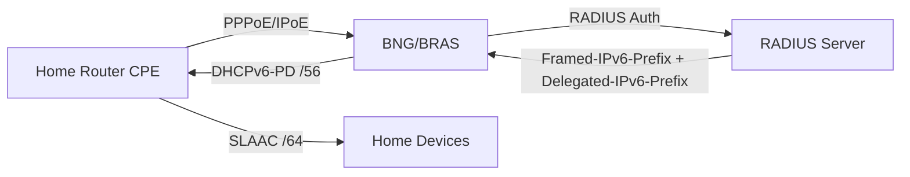

# How to Configure IPv6 for BRAS/BNG Equipment

Author: [nawazdhandala](https://www.github.com/nawazdhandala)

Tags: IPv6, BNG, BRAS, Broadband, ISP, DHCPv6, PPPoE

Description: Configure IPv6 on Broadband Network Gateway (BNG) and BRAS equipment for residential subscriber management including PPPoE, DHCPv6, and prefix delegation.

## BNG IPv6 Architecture



## Cisco ASR9K BNG: IPv6 PPPoE

```
! Cisco ASR9K IOS-XR — IPv6 BNG configuration

! DHCPv6 pool for WAN addresses
ipv6 dhcp pool WAN_POOL
 address prefix 2001:db8:wan::/48 lifetime 86400 43200

! Delegate prefix from RADIUS
ipv6 dhcp pool PD_POOL
 prefix-delegation pool RADIUS_PD

! Configure subscriber virtual template
interface Virtual-Template1
 ipv6 enable
 ipv6 address 2001:db8:bng::1/64
 ppp authentication chap
 peer ipv6 pool WAN_POOL
 ipv6 dhcp server PD_POOL

! Enable subscriber management
subscriber-manager
 accounting aaa
  list default method radius

! Verify active subscribers
show subscriber session all detail | include IPv6
show ipv6 subscribers
```

## Juniper MX BNG: IPv6 Configuration

```
# Juniper MX — IPv6 BNG with DHCPv6

set interfaces ge-0/0/0 unit 0 family pppoe

set access profile RADIUS_PROFILE
    authentication-order radius
    radius authentication-server 2001:db8::radius

set access address-assignment pool IPV6_POOL
    family inet6
    prefix 2001:db8:wan::/48
    range WAN_RANGE prefix-length 128  # /128 per subscriber

set access address-assignment pool PD_POOL
    family inet6
    prefix 2001:db8:home::/40
    range PD_RANGE prefix-length 56    # /56 per home router

# Verify
show subscribers detail
show dhcpv6 server statistics
```

## ISC Kea DHCP: BNG DHCPv6 Server

```json
{
    "Dhcp6": {
        "interfaces-config": {
            "interfaces": ["::"]
        },
        "lease-database": {
            "type": "mysql",
            "host": "2001:db8::db",
            "name": "kea"
        },
        "subnet6": [
            {
                "id": 1,
                "subnet": "2001:db8:wan::/48",
                "interface": "bng0",
                "pools": [
                    {"pool": "2001:db8:wan::1 - 2001:db8:wan::ffff"}
                ],
                "pd-pools": [
                    {
                        "prefix": "2001:db8:home::/40",
                        "prefix-len": 40,
                        "delegated-len": 56
                    }
                ],
                "option-data": [
                    {"name": "dns-servers", "data": "2001:db8::53"}
                ]
            }
        ]
    }
}
```

## RADIUS Integration for IPv6

```bash
# FreeRADIUS users file — per-subscriber IPv6 assignment
# /etc/freeradius/3.0/users

pppoe_user Cleartext-Password := "password"
    Framed-IPv6-Prefix = "2001:db8:wan::1/128",
    Delegated-IPv6-Prefix = "2001:db8:home:a0::/56",
    Framed-IPv6-Route = "2001:db8:home:a0::/56 ::",
    DNS-Server-IPv6-Address = "2001:db8::53"
```

## Monitoring BNG Subscribers

```bash
#!/bin/bash
# monitor-bng.sh — BNG subscriber statistics

# Active IPv6 sessions
ACTIVE=$(mysql -u radius -p${PASS} radius \
    -e "SELECT COUNT(*) FROM radacct WHERE acctstoptime IS NULL AND framedipv6prefix IS NOT NULL" \
    -s -N)
echo "Active IPv6 subscribers: ${ACTIVE}"

# Address pool utilization
POOL_USED=$(mysql -u radius -p${PASS} radius \
    -e "SELECT COUNT(DISTINCT framedipv6prefix) FROM radacct WHERE acctstoptime IS NULL" \
    -s -N)
echo "IPv6 pool entries used: ${POOL_USED}"

# DHCPv6-PD utilization
PD_USED=$(mysql -u radius -p${PASS} radius \
    -e "SELECT COUNT(DISTINCT delegatedipv6prefix) FROM radacct WHERE acctstoptime IS NULL AND delegatedipv6prefix IS NOT NULL" \
    -s -N)
echo "Delegated prefixes active: ${PD_USED}"
```

## Conclusion

BNG/BRAS IPv6 configuration combines RADIUS authentication, DHCPv6 for WAN address assignment, and DHCPv6-PD for home prefix delegation. Configure RADIUS to return `Framed-IPv6-Prefix` (subscriber's WAN /128) and `Delegated-IPv6-Prefix` (home /56 for DHCPv6-PD). On Cisco ASR9K, use `ipv6 dhcp pool` with `prefix-delegation pool RADIUS_PD` to apply RADIUS-returned prefixes. Monitor subscriber session counts and address pool utilization with RADIUS SQL queries and alert when pools exceed 80% utilization.
