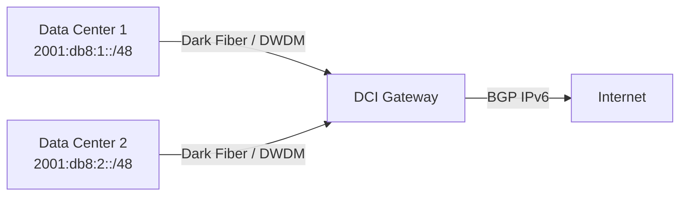

# How to Configure IPv6 for Data Center Interconnect (DCI)

Author: [nawazdhandala](https://www.github.com/nawazdhandala)

Tags: IPv6, DCI, Data Center Interconnect, BGP, MPLS, Network Design

Description: Learn how to configure IPv6 for Data Center Interconnect using BGP, MPLS, and EVPN to connect geographically separated data centers.

## What is Data Center Interconnect?

DCI links two or more data centers to enable workload mobility, disaster recovery, and distributed application deployments. IPv6 DCI eliminates address translation at boundaries and simplifies routing.

## DCI Topology Options



## BGP Configuration for IPv6 DCI

Configure MP-BGP with IPv6 address family between data center border routers:

```
# Cisco IOS-XE - DC1 Border Router
router bgp 65001
 bgp router-id 10.0.0.1
 neighbor 2001:db8:dci::2 remote-as 65002
 neighbor 2001:db8:dci::2 description DC2-Border
 !
 address-family ipv6
  neighbor 2001:db8:dci::2 activate
  network 2001:db8:1::/48
  neighbor 2001:db8:dci::2 send-community extended
 exit-address-family
```

```
# DC2 Border Router
router bgp 65002
 bgp router-id 10.0.0.2
 neighbor 2001:db8:dci::1 remote-as 65001
 !
 address-family ipv6
  neighbor 2001:db8:dci::1 activate
  network 2001:db8:2::/48
 exit-address-family
```

## MPLS/SR for DCI Transport

Segment Routing with IPv6 (SRv6) is ideal for DCI as it provides traffic engineering without complex RSVP-TE:

```
# Enable SRv6 on IOS-XE
segment-routing ipv6
 locator DC1_LOC
  prefix 2001:db8:100::/48
```

## MTU Considerations

DCI links often carry encapsulated traffic (VXLAN, MPLS). Set the DCI link MTU higher than 1500 to avoid fragmentation:

```bash
# Linux: set MTU on DCI interface
ip link set eth0 mtu 9000

# Verify
ip link show eth0
```

## Route Filtering at DCI Boundaries

Filter internal management prefixes from crossing DCI links unless explicitly required:

```
# Prefix list to block management prefixes from DCI advertisement
ipv6 prefix-list BLOCK-MGMT seq 10 deny 2001:db8:ffff::/48
ipv6 prefix-list BLOCK-MGMT seq 100 permit ::/0 le 128
```

## BFD for Fast Failure Detection

Enable BFD on DCI BGP sessions to detect link failures faster than BGP hold timers:

```
router bgp 65001
 neighbor 2001:db8:dci::2 fall-over bfd
```

## Conclusion

IPv6 DCI with MP-BGP provides clean, scalable connectivity between data centers. Using SRv6 for transport and BFD for fast failover creates a resilient multi-site architecture that avoids the complexity of IPv4 NAT at site boundaries.
