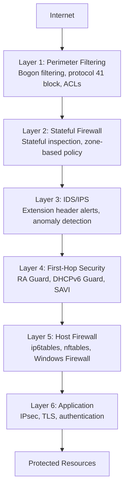

# How to Implement Defense-in-Depth for IPv6 Networks

Author: [nawazdhandala](https://www.github.com/nawazdhandala)

Tags: IPv6, Security, Defense-in-Depth, Architecture, Best Practices

Description: Learn how to implement a layered defense-in-depth security model for IPv6 networks, covering each layer from physical access to application security.

## Overview

Defense-in-depth for IPv6 applies the same principle as IPv4: no single security control should be the only line of defense. Each layer — physical, network, host, application — must have IPv6-aware security controls. This is especially important during IPv4-to-IPv6 transitions when gaps between layers are common.

## Defense-in-Depth Model for IPv6



## Layer 1: Perimeter Filtering

The first layer blocks clearly malicious or invalid IPv6 traffic at the network edge:

```bash
# Block bogon prefixes at ingress
ip6tables -A INPUT -s ::/128 -j DROP
ip6tables -A INPUT -s ::1/128 -j DROP
ip6tables -A INPUT -s 2001:db8::/32 -j DROP
ip6tables -A INPUT -s fc00::/7 -j DROP       # ULA from internet
ip6tables -A INPUT -s fe80::/10 -j DROP       # Link-local from internet

# Block deprecated/dangerous mechanisms
iptables -A FORWARD -p 41 -j DROP              # IPv6-in-IPv4
iptables -A FORWARD -p udp --dport 3544 -j DROP # Teredo
```

## Layer 2: Stateful Firewall

Stateful inspection tracks IPv6 connection state:

```bash
# nftables stateful IPv6 firewall
nft add table ip6 filter
nft add chain ip6 filter input { type filter hook input priority 0\; policy drop\; }
nft add chain ip6 filter forward { type filter hook forward priority 0\; policy drop\; }

# Allow established and related
nft add rule ip6 filter input ct state established,related accept

# Allow essential ICMPv6
nft add rule ip6 filter input ip6 nexthdr icmpv6 icmpv6 type { destination-unreachable, packet-too-big, time-exceeded, parameter-problem } accept

# NDP only from link-local
nft add rule ip6 filter input ip6 saddr fe80::/10 ip6 nexthdr icmpv6 icmpv6 type { nd-neighbor-solicit, nd-neighbor-advert, nd-router-solicit, nd-router-advert } accept

# Allow services
nft add rule ip6 filter input tcp dport { 22, 80, 443 } accept
```

## Layer 3: IDS/IPS

Intrusion detection for IPv6-specific threats:

```bash
# Suricata rules for IPv6 threats
# Detect Rogue RA
alert icmp6 any any -> any any (
    msg:"IPv6 Rogue Router Advertisement";
    itype:134;
    sid:9001000;
)

# Detect Extension Header evasion
alert ipv6 any any -> any any (
    msg:"IPv6 Type 0 Routing Header";
    ip_proto:43;
    sid:9001001;
)

# Detect IPv6 scanning attempts
alert ipv6 any any -> $HOME_NET any (
    msg:"IPv6 Network Scan Attempt";
    threshold: type both, track by_src, count 100, seconds 10;
    sid:9001002;
)
```

## Layer 4: First-Hop Security

First-hop security protects against Layer 2 IPv6 attacks:

```
Controls for access switches:
- RA Guard: Blocks rogue Router Advertisements
- DHCPv6 Guard: Blocks rogue DHCPv6 servers
- SAVI: Validates source addresses
- ND Inspection: Validates NDP traffic

Cisco configuration:
ipv6 nd raguard policy HOST-POLICY
  device-role host
interface range Gi0/1-24
  ipv6 nd raguard attach-policy HOST-POLICY
```

## Layer 5: Host Firewall

Every host needs its own IPv6 firewall — don't rely only on network firewalls:

```bash
# Minimal host firewall (ip6tables)
ip6tables -P INPUT   DROP
ip6tables -P FORWARD DROP
ip6tables -P OUTPUT  ACCEPT

# Allow loopback
ip6tables -A INPUT -i lo -j ACCEPT

# Allow established
ip6tables -A INPUT -m state --state ESTABLISHED,RELATED -j ACCEPT

# Allow essential ICMPv6
ip6tables -A INPUT -p icmpv6 --icmpv6-type packet-too-big -j ACCEPT
ip6tables -A INPUT -p icmpv6 --icmpv6-type destination-unreachable -j ACCEPT
ip6tables -A INPUT -p icmpv6 --icmpv6-type time-exceeded -j ACCEPT

# Allow NDP (link-local only)
ip6tables -A INPUT -s fe80::/10 -p icmpv6 -j ACCEPT

# Allow SSH from management network
ip6tables -A INPUT -s fd00:mgmt::/48 -p tcp --dport 22 -j ACCEPT
```

## Layer 6: Application Security

The innermost layer — application-level security:

```bash
# Enforce TLS/HTTPS — same requirement for IPv4 and IPv6
# In nginx, listen on both
listen [::]:443 ssl;   # IPv6
listen 443 ssl;        # IPv4

# strongSwan: Require IPsec for sensitive services
# Even if firewall allows the connection, application requires IPsec
conn internal-service
    left=2001:db8::server
    right=%any
    rightid=%any
    esp=aes256-sha256!
    auto=add
```

## Monitoring All Layers

```bash
# Aggregate IPv6 security events
# ip6tables logging
ip6tables -A INPUT -j LOG --log-prefix "IPv6-DROP: " --log-level 4

# Monitor for anomalies
# Alert on: sudden spike in IPv6 traffic, new routers, new prefixes
tcpdump -i eth0 'icmp6 and ip6[40] == 134' | logger -t rogue-ra-monitor
```

## Summary

Defense-in-depth for IPv6 requires security at every layer: perimeter bogon filtering, stateful firewall policies, IDS/IPS for IPv6-specific threats, first-hop security (RA Guard, DHCPv6 Guard) on access switches, host-level ip6tables/nftables rules, and application-level controls (TLS, IPsec). The most common gap is that organizations configure IPv4 security at each layer but forget to mirror those controls for IPv6. Audit each layer explicitly.
