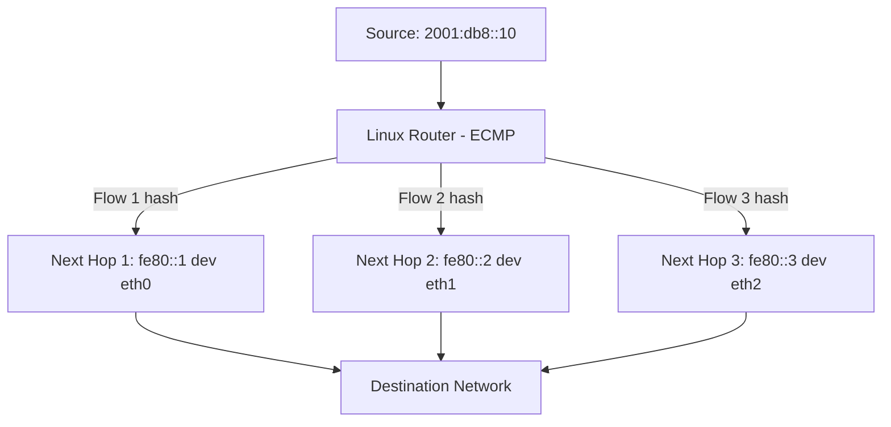

# How to Configure IPv6 Equal-Cost Multipath (ECMP) Routing

Author: [nawazdhandala](https://www.github.com/nawazdhandala)

Tags: IPv6, ECMP, Load Balancing, Routing, Linux

Description: Learn how to configure IPv6 ECMP routing on Linux to distribute traffic across multiple equal-cost paths for improved throughput and redundancy.

## Overview

Equal-Cost Multipath (ECMP) routing distributes IPv6 traffic across multiple paths that have the same prefix length and metric. This provides both load balancing and link redundancy. Linux supports ECMP natively via the kernel's multipath route feature.

## How ECMP Works



Linux uses a **hash of the source address, destination address, and optionally transport layer ports** to consistently assign each flow to one path.

## Configuring ECMP Routes

```bash
# Method 1: Add multiple routes with the same metric — kernel detects ECMP automatically
sudo ip -6 route add 2001:db8:remote::/48 via fe80::1 dev eth0 metric 100
sudo ip -6 route add 2001:db8:remote::/48 via fe80::2 dev eth1 metric 100

# Method 2: Add ECMP route explicitly in one command using nexthop
sudo ip -6 route add 2001:db8:remote::/48 \
    nexthop via fe80::1 dev eth0 weight 1 \
    nexthop via fe80::2 dev eth1 weight 1

# Verify ECMP route is installed
ip -6 route show 2001:db8:remote::/48
# 2001:db8:remote::/48 metric 100
#     nexthop via fe80::1 dev eth0 weight 1
#     nexthop via fe80::2 dev eth1 weight 1
```

## Weighted ECMP

Assign different weights to control traffic distribution:

```bash
# Send 2x more traffic through eth0 than eth1
sudo ip -6 route add 2001:db8:remote::/48 \
    nexthop via fe80::1 dev eth0 weight 2 \
    nexthop via fe80::2 dev eth1 weight 1
```

## Hash Algorithm Configuration

Linux uses a flow hash for consistent per-flow routing. Configure the hash inputs:

```bash
# View current ECMP hash algorithm
sysctl net.ipv6.fib_multipath_hash_policy
# 0 = L3 (src/dst IP only) — default
# 1 = L4 (src/dst IP + src/dst port)
# 2 = L3/L4 with inner headers (for tunnels)

# Enable L4 hashing for better load distribution with many flows
sudo sysctl -w net.ipv6.fib_multipath_hash_policy=1

# Persist
echo "net.ipv6.fib_multipath_hash_policy = 1" >> /etc/sysctl.d/99-ecmp.conf
```

## Verifying ECMP Traffic Distribution

```bash
# Send test traffic and check interface counters
watch -n 1 'ip -s link show eth0; ip -s link show eth1'

# Or use iperf3 with multiple streams to exercise ECMP hashing
iperf3 -6 -c 2001:db8:remote::server -P 10  # 10 parallel streams
```

## Testing Route Failover

When one ECMP path fails, Linux automatically removes it and redirects traffic to remaining paths:

```bash
# Simulate a link failure
sudo ip link set eth0 down

# Verify ECMP route now only uses eth1
ip -6 route show 2001:db8:remote::/48
# Should now show only nexthop via fe80::2 dev eth1

# Restore the link
sudo ip link set eth0 up
# Route should automatically restore to ECMP
```

## ECMP with Dynamic Routing (FRRouting OSPFv3)

OSPFv3 automatically installs ECMP when multiple equal-cost paths exist:

```bash
# In FRRouting vtysh
vtysh -c "show ipv6 route 2001:db8:remote::/48"
# O   2001:db8:remote::/48 [110/20] is directly connected, eth0
#                           [110/20] is directly connected, eth1

# Verify kernel sees the ECMP route
ip -6 route show 2001:db8:remote::/48 | grep nexthop
```

## Persistent ECMP Configuration

```ini
# /etc/systemd/network/10-ecmp.network
[Route]
Destination=2001:db8:remote::/48
Gateway=fe80::1
GatewayOnLink=yes
Metric=100

[Route]
Destination=2001:db8:remote::/48
Gateway=fe80::2
GatewayOnLink=yes
Metric=100
```

## Summary

IPv6 ECMP distributes traffic across equal-cost paths using per-flow hashing. Configure it with multiple `ip -6 route add` commands at the same metric, or use the explicit `nexthop ... nexthop` syntax for more control. Enable L4 hashing with `net.ipv6.fib_multipath_hash_policy=1` for better load distribution with many TCP flows.
