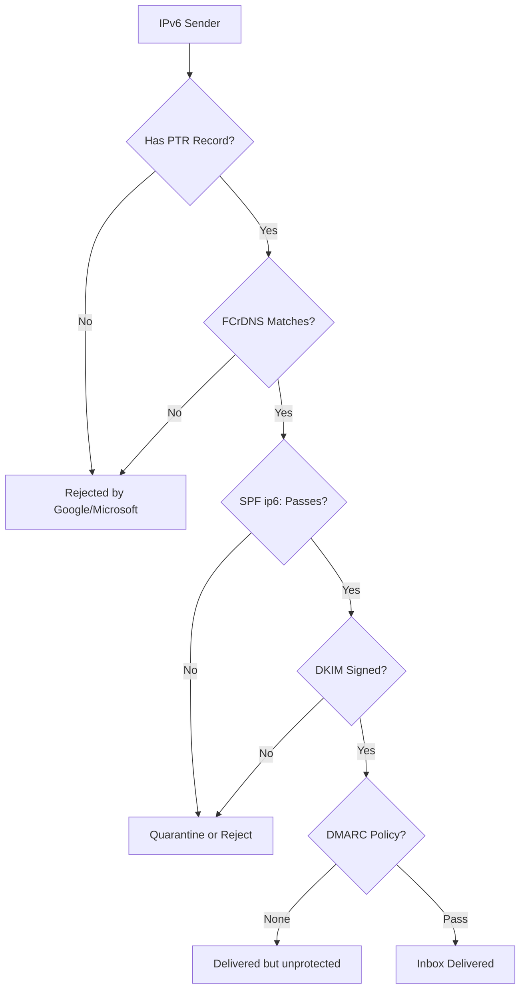

# How to Understand IPv6 Email Deliverability Best Practices

Author: [nawazdhandala](https://www.github.com/nawazdhandala)

Tags: IPv6, Email, Deliverability, SPF, DKIM, DMARC, Best Practice

Description: Understand the key best practices for achieving good email deliverability when sending from IPv6 addresses, covering reputation, authentication, and infrastructure setup.

## Introduction

Sending email from IPv6 addresses presents unique challenges. IPv6 address space is enormous, making traditional IP reputation databases less complete. Major providers like Google, Microsoft, and Yahoo have specific requirements for IPv6 senders that go beyond standard IPv4 practices. This guide consolidates the essential best practices.

## Why IPv6 Deliverability Differs



## 1. Infrastructure Requirements

### PTR Record and FCrDNS

The most critical requirement for IPv6 mail:

```bash
# Your sending IPv6 must have a PTR record

dig -x 2001:db8::10 +short
# → mail.example.com.

# And mail.example.com must have AAAA pointing back
dig AAAA mail.example.com +short
# → 2001:db8::10
```

### Stable IPv6 Address

Disable privacy extensions on mail server interfaces to maintain a stable sending IP:

```bash
# Disable temporary addresses on the mail interface
sudo sysctl -w net.ipv6.conf.eth0.use_tempaddr=0
# Make permanent
echo "net.ipv6.conf.eth0.use_tempaddr=0" | sudo tee -a /etc/sysctl.d/99-mail.conf
```

## 2. Authentication Stack (Non-Negotiable)

All three must be configured for reliable delivery to major providers:

```dns
; SPF with ip6: mechanism
example.com.  300  IN  TXT  "v=spf1 ip4:203.0.113.10 ip6:2001:db8::10 -all"

; DKIM public key
mail._domainkey.example.com.  300  IN  TXT  "v=DKIM1; k=rsa; p=<public-key>"

; DMARC policy
_dmarc.example.com.  300  IN  TXT  "v=DMARC1; p=reject; rua=mailto:dmarc@example.com"
```

## 3. Warm Up New IPv6 Addresses

New IPv6 addresses have no sending reputation. Warm up gradually:

```text
Week 1: 500-1,000 messages/day
Week 2: 2,000-5,000 messages/day
Week 3: 10,000-25,000 messages/day
Week 4+: Scale based on engagement metrics
```

Use a dedicated IPv6 address per sending stream when possible (transactional vs. marketing).

## 4. Use a /64 Dedicated to Mail

Don't use addresses from a shared range:

```bash
# Request a dedicated /64 or /48 from your provider
# Assign a single stable address for SMTP
sudo ip -6 addr add 2001:db8:mail::1/64 dev eth0

# Pin Postfix to this address
sudo postconf -e 'smtp_bind_address6 = 2001:db8:mail::1'
```

## 5. Monitor Blacklists

IPv6 DNSBLs are growing. Monitor your IPs:

```bash
# Check IPv6 address against major DNSBLs
python3 - << 'EOF'
import subprocess

ip = "2001:db8::10"
dnsbls = [
    "xbl.spamhaus.org",
    "bl.spamcop.net",
    "dnsbl.sorbs.net"
]

# Reverse the IPv6 address for DNSBL lookup
import ipaddress
expanded = ipaddress.IPv6Address(ip).exploded.replace(":", "")
reversed_ip = ".".join(reversed(expanded))

for dnsbl in dnsbls:
    query = f"{reversed_ip}.{dnsbl}"
    result = subprocess.run(["dig", "+short", query], capture_output=True, text=True)
    if result.stdout.strip():
        print(f"LISTED in {dnsbl}: {result.stdout.strip()}")
    else:
        print(f"Clean in {dnsbl}")
EOF
```

## 6. Configure Postfix for Best IPv6 Practices

```ini
# /etc/postfix/main.cf - Recommended IPv6 settings
inet_protocols = all
smtp_address_preference = ipv6
smtp_bind_address6 = 2001:db8::10
smtp_bind_address = 203.0.113.10
myhostname = mail.example.com
smtp_helo_name = $myhostname
```

## 7. Monitor Delivery Rates

```bash
# Count daily delivery success rates
sudo awk '/sent|deferred|bounced/ {print $NF}' /var/log/mail.log | \
    grep -oE 'status=[a-z]+' | sort | uniq -c

# Track IPv6 vs IPv4 delivery
sudo grep "status=sent" /var/log/mail.log | \
    grep -oE 'relay=.*?\]' | \
    awk '{if ($0 ~ /:/) print "IPv6"; else print "IPv4"}' | \
    sort | uniq -c
```

## 8. Register with Postmaster Tools

Register your sending domain with major provider postmaster tools:

- **Google Postmaster Tools**: https://postmaster.google.com
- **Microsoft SNDS**: https://sendersupport.olc.protection.outlook.com/snds
- **Yahoo Sender Hub**: https://senders.yahooinc.com

These provide visibility into deliverability metrics for your IPv6 addresses.

## Summary Checklist

- [ ] PTR record configured for IPv6 sending address
- [ ] FCrDNS verified (PTR → hostname → AAAA matches)
- [ ] SPF record includes `ip6:` mechanism
- [ ] DKIM signing configured and DNS record published
- [ ] DMARC policy at least `p=quarantine`
- [ ] Privacy extensions disabled on mail server interface
- [ ] Postfix bound to stable IPv6 address
- [ ] IPv6 not blacklisted in major DNSBLs
- [ ] Registered with Google/Microsoft postmaster tools

## Conclusion

IPv6 email deliverability requires the same authentication foundations as IPv4 (SPF, DKIM, DMARC) plus additional infrastructure work unique to IPv6: stable PTR/FCrDNS, disabled privacy extensions, address warmup, and monitoring on IPv6-specific DNSBL lists. Building these foundations correctly from the start saves significant troubleshooting time.
