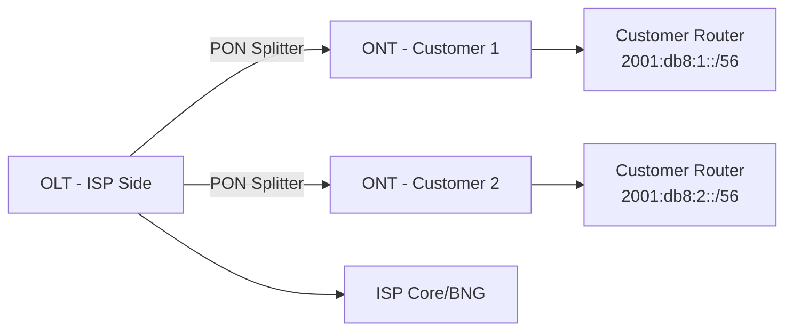

# How to Configure IPv6 for Fiber (GPON/XGS-PON) Networks

Author: [nawazdhandala](https://www.github.com/nawazdhandala)

Tags: IPv6, GPON, XGS-PON, Fiber, ISP, OLT, ONT

Description: Configure IPv6 for fiber-optic access networks using GPON and XGS-PON, including OLT configuration and ONT/CPE prefix delegation.

## Fiber Network Architecture

Fiber access networks use PON (Passive Optical Network) technology. The OLT (Optical Line Terminal) sits at the ISP, and ONTs/ONU (Optical Network Terminals/Units) are at customer premises.



## OLT Configuration (Huawei MA5800)

Configure IPv6 on the OLT uplink and enable DHCPv6 relay for subscriber prefix delegation:

```text
! Enable IPv6 globally
ipv6 enable

! Configure uplink to BNG
interface XGigabitEthernet 0/0/0
  ipv6 enable
  ipv6 address 2001:db8:olt::1/64
  undo ipv6 nd ra halt

! Configure DHCPv6 relay on subscriber VLANs
interface Vlanif 100
  ipv6 enable
  ipv6 address 2001:db8:subs:1::1/64
  dhcpv6 relay destination 2001:db8:dhcp::10
  ipv6 nd ra-interval 30

! Configure IPv6 routing toward BNG
ipv6 route-static :: 0 2001:db8:olt::2
```

## Nokia 7360 OLT IPv6 Configuration

On Nokia ISAM/7360:

```text
configure router
    interface "olt-uplink"
        ipv6
            address 2001:db8:olt::1/64
            no shutdown
        exit
    exit

configure service vprn 1
    dhcp
        server 2001:db8:dhcp::10
        relay-agent-remote-id
    exit
exit
```

## ONT/CPE IPv6 Provisioning

ONT configuration pushed via OMCI (ONU Management Control Interface) or TR-069:

```text
# TR-069 (CWMP) parameter for IPv6 PD on residential gateway

InternetGatewayDevice.WANDevice.1.WANConnectionDevice.1.WANIPConnection.1.
  X_IPv6Enable = true
  X_IPv6PrefixDelegationEnabled = true
  X_IPv6PrefixLength = 56
```

## DHCPv6 Server for PON Subscribers

Configure the DHCPv6 server to handle requests from PON OLTs via relay:

```json
{
  "Dhcp6": {
    "subnet6": [
      {
        "id": 1,
        "subnet": "2001:db8:fiber::/40",
        "relay": {
          "ip-addresses": ["2001:db8:olt::1"]
        },
        "pd-pools": [
          {
            "prefix": "2001:db8:fiber::",
            "prefix-len": 40,
            "delegated-len": 56
          }
        ],
        "option-data": [
          {
            "name": "dns-servers",
            "data": "2001:db8:dns::1"
          }
        ]
      }
    ]
  }
}
```

## XGS-PON Specific Considerations

XGS-PON (10 Gigabit Symmetric PON) supports higher bandwidth but the IPv6 configuration principles are the same. Key difference: XGS-PON OLTs typically support more ONTs per port (128 vs 64 for GPON), requiring larger DHCPv6-PD pools per OLT interface.

## Monitoring ONT IPv6 Status

```bash
# Huawei OLT: verify ONT IPv6 addresses
display ont info 0 1 all | include ipv6

# Check DHCPv6 lease bindings for PON subscribers
# On the Kea DHCPv6 server:
kea-shell --host localhost --port 8000 \
  --service dhcp6 lease6-get-all | python3 -m json.tool
```

## Conclusion

IPv6 on GPON/XGS-PON fiber networks requires OLT interface IPv6 addressing, DHCPv6 relay configuration, and an upstream DHCPv6-PD server. The ONTs/CPE request prefix delegation automatically once the relay is in place. With fiber's high bandwidth, XGS-PON is well-positioned to deliver dual-stack IPv4/IPv6 to residential and business customers.
