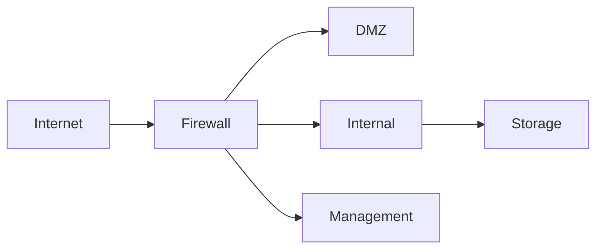

# How to Design IPv6 Firewall Zones for Data Centers

Author: [nawazdhandala](https://www.github.com/nawazdhandala)

Tags: IPv6, Firewall, Data Center, Network Security, Segmentation

Description: A practical guide to designing IPv6 firewall zones in data centers, covering zone models, rule sets, and policy enforcement strategies.

## Why IPv6 Firewall Zones Matter

IPv6 changes the threat landscape significantly. Unlike IPv4 with NAT providing implicit hiding, IPv6 gives every device a globally routable address. This makes proper firewall zone design essential for data center security.

## Common IPv6 Zone Models

A typical data center IPv6 firewall design uses these zones:

- **External Zone**: Internet-facing traffic (2000::/3)
- **DMZ Zone**: Public-facing services (e.g., 2001:db8:1::/48)
- **Internal Zone**: Application and compute tiers
- **Management Zone**: Out-of-band access (e.g., 2001:db8:ffff::/48)
- **Storage Zone**: Backend storage networks



## Addressing Plan for Zones

Assign dedicated prefixes to each zone to simplify policy writing:

| Zone       | Prefix Example          |
|------------|-------------------------|
| DMZ        | 2001:db8:0:1::/64       |
| App Tier   | 2001:db8:0:10::/64      |
| DB Tier    | 2001:db8:0:20::/64      |
| Mgmt       | 2001:db8:0:ff::/64      |

## Writing IPv6 Firewall Rules

Here is an example using `ip6tables` on a Linux-based firewall to enforce zone policies. These rules allow established traffic and permit only necessary new connections into the DMZ.

```bash
# Flush existing IPv6 rules
ip6tables -F

# Allow loopback traffic
ip6tables -A INPUT -i lo -j ACCEPT

# Allow established and related connections (stateful)
ip6tables -A INPUT -m state --state ESTABLISHED,RELATED -j ACCEPT

# Allow ICMPv6 (required for IPv6 to function correctly)
ip6tables -A INPUT -p ipv6-icmp -j ACCEPT

# Allow HTTPS into the DMZ web tier from the internet
ip6tables -A FORWARD -s ::/0 -d 2001:db8:0:1::/64 -p tcp --dport 443 -m state --state NEW -j ACCEPT

# Block all traffic from the internet to the internal zone
ip6tables -A FORWARD -s ::/0 -d 2001:db8:0:10::/64 -j DROP

# Allow internal zone to reach the DB tier on PostgreSQL port
ip6tables -A FORWARD -s 2001:db8:0:10::/64 -d 2001:db8:0:20::/64 -p tcp --dport 5432 -j ACCEPT

# Allow management zone to SSH anywhere internally
ip6tables -A FORWARD -s 2001:db8:0:ff::/64 -d 2001:db8::/32 -p tcp --dport 22 -j ACCEPT

# Default deny all forwarded traffic
ip6tables -A FORWARD -j DROP
```

## ICMPv6 Must-Allow Rules

Unlike IPv4, ICMPv6 is critical for IPv6 operation. Always permit these ICMPv6 types at zone boundaries:

```bash
# Neighbor Discovery Protocol (NDP) - required for address resolution
ip6tables -A INPUT -p ipv6-icmp --icmpv6-type 133 -j ACCEPT  # Router Solicitation
ip6tables -A INPUT -p ipv6-icmp --icmpv6-type 134 -j ACCEPT  # Router Advertisement
ip6tables -A INPUT -p ipv6-icmp --icmpv6-type 135 -j ACCEPT  # Neighbor Solicitation
ip6tables -A INPUT -p ipv6-icmp --icmpv6-type 136 -j ACCEPT  # Neighbor Advertisement
ip6tables -A INPUT -p ipv6-icmp --icmpv6-type 2   -j ACCEPT  # Packet Too Big (PMTUD)
```

## Management Zone Best Practices

- Use ULA (fc00::/7) or a private /48 for management if it should never be internet-routable.
- Enforce MFA at the management zone boundary.
- Log all connections to the management zone with flow export (NetFlow/IPFIX).

## Monitoring Zone Compliance

Use flow-based monitoring to detect policy violations. Tools like `ntopng` or `pmacct` can correlate IPv6 flows against zone policies and alert on anomalies.

## Conclusion

Designing IPv6 firewall zones requires explicit segmentation and stateful policy enforcement. Without NAT as a crutch, each zone boundary must be deliberately designed with both allow and deny rules to protect your data center workloads.
