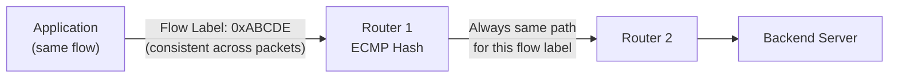

# How to Use IPv6 Flow Labels for Application Performance

Author: [nawazdhandala](https://www.github.com/nawazdhandala)

Tags: IPv6, Flow Label, Performance, ECMP, QoS, Networking

Description: Leverage the IPv6 Flow Label field to improve ECMP load balancing, enable per-flow QoS, and provide consistent routing for application traffic.

## Introduction

The IPv6 header includes a 20-bit Flow Label field that identifies packets belonging to the same application flow. Routers can use it for ECMP hashing, consistent routing, and QoS without parsing transport layer headers, improving performance and reducing per-packet processing.

## What Is the Flow Label?

The Flow Label is a 20-bit field in the IPv6 base header. RFC 6437 defines its semantics:

- A non-zero value indicates the packet belongs to a specific flow
- All packets in a flow from the same source should use the same Flow Label
- Routers use it to maintain per-flow consistency without stateful tracking



## Step 1: Set Flow Labels in Linux

Linux automatically assigns flow labels to IPv6 sockets.

```bash
# Check current flow label mode
sysctl net.ipv6.flowlabel_consistency
sysctl net.ipv6.flowlabel_reflect

# Enable flow label reflection (server returns same flow label)
echo "net.ipv6.flowlabel_reflect = 7" | \
  sudo tee -a /etc/sysctl.d/99-flowlabel.conf

# 7 = reflect for TCP (1) + UDP (2) + ICMP (4) combined
sudo sysctl -p /etc/sysctl.d/99-flowlabel.conf
```

## Step 2: Set Flow Labels in Python Applications

```python
import socket
import struct

# Set a specific IPv6 flow label on a socket
# The flow label is embedded in the traffic class + flow label word

def create_socket_with_flow_label(flow_label: int):
    """
    Create an IPv6 UDP socket with a specific flow label.
    Flow label must be 0 to 0xFFFFF (20 bits).
    """
    if not (0 <= flow_label <= 0xFFFFF):
        raise ValueError("Flow label must be 0-1048575")

    sock = socket.socket(socket.AF_INET6, socket.SOCK_DGRAM)

    # IPV6_FLOWINFO includes traffic class (8 bits) + flow label (20 bits)
    # Pack as 32-bit big-endian: [TrafficClass][FlowLabel 20-bit]
    flow_info = flow_label & 0xFFFFF  # lower 20 bits

    # IPV6_FLOWINFO_SEND = 33 on Linux
    IPV6_FLOWINFO_SEND = 33
    sock.setsockopt(socket.IPPROTO_IPV6, IPV6_FLOWINFO_SEND, 1)

    return sock, flow_info


# Usage: consistent flow label for all packets in an HTTP/2 stream
sock, flow_info = create_socket_with_flow_label(0xABCDE)

# When sending, include flow info in the address tuple
dest = ("2001:db8::1", 80, 0, 0)  # (addr, port, flowinfo, scope_id)
dest_with_flow = ("2001:db8::1", 80, flow_info, 0)
sock.sendto(b"data", dest_with_flow)
```

## Step 3: ECMP Load Balancing with Flow Labels

Configure a Linux router to hash ECMP routes using flow labels.

```bash
# Enable flow label-aware ECMP hashing
# Policy 2 = L3 + flow label (default in modern kernels)
echo "net.ipv6.fib_multipath_hash_policy = 2" | \
  sudo tee -a /etc/sysctl.d/99-ecmp.conf

sudo sysctl -p /etc/sysctl.d/99-ecmp.conf

# Verify
sysctl net.ipv6.fib_multipath_hash_policy

# Add ECMP routes that benefit from flow-label hashing
ip -6 route add 2001:db8::/32 \
  nexthop via fe80::1 dev eth0 weight 1 \
  nexthop via fe80::2 dev eth1 weight 1
```

## Step 4: Apply QoS Based on Flow Label with tc

```bash
# Create a prio qdisc and classify by flow label using tc-flower
sudo tc qdisc add dev eth0 root handle 1: prio bands 3

# Match IPv6 packets with a specific flow label range and prioritize
sudo tc filter add dev eth0 parent 1: protocol ipv6 \
  flower ip_flags is_fragment=0 \
  action skbedit priority 1

# For more granular flow label matching, use u32 filter
# Note: flow label sits at bits 12-31 of the 2nd 32-bit word in IPv6 header
sudo tc filter add dev eth0 parent 1: protocol ipv6 \
  u32 match u32 0x000ABCDE 0x000FFFFF at 0 \
  flowid 1:1
```

## Step 5: Verify Flow Label Usage

```bash
# Capture packets and inspect flow label with tcpdump
sudo tcpdump -i eth0 -n -v ip6 | grep "flow"

# Example output:
# IP6 (class 0x00, flowlabel 0xabcde, ...)

# Use Wireshark display filter
# ipv6.flow == 0xabcde
```

## Conclusion

IPv6 Flow Labels enable routers to maintain per-flow consistency in ECMP environments without stateful NAT or connection tracking. Setting a stable, application-specific flow label improves load-balancing fairness and enables QoS policies. Monitor flow distribution across your backend servers with OneUptime to detect ECMP imbalances.
