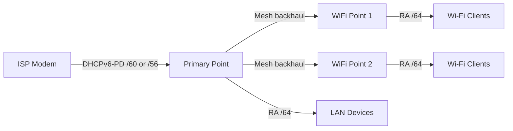

# How to Configure IPv6 on Google WiFi and Nest WiFi

Author: [nawazdhandala](https://www.github.com/nawazdhandala)

Tags: IPv6, Google WiFi, Nest WiFi, Mesh Network, DHCPv6

Description: Enable and verify IPv6 on Google WiFi and Nest WiFi mesh systems, understand automatic DHCPv6-PD handling, and troubleshoot common IPv6 issues with Google's mesh platform.

## Google WiFi / Nest WiFi IPv6 Architecture

Google WiFi and Nest WiFi Pro are managed entirely through the Google Home app. IPv6 configuration is largely automatic with minimal manual controls.



## Automatic IPv6 Setup

Google WiFi handles IPv6 automatically when your ISP provides it.

```
Google Home App → Wi-Fi → Settings → Advanced Networking → IPv6

IPv6: Enabled (default)

Google WiFi behavior:
  1. Primary point sends DHCPv6 Solicit to ISP modem
  2. ISP assigns IPv6 WAN address
  3. ISP delegates prefix (/60 or /56) via DHCPv6-PD
  4. Primary point sub-delegates /64s to LAN and each mesh point
  5. All devices receive /64 via SLAAC

Note: Google WiFi ONLY supports DHCPv6-PD — no static IPv6 or 6in4 tunnel
```

## Verify IPv6 is Working

Since Google WiFi has minimal CLI access, verify from connected devices.

```bash
# From any device connected to Google WiFi

# Check for global IPv6 address
ip -6 addr show | grep "scope global"
# Expected: 2001:db8:XXXX:XXXX::/64 from delegated prefix

# Check default IPv6 route
ip -6 route show default
# Expected: default via <link-local of Google point> dev eth0

# Test connectivity
ping6 -c 4 2606:4700:4700::1111    # Cloudflare DNS over IPv6
ping6 -c 4 2001:4860:4860::8888    # Google DNS over IPv6

# Verify your public IPv6 address
curl -6 https://ifconfig.co

# Run the official IPv6 test
curl -s https://test-ipv6.com/ip/?callback=x | python3 -m json.tool
```

## Nest WiFi Pro (WiFi 6E) IPv6

Nest WiFi Pro also supports IPv6 and Matter/Thread for smart home devices.

```bash
# Nest WiFi Pro enables Thread (IPv6-based mesh for IoT)
# Thread devices get IPv6 via the Nest Thread border router

# Thread device IPv6 uses ULA (fc00::/7) internally
# Mapped to your global IPv6 prefix for internet access

# Verify Thread border router via Google Home app:
# Home → Your Nest WiFi Pro → Settings → Thread

# Check Thread IPv6 from a paired Matter device
# (vendor-specific tools required)

# Test standard IPv6 for regular clients (same as Google WiFi above)
ping6 2606:4700:4700::1111
```

## Troubleshoot Google WiFi IPv6

```bash
# Issue 1: IPv6 not working — check if ISP supports DHCPv6-PD
# Google WiFi requires DHCP-PD; pure RA ISPs may not work
# Verify with your ISP: do they support DHCPv6-PD?

# Issue 2: IPv6 worked before, now broken after firmware update
# Google auto-updates firmware — check Google WiFi status page
# Factory reset and re-setup sometimes helps

# Issue 3: Some devices get IPv6, others don't
# Usually client-side issue — restart device network stack
# Linux: sudo dhclient -6 eth0 (or systemctl restart NetworkManager)
# Windows: netsh int ipv6 reset, then reboot
# iPhone: Settings → General → Transfer or Reset iPhone → Reset Network Settings

# Issue 4: IPv6 assigned but no internet (MTU issue)
# Check from device:
ping6 -s 1400 2606:4700:4700::1111  # should work
ping6 -s 1480 2606:4700:4700::1111  # may fail if MTU issue
# Google WiFi has fixed MTU — limited manual control
```

## Google WiFi in Bridge Mode

If using Google WiFi behind another router, bridge mode disables NAT.

```
Google Home App → Wi-Fi → Settings → Advanced Networking → WAN → Bridge Mode

In bridge mode:
  - Google WiFi acts as a managed switch/AP
  - IPv6 passes through from your main router
  - Your main router handles DHCPv6-PD
  - Google WiFi APs do NOT run radvd
  - Devices get IPv6 SLAAC from your main router

Bridge mode is recommended when:
  - You have a router with full IPv6 control
  - You need more advanced firewall rules
  - You want precise prefix delegation control
```

## Conclusion

Google WiFi and Nest WiFi automatically configure IPv6 when the ISP modem provides DHCPv6 prefix delegation — there are no manual IPv6 settings to configure. The primary WiFi point negotiates DHCPv6-PD, sub-delegates /64 prefixes to mesh points, and sends Router Advertisements so that all connected devices receive IPv6 via SLAAC. Verify IPv6 by checking connected devices for a global scope address and testing `ping6 2606:4700:4700::1111`. If IPv6 does not work, the most common cause is an ISP modem that does not pass DHCPv6-PD through — switch the modem to bridge mode or contact your ISP to enable IPv6 prefix delegation.
