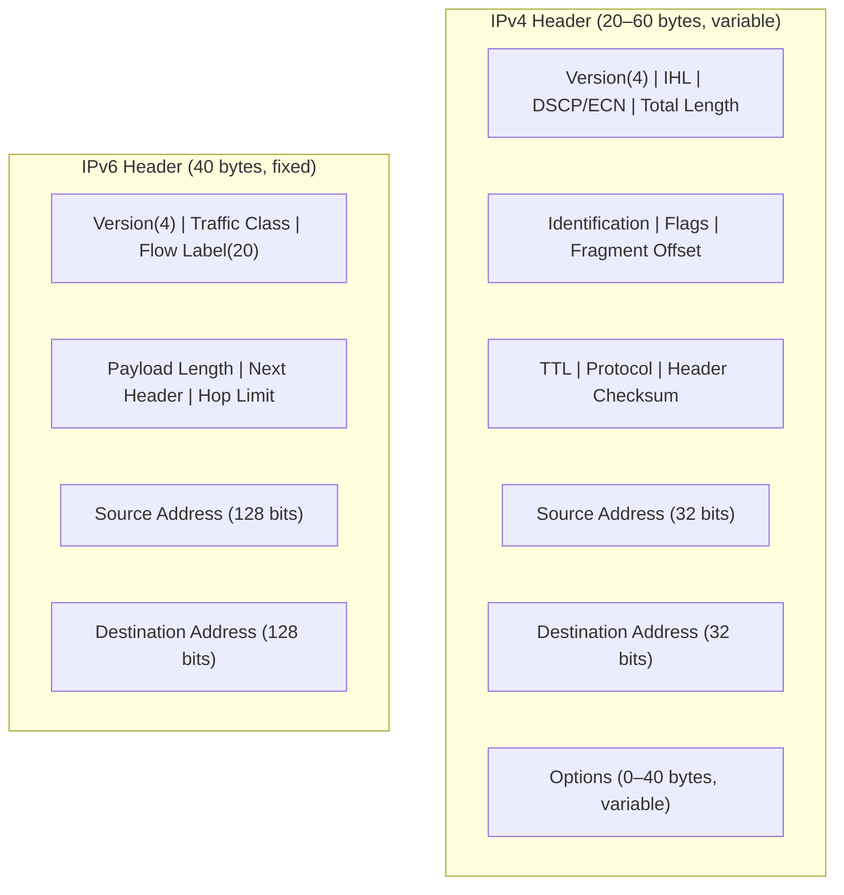

# How to Understand IPv6 Header Efficiency vs IPv4

Author: [nawazdhandala](https://www.github.com/nawazdhandala)

Tags: IPv6, IPv4, Networking, Header, Protocol, Performance

Description: Compare the IPv6 and IPv4 header structures to understand the design tradeoffs, efficiency improvements, and practical performance implications for modern networks.

## Introduction

IPv6 was designed with lessons from IPv4's 30-year history. While IPv6 headers are larger in absolute terms (40 bytes vs 20 bytes minimum), they are more efficient because of their fixed size, removed fragmentation overhead, and eliminated checksum computation.

## Header Structure Comparison



## Field-by-Field Comparison

| Field | IPv4 | IPv6 | Note |
|---|---|---|---|
| Version | 4 bits | 4 bits | Same |
| Header Length | 4 bits (IHL) | Removed | IPv6 header is fixed at 40 bytes |
| ToS/DSCP | 8 bits | Traffic Class (8 bits) | Equivalent |
| Flow Label | Not present | 20 bits | New in IPv6 |
| Total/Payload Length | 16 bits | 16 bits (payload only) | IPv6 excludes header from length |
| Identification | 16 bits | Removed | Fragmentation moved to extension headers |
| Flags | 3 bits | Removed | Same reason |
| Fragment Offset | 13 bits | Removed | Same reason |
| TTL | 8 bits | Hop Limit (8 bits) | Renamed, equivalent |
| Protocol | 8 bits | Next Header (8 bits) | Equivalent, but chains extension headers |
| Header Checksum | 16 bits | Removed | L2 and L4 provide checksums |
| Source Address | 32 bits | 128 bits | 4x larger |
| Destination Address | 32 bits | 128 bits | 4x larger |
| Options | 0–40 bytes | Extension Headers | Moved out of base header |

## Why IPv6 Is More Efficient to Process

### 1. Fixed Header Size Enables Hardware Optimization

```
IPv4: IHL field required to skip variable options → branching in fast-path code
IPv6: always 40 bytes → parse at fixed offset → simpler hardware parser
```

### 2. No Header Checksum

IPv4 routers must recompute the checksum at every hop (TTL decrements by 1).

```c
/* Conceptual: IPv4 router must do this at EVERY hop */
ip_header->ttl--;
ip_header->check = ip_checksum(ip_header, ip_header->ihl * 4);

/* IPv6 router: just decrement hop limit, no checksum */
ipv6_header->hop_limit--;
/* Done — no checksum update needed */
```

This saves CPU cycles at every routing hop across the internet.

### 3. Fragmentation Is End-to-End Only

IPv4 routers can fragment packets. IPv6 routers cannot — only the source host fragments, reducing router state and processing.

```bash
# IPv6 fragmentation is done by the source (Path MTU Discovery)
# Check the PMTU to a destination
ip -6 route get 2001:db8::1 | grep mtu

# Verify PMTU discovery is enabled
sysctl net.ipv6.conf.all.mtu_disc_policy
```

## Practical Overhead

For a 1500-byte Ethernet frame:
- IPv4: 20 bytes header = **1.3% overhead**
- IPv6: 40 bytes header = **2.7% overhead**

However, for larger jumbo frames (9000 bytes):
- IPv4: 20/9000 = **0.22% overhead**
- IPv6: 40/9000 = **0.44% overhead**

The absolute overhead is 20 bytes — negligible at any meaningful bandwidth.

## Conclusion

IPv6's fixed-size header and elimination of per-hop checksum computation make it more processor-efficient for routers, despite being larger. For application developers, the key takeaway is that IPv6 processing overhead is not a concern on modern hardware. Use OneUptime to measure actual per-protocol latency on your infrastructure.
