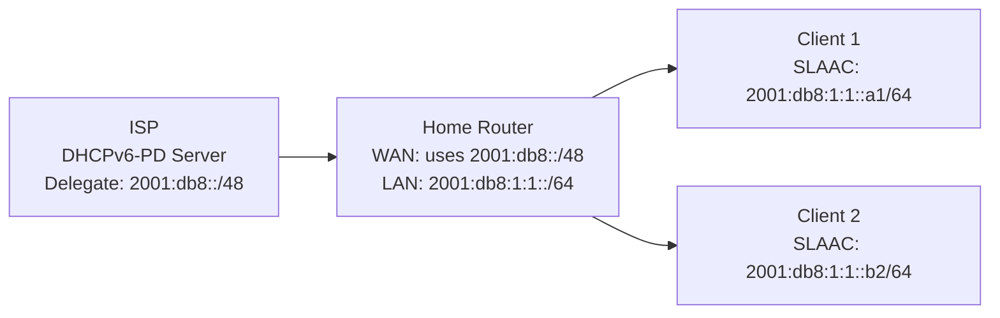

# How to Configure IPv6 on a Home Router

Author: [nawazdhandala](https://www.github.com/nawazdhandala)

Tags: IPv6, Home Router, DHCPv6-PD, SLAAC, Networking, ISP

Description: Configure IPv6 on a home router to obtain a prefix from your ISP via DHCPv6 Prefix Delegation and distribute it to your LAN devices using SLAAC.

## Introduction

Most residential ISPs now offer IPv6 connectivity. The typical setup involves obtaining a prefix from the ISP via DHCPv6-PD (Prefix Delegation) on the WAN interface, then distributing a /64 from that prefix to the LAN using Router Advertisements. This guide covers setting this up on a Linux-based home router.

## Understanding DHCPv6 Prefix Delegation

Your ISP assigns you a prefix (typically /56 or /48) via DHCPv6-PD. Your router then splits this into /64 subnets for each LAN segment and advertises them to clients via SLAAC.



## Step 1: Request Prefix Delegation from ISP

### Using dhcpcd (most home Linux routers)

```bash
# /etc/dhcpcd.conf

# Configure WAN interface to request an IPv6 prefix

interface eth0  # WAN interface
    # Request an IPv6 address for the WAN interface
    ipv6rs
    # Request a /56 prefix delegation
    ia_na 1
    ia_pd 1 eth1/0/64  # Assign first /64 to eth1 (LAN)
```

### Using NetworkManager

```bash
# Configure WAN interface for DHCPv6 with prefix delegation
nmcli connection modify "WAN" \
    ipv6.method auto \
    ipv6.dhcp-send-hostname yes

# Set dhcp-iaid for prefix delegation
nmcli connection modify "WAN" ipv6.dhcp-iaid stable
nmcli connection up "WAN"
```

## Step 2: Configure the LAN Interface

Once the prefix is delegated, assign the first /64 to the LAN interface:

```bash
# For dhcpcd, it handles this automatically from ia_pd configuration
# For manual setup:

# Assuming ISP delegated 2001:db8::/48 and we assign 2001:db8:1:1::/64 to LAN
sudo ip -6 addr add 2001:db8:1:1::1/64 dev eth1

# Persist this with NetworkManager
nmcli connection modify "LAN" \
    ipv6.method manual \
    ipv6.addresses "2001:db8:1:1::1/64"
nmcli connection up "LAN"
```

## Step 3: Configure radvd for SLAAC

```bash
sudo apt-get install radvd

sudo tee /etc/radvd.conf > /dev/null << 'EOF'
# Home router RA configuration

interface eth1 {
    AdvSendAdvert on;
    AdvManagedFlag off;
    AdvOtherConfigFlag off;
    MinRtrAdvInterval 30;
    MaxRtrAdvInterval 100;
    AdvDefaultLifetime 1800;

    # The prefix derived from ISP delegation
    prefix 2001:db8:1:1::/64 {
        AdvOnLink on;
        AdvAutonomous on;
        AdvValidLifetime 86400;
        AdvPreferredLifetime 14400;
    };

    # Use ISP's DNS or a public DNS
    RDNSS 2606:4700:4700::1111 2001:4860:4860::8888 {
        AdvRDNSSLifetime 600;
    };
};
EOF

sudo systemctl enable --now radvd
```

## Step 4: Enable IPv6 Forwarding and Firewall

```bash
# Enable forwarding
sudo sysctl -w net.ipv6.conf.all.forwarding=1
echo "net.ipv6.conf.all.forwarding = 1" | sudo tee /etc/sysctl.d/50-ipv6.conf

# Basic firewall: allow LAN out, block unsolicited inbound
sudo ip6tables -A FORWARD -i eth1 -o eth0 -j ACCEPT
sudo ip6tables -A FORWARD -m state --state ESTABLISHED,RELATED -j ACCEPT
sudo ip6tables -A FORWARD -i eth0 -o eth1 -j DROP

# Allow ICMPv6 to pass through (required for IPv6 to function)
sudo ip6tables -A FORWARD -p icmpv6 -j ACCEPT
```

## Step 5: Verify the Setup

```bash
# Verify prefix was delegated from ISP
ip -6 addr show eth0

# Verify LAN address is assigned
ip -6 addr show eth1

# Test LAN client can reach the internet
# From a client:
ping6 2606:4700:4700::1111

# Check default route on clients
ip -6 route show default
```

## Dynamic Prefix Handling

If the ISP changes your delegated prefix, radvd needs to advertise the new prefix. Using dhcpcd with the `ia_pd` hook handles this automatically. For manual setups:

```bash
# Create a script to update radvd.conf when the prefix changes
# /etc/dhcpcd.exit-hook
if [ "$reason" = "BOUND6" ] || [ "$reason" = "REBIND6" ]; then
    NEW_PREFIX=$(ip -6 addr show eth1 | grep "scope global" | awk '{print $2}' | head -1)
    # Update radvd.conf and reload
    systemctl reload radvd
fi
```

## Conclusion

A home router IPv6 setup is straightforward: request a prefix from the ISP via DHCPv6-PD, assign a /64 to the LAN interface, and advertise it via radvd with SLAAC. The entire LAN gets globally routable IPv6 addresses without NAT. The firewall rules protect LAN devices from unsolicited inbound connections while allowing outbound traffic and established connections.
