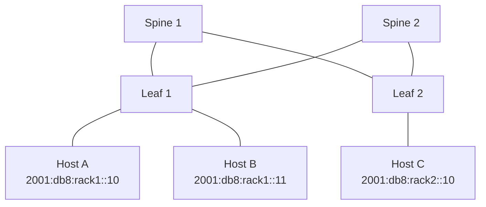

# How to Design IPv6 for Hyperscale Data Centers

Author: [nawazdhandala](https://www.github.com/nawazdhandala)

Tags: IPv6, Hyperscale, Data Center, BGP, Clos Network, Network Design

Description: Design principles and addressing strategies for deploying IPv6 in hyperscale data centers using Clos fabrics and BGP unnumbered.

## Hyperscale Design Principles

Hyperscale data centers (like those at Google, Facebook/Meta, and Microsoft scale) use Clos (fat-tree) topologies with equal-cost multipath (ECMP) and BGP as the routing protocol. IPv6 fits naturally into this model.

## Clos Fabric with IPv6



## BGP Unnumbered for Fabric Links

BGP unnumbered uses IPv6 link-local addresses for peering, eliminating the need to assign addresses to every fabric link:

```
# FRRouting (FRR) - BGP unnumbered on leaf switch
router bgp 65100
 bgp router-id 10.0.0.1
 !
 neighbor fabric interface remote-as external
 !
 address-family ipv6 unicast
  neighbor fabric activate
  network 2001:db8:rack1::/48
 exit-address-family
```

## Addressing Hierarchy

Assign prefixes hierarchically by pod and rack:

```
/16  - Data Center total allocation
  /24  - Pod
    /32  - Row
      /40  - Rack
        /48  - Server (with room for VMs)
          /64  - Individual subnet
```

## ECMP Load Balancing

Hyperscale fabrics rely on ECMP over many parallel paths. Verify IPv6 ECMP is hashing correctly:

```bash
# Linux: check ECMP hash policy for IPv6
sysctl net.ipv6.fib_multipath_hash_policy
# Set to 1 for L4 (src/dst port included in hash) for better distribution
sysctl -w net.ipv6.fib_multipath_hash_policy=1
```

## Anycast Services

Deploy anycast IPv6 addresses for internal services (DNS, NTP, load balancers) to ensure every host uses the nearest instance:

```
# Advertise anycast address from all DNS servers
router bgp 65100
 address-family ipv6
  network 2001:db8:anycast::53/128
```

## Large-Scale DHCPv6 Considerations

At hyperscale, stateless address autoconfiguration (SLAAC) is preferred over DHCPv6 to reduce control plane load. Combine SLAAC with DHCPv6 stateless for DNS option delivery.

## Monitoring at Scale

Use streaming telemetry (gNMI/gRPC) to collect IPv6 routing table states and neighbor statistics from thousands of switches simultaneously. Tools like Telegraf + InfluxDB handle this efficiently.

## Conclusion

IPv6 is well-suited for hyperscale data centers. BGP unnumbered simplifies fabric link addressing, the vast address space accommodates hierarchical allocation, and SLAAC reduces DHCP control-plane load. The key is a disciplined hierarchical addressing plan that matches your physical topology.
