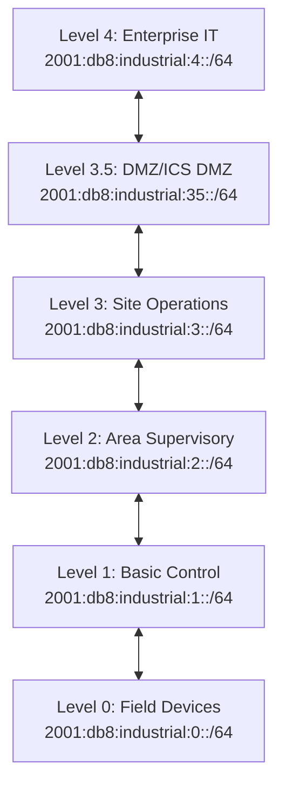

# How to Plan IPv6 Addressing for Industrial IoT

Author: [nawazdhandala](https://www.github.com/nawazdhandala)

Tags: IPv6, Industrial IoT, IIoT, OT Networks, Addressing, Purdue Model

Description: Plan IPv6 addressing for Industrial IoT networks following the Purdue Model, with hierarchical addressing for PLCs, SCADA systems, sensors, and IT/OT network segmentation.

## Introduction

Industrial IoT (IIoT) networks follow the Purdue Model for security and segmentation, separating field devices, control systems, and enterprise IT. IPv6 addressing for IIoT must respect these boundaries while providing efficient, scalable addressing for thousands of industrial devices including PLCs, RTUs, sensors, and SCADA systems.

## Purdue Model with IPv6



## IPv6 Addressing Scheme

```
Enterprise /32
└── Industrial Site /40 (2001:db8:industrial::/40)
    ├── Level 4 - Enterprise       /64 (::4:0::/64)
    ├── Level 3.5 - ICS DMZ        /64 (::35:0::/64)
    ├── Level 3 - SCADA/HMI        /64 (::3:0::/64)
    ├── Level 2 - DCS/Area Control /64 (::2:0::/64)
    ├── Level 1 - PLCs/RTUs        /64 (::1:0::/64)
    └── Level 0 - Field Devices    /64 (::0:0::/64)
```

## Level 1: PLC and RTU Addressing

```text
# Level 1 addressing plan - PLCs and RTUs
# Base: 2001:db8:industrial:1::/64

# Address structure for PLCs:
# 2001:db8:industrial:1::plc:<area><unit>
# Example:
# 2001:db8:industrial:1::plc:1:1   - Area 1, PLC 1
# 2001:db8:industrial:1::plc:1:2   - Area 1, PLC 2
# 2001:db8:industrial:1::plc:2:1   - Area 2, PLC 1

# In hex addresses:
# 2001:db8:industrial:1::1:1    - Area 1, PLC 1
# 2001:db8:industrial:1::1:2    - Area 1, PLC 2
# 2001:db8:industrial:1::2:1    - Area 2, PLC 1
```

## Level 0: Field Device Addressing

Field devices (sensors, actuators) typically use SLAAC or DHCPv6:

```text
# /etc/dhcp/dhcpd6.conf - DHCPv6 for Level 0 devices

subnet6 2001:db8:industrial:0::/64 {
    # Address pool for dynamic sensors
    range6 2001:db8:industrial:0::1000 2001:db8:industrial:0::efff;

    # Static reservations for critical field devices
    host pressure-sensor-line-1 {
        host-identifier option dhcp6.client-id 00:03:00:01:00:aa:bb:cc:dd:ee;
        fixed-address6 2001:db8:industrial:0::press:1;
    }

    host temperature-transmitter-1 {
        host-identifier option dhcp6.client-id 00:03:00:01:00:11:22:33:44:55;
        fixed-address6 2001:db8:industrial:0::temp:1;
    }

    option dhcp6.name-servers 2001:db8:industrial:3::dns;
    option dhcp6.domain-search "industrial.example.com";
}
```

## Firewall Rules Between Purdue Levels

```bash
#!/bin/bash
# industrial_ipv6_firewall.sh
# Implement Purdue Model firewall rules with IPv6

# Define level prefixes
L0="2001:db8:industrial:0::/64"
L1="2001:db8:industrial:1::/64"
L2="2001:db8:industrial:2::/64"
L3="2001:db8:industrial:3::/64"
L35="2001:db8:industrial:35::/64"
L4="2001:db8:industrial:4::/64"

# Default drop
ip6tables -P FORWARD DROP

# Allow established/related
ip6tables -A FORWARD -m state --state ESTABLISHED,RELATED -j ACCEPT

# Allow ICMPv6 (required)
ip6tables -A FORWARD -p icmpv6 -j ACCEPT

# Level 0 field devices → Level 1 controllers ONLY (no bypassing levels)
ip6tables -A FORWARD -s "$L0" -d "$L1" -j ACCEPT
ip6tables -A FORWARD -s "$L0" -j DROP   # Block all other L0 egress

# Level 1 → Level 2 ONLY
ip6tables -A FORWARD -s "$L1" -d "$L2" -j ACCEPT
ip6tables -A FORWARD -s "$L1" -d "$L0" -j ACCEPT  # L1 can push to L0
ip6tables -A FORWARD -s "$L1" -j DROP

# Level 2 → Level 3 ONLY
ip6tables -A FORWARD -s "$L2" -d "$L3" -j ACCEPT
ip6tables -A FORWARD -s "$L2" -d "$L1" -j ACCEPT  # L2 can push to L1
ip6tables -A FORWARD -s "$L2" -j DROP

# Level 3 → Level 3.5 DMZ (NOT directly to Level 4)
ip6tables -A FORWARD -s "$L3" -d "$L35" -j ACCEPT
ip6tables -A FORWARD -s "$L3" -j DROP

# Level 3.5 DMZ ↔ Level 4 (controlled)
ip6tables -A FORWARD -s "$L35" -d "$L4" -j ACCEPT
ip6tables -A FORWARD -s "$L4" -d "$L35" -j ACCEPT
ip6tables -A FORWARD -s "$L4" -j DROP
```

## Industrial Protocol Support over IPv6

Common industrial protocols that support IPv6:

```bash
# EtherNet/IP (port 44818) - Allen-Bradley PLCs
ip6tables -A FORWARD -s "$L2" -d "$L1" -p tcp --dport 44818 -j ACCEPT

# Modbus TCP (port 502) - legacy but IPv6 capable
ip6tables -A FORWARD -s "$L2" -d "$L1" -p tcp --dport 502 -j ACCEPT

# OPC-UA (port 4840) - modern industrial protocol
ip6tables -A FORWARD -s "$L3" -d "$L2" -p tcp --dport 4840 -j ACCEPT

# MQTT for industrial telemetry (port 8883 for TLS)
ip6tables -A FORWARD -s "$L1" -d "$L3" -p tcp --dport 8883 -j ACCEPT
```

## DNS for Industrial Devices

```text
# DNS naming convention for industrial devices
# Format: <device-type>-<area>-<unit>.<level>.industrial.example.com

plc-area1-unit1.l1.industrial.example.com.   AAAA 2001:db8:industrial:1::1:1
scada-server-1.l3.industrial.example.com.    AAAA 2001:db8:industrial:3::scada:1
hmi-line1.l2.industrial.example.com.         AAAA 2001:db8:industrial:2::hmi:1
```

## Conclusion

IPv6 addressing for Industrial IoT follows the Purdue Model's hierarchical segmentation, with each level receiving a dedicated /64 prefix and strict firewall rules controlling inter-level communication. Static DHCPv6 reservations for critical devices (PLCs, RTUs) ensure predictable, auditable addressing, while SLAAC handles less critical field devices. The addressing scheme encodes the device's role and location, simplifying operations and troubleshooting. Security is maintained by enforcing that communication only flows between adjacent levels, never bypassing the segmentation boundaries.
