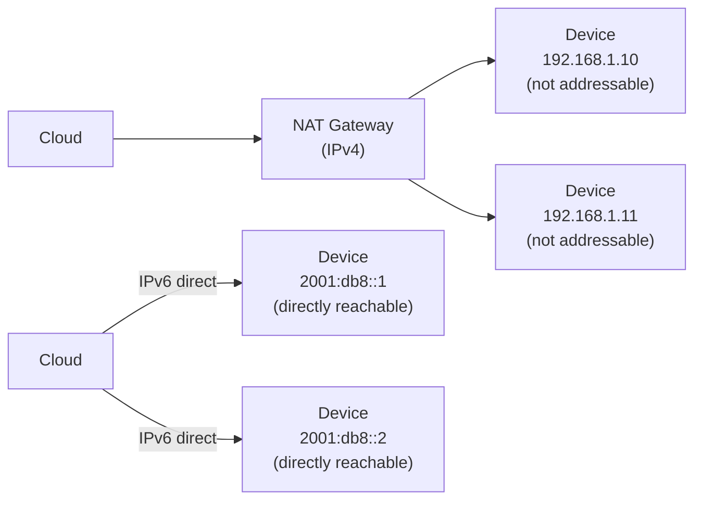

# How to Understand the Relationship Between IPv6 and IoT

Author: [nawazdhandala](https://www.github.com/nawazdhandala)

Tags: IPv6, IoT, Addressing, Networking, Security, Scalability

Description: Understand why IPv6 is essential for the Internet of Things, including the address exhaustion problem, direct end-to-end connectivity, and the impact on IoT security and scalability.

## Introduction

The relationship between IPv6 and IoT is fundamental: the Internet of Things requires unique, globally routable addresses for billions of devices, and IPv4 simply cannot provide this. IPv6 was not designed with IoT in mind, but its vast address space, mandatory security features, and built-in autoconfiguration capabilities make it the natural choice for connecting billions of devices.

## The Scale Problem

IPv4 provides approximately 4.3 billion addresses. With IoT projections of 50-100 billion connected devices by 2030:

```
IPv4 maximum addresses: 4,294,967,296 (~4.3 billion)
IoT devices projected by 2030: ~75 billion
IPv4 shortfall: ~70 billion addresses

IPv6 addresses: 340,282,366,920,938,463,463,374,607,431,768,211,456
                (~340 undecillion)
IPv6 per km² of Earth's surface: ~670 quadrillion addresses
```

IPv6 provides effectively unlimited addresses for every device, sensor, and actuator that could ever be deployed.

## Why NAT is Problematic for IoT

Under IPv4 with NAT (Network Address Translation), IoT devices:
- Cannot receive inbound connections from the internet (cloud cannot push to device)
- Require complex NAT traversal (STUN, TURN, hole punching)
- Cannot be directly addressed for management and monitoring
- Add latency and complexity to every connection

With IPv6:
- Every device has a globally unique, directly routable address
- Cloud platforms can initiate connections to devices (with appropriate firewall rules)
- No NAT traversal overhead or complexity
- Direct end-to-end connectivity simplifies protocol design



## IPv6 Features Beneficial to IoT

### 1. Stateless Address Autoconfiguration (SLAAC)
IoT devices can configure their own addresses from a Router Advertisement prefix without a DHCP server. This is critical for large-scale, unattended deployments.

### 2. Mandatory IPsec Support
IPv6 originally mandated IPsec support (now recommended rather than required). For IoT security, IPv6 provides a foundation for encrypted communications at the network layer.

### 3. Multicast Groups
IPv6 multicast enables efficient one-to-many communication for IoT scenarios like device discovery (`ff02::1` for all nodes, `ff05::x` for site-local groups) without broadcast storms.

### 4. Neighbor Discovery Protocol
IPv6 NDP replaces ARP with a more secure and flexible mechanism. IoT devices use NDP for gateway discovery, address resolution, and duplicate address detection.

### 5. 6LoWPAN Header Compression
For constrained devices on IEEE 802.15.4, 6LoWPAN compresses IPv6 headers from 40 bytes to 2-7 bytes, making IPv6 practical on devices with tiny radio frames.

## IoT Protocol Stack with IPv6

```
Application Layer:   CoAP, MQTT, HTTP/2, Matter
Transport Layer:     UDP, TCP, DTLS
Network Layer:       IPv6
Adaptation Layer:    6LoWPAN (for 802.15.4 networks)
Link Layer:          IEEE 802.15.4, Wi-Fi, Ethernet, LTE-M, NB-IoT
```

## Security Implications

IPv6 direct addressability means IoT device security is critical:

```bash
# Every IPv6-connected IoT device is reachable from the internet
# Unless protected by firewall rules

# Example: Allow only established/related connections inbound
# On a Linux IoT gateway:
ip6tables -A INPUT -m state --state ESTABLISHED,RELATED -j ACCEPT
ip6tables -A INPUT -p icmpv6 -j ACCEPT  # Required for IPv6
ip6tables -A INPUT -j DROP              # Block everything else
ip6tables -A FORWARD -i eth1 -m state --state ESTABLISHED,RELATED -j ACCEPT
ip6tables -A FORWARD -i eth1 -j DROP    # Block unsolicited inbound to devices
```

## Conclusion

IPv6 is not merely a preference for IoT — it is a necessity. The address space alone justifies the transition, but the additional benefits of SLAAC, multicast, NDP, and the ecosystem of IoT-specific adaptations (6LoWPAN, Thread, Matter) built on IPv6 make it the definitive networking layer for the Internet of Things. The direct addressability that IPv6 enables also raises the importance of IoT device security, making firewall rules and device hardening essential components of any IPv6 IoT deployment.
