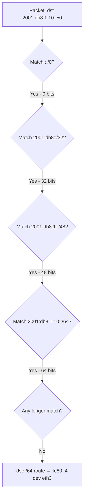

# How to Understand IPv6 Longest Prefix Match Routing

Author: [nawazdhandala](https://www.github.com/nawazdhandala)

Tags: IPv6, Routing, Longest Prefix Match, Networking, Fundamentals

Description: Understand how IPv6 routers use longest prefix match to select the most specific route for each packet, with practical examples.

## Overview

**Longest Prefix Match (LPM)** is the algorithm IPv6 routers use to find the best matching route for a destination address. When multiple routes match a destination, the route with the longest (most specific) prefix is used.

## How Longest Prefix Match Works

Consider a routing table with these entries:

| Prefix | Next Hop |
|--------|----------|
| `::/0` | `fe80::1 dev eth0` (default) |
| `2001:db8::/32` | `fe80::2 dev eth1` |
| `2001:db8:1::/48` | `fe80::3 dev eth2` |
| `2001:db8:1:10::/64` | `fe80::4 dev eth3` |

For a packet destined to `2001:db8:1:10::50`:

```text
::/0             → matches (0 bits)
2001:db8::/32    → matches (32 bits)
2001:db8:1::/48  → matches (48 bits)
2001:db8:1:10::/64 → matches (64 bits) ← WINNER (longest match)
```

The packet is forwarded to `fe80::4 dev eth3`.

## Visualizing LPM Decision



## Practical Demonstration on Linux

```bash
# Set up example routes for testing

sudo ip -6 route add 2001:db8::/32 via fe80::2 dev eth1
sudo ip -6 route add 2001:db8:1::/48 via fe80::3 dev eth2
sudo ip -6 route add 2001:db8:1:10::/64 via fe80::4 dev eth3

# Test which route wins for a specific destination
ip -6 route get 2001:db8:1:10::50
# Output: 2001:db8:1:10::50 via fe80::4 dev eth3

ip -6 route get 2001:db8:1:20::50
# Output: 2001:db8:1:20::50 via fe80::3 dev eth2  (no /64 match)

ip -6 route get 2001:db8:2::50
# Output: 2001:db8:2::50 via fe80::2 dev eth1  (only /32 matches)

ip -6 route get 2001:db9::1
# Output: 2001:db9::1 via fe80::1 dev eth0  (only default matches)
```

## Tie-Breaking When Prefix Lengths are Equal

When two routes have the same prefix length, the router uses **metric** (administrative distance) to choose:

```bash
# Two equal-length routes with different metrics
sudo ip -6 route add 2001:db8:1::/48 via fe80::3 dev eth2 metric 100
sudo ip -6 route add 2001:db8:1::/48 via fe80::5 dev eth4 metric 200

# The lower metric wins
ip -6 route show 2001:db8:1::/48
# 2001:db8:1::/48 via fe80::3 dev eth2 metric 100  ← used
# 2001:db8:1::/48 via fe80::5 dev eth4 metric 200  ← backup
```

## ECMP: Equal-Cost Multipath

If two routes have the same prefix length AND the same metric, both are installed and traffic is load-balanced:

```bash
# Both routes are used (ECMP)
sudo ip -6 route add 2001:db8:1::/48 via fe80::3 dev eth2 metric 100
sudo ip -6 route add 2001:db8:1::/48 via fe80::5 dev eth4 metric 100

ip -6 route show 2001:db8:1::/48
# 2001:db8:1::/48 metric 100
#     nexthop via fe80::3 dev eth2 weight 1
#     nexthop via fe80::5 dev eth4 weight 1
```

## Black Hole and Null Routes

A null route (black hole) uses a specific prefix to silently drop traffic - it wins via LPM over less-specific routes:

```bash
# Add a null route to block traffic to a specific prefix
sudo ip -6 route add blackhole 2001:db8:bad::/48

# Any traffic to 2001:db8:bad:: is dropped, even if a broader route exists
ip -6 route get 2001:db8:bad::1
# blackhole 2001:db8:bad::/48
```

## Summary

IPv6 longest prefix match selects the route with the most bits matching the destination address. Always test route selection with `ip -6 route get <destination>`. When prefix lengths tie, metric wins; when both tie, ECMP load-balances across all matching paths.
