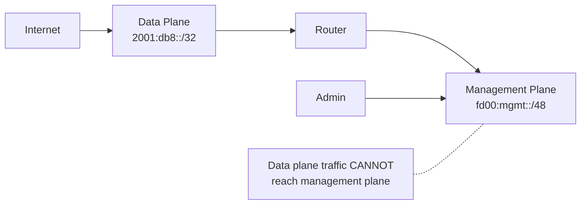

# How to Separate IPv6 Management Plane from Data Plane

Author: [nawazdhandala](https://www.github.com/nawazdhandala)

Tags: IPv6, Security, Management Plane, Network Architecture, Out-of-Band

Description: Learn how to design and implement management plane separation for IPv6 networks, using dedicated management VRFs, ULA addressing, and access controls.

## Overview

Management plane separation ensures that administrative access to network devices is isolated from user data traffic. For IPv6 networks this means using separate interfaces, VRFs, or VLANs for management traffic with ULA (Unique Local Addresses) or a dedicated management prefix that is not reachable from the data plane.

## Why Separate Management and Data Planes?



Benefits:
- Compromise of a data-plane user cannot directly attack management interfaces
- Management traffic is not exposed to internet routing
- Simpler, smaller attack surface for network devices

## IPv6 Address Design for Management

Use ULA (Unique Local Addresses, fc00::/7) for management networks:

```
Management network:     fd00:mgmt::/48   (ULA — never routed to internet)
Router loopbacks:       fd00:mgmt:0::/64
Switch management:      fd00:mgmt:1::/64
Server IPMI/BMC:        fd00:mgmt:2::/64
Admin workstations:     fd00:mgmt:3::/64
```

ULA ensures management addresses can never appear in the global routing table.

## Cisco: Management VRF for IPv6

```
! Create a management VRF
vrf definition MGMT
 address-family ipv6
!

! Assign the management interface to the VRF
interface GigabitEthernet0/0
  description "Management Network"
  vrf forwarding MGMT
  ipv6 address fd00:mgmt:0::1/64
  ipv6 nd ra suppress   ! No RA on management link
  no shutdown

! Restrict VTY access to management VRF only
line vty 0 15
  login local
  transport input ssh
  ipv6 access-class IPv6-MGMT-ACL in

ipv6 access-list IPv6-MGMT-ACL
  permit ipv6 fd00:mgmt::/48 any   ! Only management subnet
  deny   ipv6 any any log
```

## Juniper: Routing Instance for Management

```
# JunOS: Use the dedicated fxp0 management interface
set interfaces fxp0 unit 0 family inet6 address fd00:mgmt:0::1/64

# Restrict SSH to management interface only
set system services ssh root-login deny
set firewall family inet6 filter MGMT-ONLY term allow-mgmt from source-address fd00:mgmt::/48
set firewall family inet6 filter MGMT-ONLY term allow-mgmt then accept
set firewall family inet6 filter MGMT-ONLY term deny-rest then reject
set interfaces lo0 unit 0 family inet6 filter input MGMT-ONLY
```

## Linux: Management Namespace Separation

On Linux servers, use network namespaces to separate management from data:

```bash
# Create a management namespace
ip netns add mgmt

# Add management interface to namespace
ip link set eth0 netns mgmt

# Configure address in namespace
ip netns exec mgmt ip -6 addr add fd00:mgmt:2::10/64 dev eth0
ip netns exec mgmt ip link set eth0 up
ip netns exec mgmt ip -6 route add default via fd00:mgmt:2::1

# Run sshd in management namespace only
ip netns exec mgmt /usr/sbin/sshd -f /etc/ssh/sshd_mgmt.conf
```

## VRF-Based Separation on Linux

```bash
# Create a management VRF
ip link add mgmt0 type vrf table 100
ip link set mgmt0 up

# Assign interface to management VRF
ip link set eth0 master mgmt0

# Configure address
ip -6 addr add fd00:mgmt:2::10/64 dev eth0

# Traffic in management VRF is isolated in routing table 100
ip -6 route show vrf mgmt0
```

## Firewall Rules for Management Plane

```bash
# ip6tables: Restrict SSH to management network only
ip6tables -A INPUT -p tcp --dport 22 -s fd00:mgmt::/48 -j ACCEPT
ip6tables -A INPUT -p tcp --dport 22 -j DROP

# Restrict SNMP to management network
ip6tables -A INPUT -p udp --dport 161 -s fd00:mgmt::/48 -j ACCEPT
ip6tables -A INPUT -p udp --dport 161 -j DROP

# Restrict Netconf/RESTCONF
ip6tables -A INPUT -p tcp --dport 830 -s fd00:mgmt::/48 -j ACCEPT
ip6tables -A INPUT -p tcp --dport 830 -j DROP
```

## Control Plane Policing (CoPP)

On routers, use Control Plane Policing to rate-limit traffic destined for the router CPU:

```
! Cisco: CoPP for IPv6 management traffic
policy-map COPP-POLICY
 class MGMT-TRAFFIC
  police rate 1000 pps
 class SSH-TRAFFIC
  police rate 100 pps
 class ROUTING-PROTOCOL
  police rate 5000 pps
 class DEFAULT
  police rate 500 pps

control-plane
 service-policy input COPP-POLICY
```

## Summary

IPv6 management plane separation uses ULA addressing (fd00::/8), dedicated VRFs or network namespaces, and strict ACLs that restrict management protocols (SSH, SNMP, NETCONF) to the management prefix only. On Cisco, use `vrf definition MGMT` with a management interface. On Juniper, use the dedicated fxp0 interface. On Linux, use VRFs or network namespaces. Combined with Control Plane Policing, this protects network devices from being attacked via the data plane.
