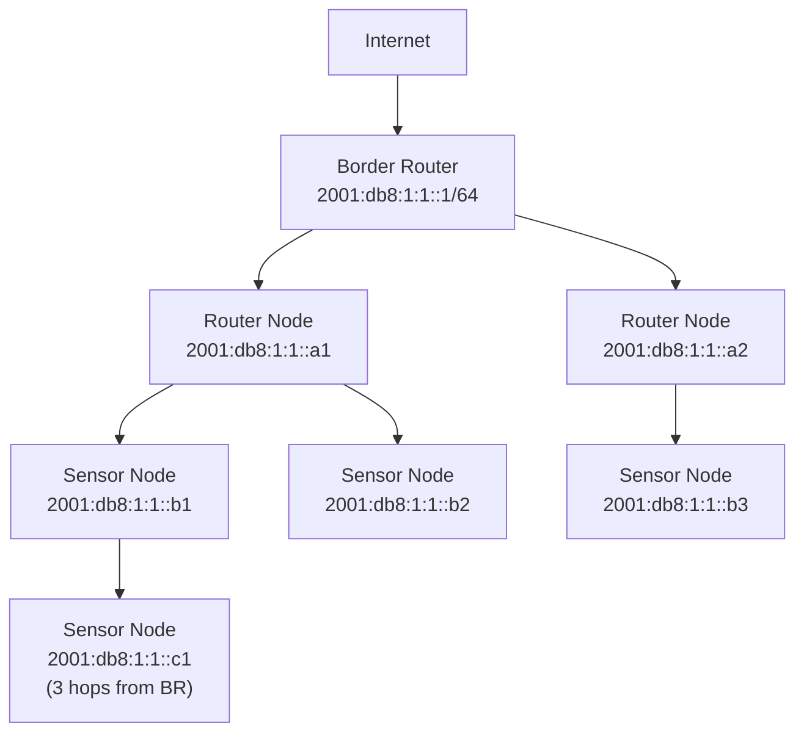

# How to Configure IPv6 Mesh Networks for IoT

Author: [nawazdhandala](https://www.github.com/nawazdhandala)

Tags: IPv6, IoT, Mesh Network, 6LoWPAN, RPL, Networking

Description: Configure IPv6 mesh networks for IoT deployments using 6LoWPAN and RPL routing, enabling multi-hop connectivity between constrained devices and a border router.

## Introduction

IPv6 mesh networks for IoT allow devices to communicate through multiple hops when direct connectivity to a border router is not possible. This is essential for large sensor deployments in buildings, factories, or outdoor environments where radio range is limited.

## Mesh Network Architecture



## RPL Routing Protocol

RPL (Routing Protocol for Low-Power and Lossy Networks, RFC 6550) is the standard routing protocol for IPv6 mesh IoT networks. It builds a DODAG (Destination-Oriented Directed Acyclic Graph) rooted at the border router.

## Setting Up a Linux-Based Border Router

```bash
# Install required packages for an IEEE 802.15.4 based mesh
sudo apt-get install wpan-tools

# Configure the 802.15.4 interface
sudo iwpan phy phy0 set channel 0 26
sudo iwpan dev wpan0 set pan_id 0xabcd
sudo iwpan dev wpan0 set short_addr 0x0001

# Create 6LoWPAN interface
sudo ip link add link wpan0 name lowpan0 type lowpan
sudo ip link set wpan0 up
sudo ip link set lowpan0 up

# Assign an IPv6 address to the border router's 6LoWPAN interface
sudo ip -6 addr add 2001:db8:1:1::1/64 dev lowpan0

# Enable IPv6 forwarding
sudo sysctl -w net.ipv6.conf.all.forwarding=1

# Set up radvd to provide prefix to the mesh
sudo tee /etc/radvd.conf > /dev/null << 'EOF'
interface lowpan0 {
    AdvSendAdvert on;
    AdvManagedFlag off;
    AdvOtherConfigFlag off;
    prefix 2001:db8:1:1::/64 {
        AdvOnLink on;
        AdvAutonomous on;
        AdvValidLifetime 86400;
        AdvPreferredLifetime 14400;
    };
};
EOF
sudo systemctl start radvd
```

## Configuring an OpenThread Mesh Network

OpenThread provides a production-ready Thread (RPL-based) mesh implementation:

```bash
# Install OpenThread CLI for development
sudo apt-get install openthread-cli

# On each router node (using OpenThread CLI):
# 1. Set the same network dataset as the border router
> dataset set active <hexdump>

# 2. Start the thread interface
> ifconfig up
> thread start

# 3. Check the device joined the mesh
> state
# router

# 4. Show routing table
> router table
# Shows all routers in the mesh with their RLOC16 and next hop

# 5. Show all addresses
> ipaddr
# Shows link-local, mesh-local EID, RLOC, and global addresses
```

## Configuring RIOT OS for Mesh Networking

```makefile
# Makefile - RIOT OS with RPL mesh networking

BOARD = iotlab-m3
USEMODULE += gnrc_ipv6_router_default
USEMODULE += gnrc_sixlowpan_full
USEMODULE += gnrc_rpl
USEMODULE += auto_init_gnrc_netif
USEMODULE += gnrc_icmpv6_echo
USEMODULE += shell
```

```c
// main.c - Initialize RPL routing on the router node

#include "net/gnrc/rpl.h"
#include "net/gnrc/netif.h"

int main(void) {
    // Get the first network interface (IEEE 802.15.4)
    gnrc_netif_t *netif = gnrc_netif_iter(NULL);

    // Initialize RPL with DODAG root at the border router
    // Instance 0, DODAG root: 2001:db8:1:1::1
    ipv6_addr_t dodag_id;
    ipv6_addr_from_str(&dodag_id, "2001:db8:1:1::1");

    // On non-root nodes, RPL will auto-join the DODAG via DIO messages
    // On the border router node, initialize as root:
    // gnrc_rpl_root_init(0, &dodag_id, false, false);

    // On regular mesh nodes, just start listening
    gnrc_rpl_init(netif->pid);

    // Start the shell for debugging
    shell_run(NULL, NULL, 0);
    return 0;
}
```

## Verifying Mesh Connectivity

```bash
# From the border router, ping a deep mesh node (3 hops away)
ping6 -c 3 2001:db8:1:1::c1

# Traceroute to see the path through the mesh
traceroute6 2001:db8:1:1::c1

# On a RIOT OS node, check RPL parent and routing table
> rpl
> nib route
```

## Conclusion

IPv6 mesh networks for IoT use 6LoWPAN for header compression, RPL for multi-hop routing, and a border router to bridge the mesh to the broader IPv6 network. Tools like OpenThread and RIOT OS provide production-ready implementations. The key insight is that RPL builds a routing topology automatically based on radio link quality, creating a self-healing mesh that routes around node failures.
