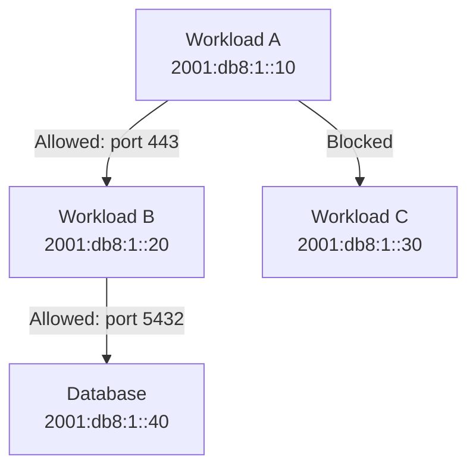

# How to Implement IPv6 Microsegmentation in Data Centers

Author: [nawazdhandala](https://www.github.com/nawazdhandala)

Tags: IPv6, Microsegmentation, Zero Trust, Data Center, Security, SDN

Description: Learn how to implement IPv6 microsegmentation in data centers using host-based firewalls, SDN policies, and prefix-based ACLs.

## What is Microsegmentation?

Microsegmentation applies security policies at the individual workload level rather than the network perimeter. In IPv6 environments, each workload has a unique address, making microsegmentation more natural than with IPv4 NAT.

## Microsegmentation Approaches



## Host-Based Firewall with nftables

Nftables is the preferred approach for per-host IPv6 microsegmentation on Linux:

```bash
# /etc/nftables.conf for a web application workload

table ip6 filter {
    chain input {
        type filter hook input priority 0; policy drop;

        # Allow loopback
        iif "lo" accept

        # Allow established/related connections
        ct state established,related accept

        # Allow ICMPv6 (required for IPv6 operation)
        ip6 nexthdr icmpv6 accept

        # Allow HTTPS from load balancer prefix only
        ip6 saddr 2001:db8:lb::/64 tcp dport 443 ct state new accept

        # Allow SSH from management network only
        ip6 saddr 2001:db8:mgmt::/64 tcp dport 22 ct state new accept

        # Log and drop everything else
        log prefix "DROPPED: " drop
    }

    chain output {
        type filter hook output priority 0; policy accept;
    }
}
```

Apply the configuration:

```bash
nft -f /etc/nftables.conf
systemctl enable nftables
```

## Kubernetes NetworkPolicy for Pod Microsegmentation

In Kubernetes, use NetworkPolicy resources to enforce IPv6 microsegmentation between pods:

```yaml
# Allow only frontend pods to reach backend on port 8080
apiVersion: networking.k8s.io/v1
kind: NetworkPolicy
metadata:
  name: backend-microseg
  namespace: production
spec:
  podSelector:
    matchLabels:
      role: backend
  policyTypes:
    - Ingress
  ingress:
    - from:
        - podSelector:
            matchLabels:
              role: frontend
      ports:
        - protocol: TCP
          port: 8080
```

## Calico for IPv6 Microsegmentation

Calico is a popular CNI that supports IPv6 microsegmentation with GlobalNetworkPolicy:

```yaml
apiVersion: projectcalico.org/v3
kind: GlobalNetworkPolicy
metadata:
  name: deny-cross-tenant
spec:
  selector: has(tenant)
  types:
    - Ingress
  ingress:
    - action: Allow
      source:
        selector: tenant == 'same-tenant-label'
    - action: Deny
```

## Prefix-Based ACLs on Top-of-Rack Switches

For hardware-enforced microsegmentation, apply IPv6 ACLs on ToR switches:

```text
# Arista EOS - IPv6 ACL for workload isolation
ipv6 access-list WORKLOAD-ISOLATION
   10 permit ipv6 2001:db8:1::10/128 2001:db8:1::20/128
   20 deny   ipv6 2001:db8:1::10/128 2001:db8:1::/64
   30 permit ipv6 any any
```

## Conclusion

IPv6 microsegmentation works at multiple layers: host-based nftables, Kubernetes NetworkPolicy, and switch ACLs. The unique per-workload address in IPv6 makes policy writing precise - you can target individual /128 addresses rather than relying on port ranges or tags.
