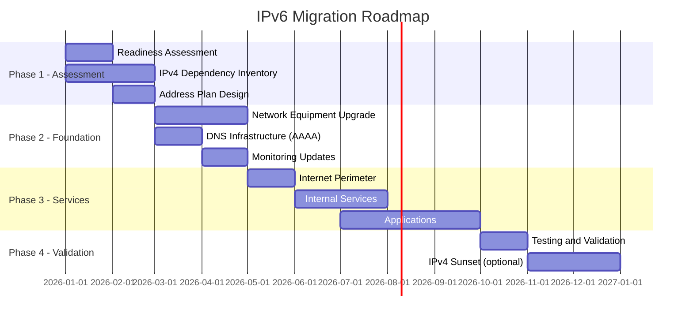

# How to Create an IPv6 Migration Roadmap

Author: [nawazdhandala](https://www.github.com/nawazdhandala)

Tags: IPv6, Migration, Planning, Network Strategy, IPv6 Transition

Description: Build a structured IPv6 migration roadmap covering assessment, planning, implementation, and validation phases with timelines and milestone definitions.

## Introduction

An IPv6 migration roadmap provides a structured timeline for transitioning from IPv4-only or IPv4-primary infrastructure to dual-stack or IPv6-capable systems. Without a roadmap, IPv6 migration tends to stall as competing priorities arise. A clear roadmap with milestones, owners, and success criteria keeps the effort on track across multi-year timelines.

## Migration Phases Overview



## Phase 1: Assessment (Months 1-2)

**Objectives:**
- Understand current IPv4 usage and dependencies
- Identify gaps in IPv6 readiness
- Design the IPv6 address plan

**Key Activities:**
1. Run IPv6 readiness assessment (hardware, software, services)
2. Inventory all IPv4-only dependencies
3. Assess ISP and cloud provider IPv6 support
4. Design hierarchical IPv6 address plan
5. Secure IPv6 address allocation from RIR or ISP

**Milestone:** Signed-off IPv6 address plan and gap analysis report

## Phase 2: Foundation (Months 3-4)

**Objectives:**
- Enable IPv6 on core infrastructure
- Avoid user-visible disruption

**Key Activities:**
1. Upgrade or replace IPv6-incapable network equipment
2. Enable IPv6 on core routers and switches
3. Configure DHCPv6 and SLAAC
4. Add AAAA records for internal DNS resolvers
5. Update monitoring tools to handle IPv6

**Milestone:** IPv6 reachable from all internal subnets; monitoring shows IPv6 traffic

## Phase 3: Services (Months 5-9)

**Objectives:**
- Enable IPv6 on all customer-facing and internal services
- Validate dual-stack operation

**Key Activities:**
1. Enable IPv6 on internet-facing services (web, mail, VPN)
2. Add AAAA DNS records for external services
3. Update load balancers for IPv6
4. Enable IPv6 on internal applications
5. Update firewall rules for IPv6 traffic
6. Enable IPv6 in CI/CD pipelines

**Milestone:** All services reachable over IPv6; traffic split shows IPv6 growth

## Phase 4: Validation and Optimization (Months 10-12)

**Objectives:**
- Confirm correct operation
- Optimize for IPv6 performance
- Plan IPv4 sunset (if applicable)

**Key Activities:**
1. Run comprehensive IPv6 acceptance tests
2. Verify Happy Eyeballs behavior in clients
3. Optimize IPv6 routing (prefix summarization, anycast)
4. Document final IPv6 address plan in IPAM
5. Set IPv4 sunset timeline if business case supports it

**Milestone:** IPv6 carries >50% of traffic; all services have AAAA records

## Roadmap Template

```markdown
# IPv6 Migration Roadmap - [Organization Name]

## Program Objectives
- Enable IPv6 on all public-facing services by Q3 2026
- Achieve dual-stack on all internal networks by Q4 2026
- Maintain service availability throughout migration

## Governance
- Executive Sponsor: [Name]
- Technical Lead: [Name]
- Teams: Networking, Security, Applications, Operations

## Milestones
| Milestone | Target Date | Owner | Status |
|-----------|-------------|-------|--------|
| Address plan approved | 2026-02-28 | Network | In Progress |
| Core network IPv6 enabled | 2026-04-30 | Network | Planned |
| DNS AAAA records live | 2026-05-15 | DNS/Ops | Planned |
| Public services dual-stack | 2026-06-30 | Apps | Planned |
| All services dual-stack | 2026-09-30 | All | Planned |
| IPv6 validation complete | 2026-11-30 | QA | Planned |

## Success Criteria
- Zero service outages caused by IPv6 migration
- All services respond on AAAA addresses
- IPv6 traffic > 40% of total within 6 months of launch
- All monitoring alerts work for IPv6 addresses
```

## Common Roadmap Pitfalls

| Pitfall | Mitigation |
|---------|-----------|
| No executive sponsor | Secure sponsorship before starting |
| Missing application changes | Inventory IPv4 hardcoding early |
| Firewall rules copied without review | Audit before enabling IPv6 policies |
| Monitoring not updated | Include monitoring in Phase 2 |
| Skipping staging tests | Test all services in staging with IPv6-only clients |

## Conclusion

An effective IPv6 migration roadmap follows four phases: Assessment (understand gaps), Foundation (core infrastructure), Services (application-level enablement), and Validation. Keep phases short (1-3 months each) with clear milestones to maintain momentum. Prioritize enabling IPv6 on DNS and monitoring in Phase 2 - this provides visibility before broader rollout and catches issues early without user impact.
