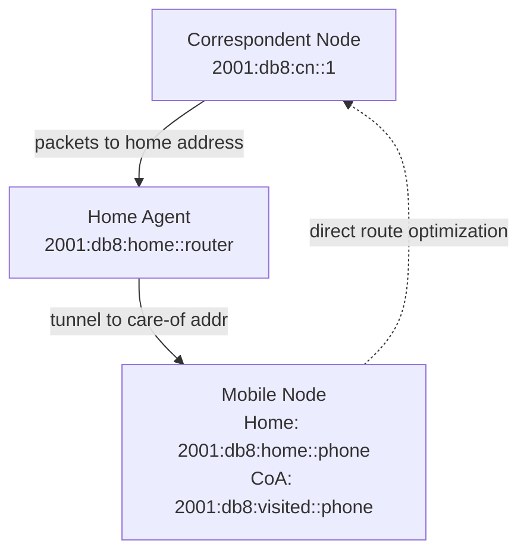

# How to Understand the Mobility Header in IPv6

Author: [nawazdhandala](https://www.github.com/nawazdhandala)

Tags: IPv6, Mobility, MIPv6, Extension Headers, RFC 6275

Description: Understand the IPv6 Mobility Header extension header used by Mobile IPv6 (MIPv6) for enabling mobile nodes to maintain connectivity while changing IP addresses.

## Introduction

The IPv6 Mobility Header (Next Header = 135) is an extension header defined by RFC 6275 for Mobile IPv6 (MIPv6). It enables mobile nodes to maintain network connections while moving between networks and changing their IP addresses. The key concept: a mobile node has a permanent "home address" and a temporary "care-of address" at its current network location.

## Core Mobile IPv6 Concepts



## Mobile IPv6 Addresses

```
Home Address (HoA):
  - Permanent address assigned from the home network
  - e.g., 2001:db8:home::phone
  - Used as source/destination by applications
  - Stable across movements

Care-of Address (CoA):
  - Temporary address acquired at the current location
  - e.g., 2001:db8:visited::phone (via SLAAC at visited network)
  - Used as the actual routing address
  - Changes as the mobile node moves

Home Agent (HA):
  - Router at the home network
  - Receives packets sent to the home address
  - Forwards them to the mobile node's current CoA
  - Maintains the home address binding

Binding:
  - The association: Home Address ↔ Care-of Address
  - Stored at the Home Agent
```

## Mobility Header Format

```
 0                   1                   2                   3
 0 1 2 3 4 5 6 7 8 9 0 1 2 3 4 5 6 7 8 9 0 1 2 3 4 5 6 7 8 9 0 1
+-+-+-+-+-+-+-+-+-+-+-+-+-+-+-+-+-+-+-+-+-+-+-+-+-+-+-+-+-+-+-+-+
|  Payload Proto|  Header Len   |   MH Type     |   Reserved    |
+-+-+-+-+-+-+-+-+-+-+-+-+-+-+-+-+-+-+-+-+-+-+-+-+-+-+-+-+-+-+-+-+
|           Checksum            |                               |
+-+-+-+-+-+-+-+-+-+-+-+-+-+-+-+-+  MH Data  ....               |
|                                                               |
+-+-+-+-+-+-+-+-+-+-+-+-+-+-+-+-+-+-+-+-+-+-+-+-+-+-+-+-+-+-+-+-+

Payload Proto: Usually 59 (No Next Header) - MH is usually last
Header Len:    Length in 8-byte units (not including first 8 bytes)
MH Type:       Message type (see below)
Checksum:      ICMPv6-style checksum including pseudo-header
```

## Mobility Header Message Types

| MH Type | Name | Purpose |
|---|---|---|
| 0 | Binding Refresh Request | HA → MN: renew binding |
| 1 | Home Test Init (HoTI) | RO: verify home address |
| 2 | Care-of Test Init (CoTI) | RO: verify care-of address |
| 3 | Home Test (HoT) | RO: home address token |
| 4 | Care-of Test (CoT) | RO: care-of address token |
| 5 | Binding Update (BU) | MN → HA/CN: register CoA |
| 6 | Binding Acknowledgement (BA) | HA/CN → MN: confirm binding |
| 7 | Binding Error (BE) | Error in binding |

## MIPv6 Message Flow

```
Mobile Node changes network:
1. MN acquires new Care-of Address via SLAAC at visited network
2. MN sends Binding Update (MH Type 5) to Home Agent
   → src = CoA, dst = HA address
   → Mobility Header: BU with Home Address, lifetime
   → Protected by IPsec (AH or ESP between MN and HA)
3. HA acknowledges with Binding Acknowledgement (MH Type 6)
4. HA intercepts packets sent to MN's home address
5. HA tunnels them to MN's CoA using IPv6-in-IPv6 tunnel

Route Optimization (optional, RFC 6275 Section 11):
1. MN performs Return Routability procedure with CN
2. MN sends BU directly to CN
3. CN sends packets directly to CoA (instead of via HA)
```

## Inspecting Mobility Traffic

```bash
# Capture IPv6 Mobility Header packets
sudo tcpdump -i eth0 "ip6[6] == 135"

# Verbose output to see MH type
sudo tcpdump -i eth0 -vv "ip6[6] == 135"

# Example output:
# 2001:db8::phone.61935 > 2001:db8:home::1.0: DSTOPT
#   (next-header Mobility Header (135), length 24)
#   Binding Update (5), length 24, seq 1234, lifetime 300
```

## Practical MIPv6 Status

While MIPv6 is fully specified and implemented in Linux, it has seen limited widespread deployment due to:

1. **Complexity**: Requires Home Agent infrastructure
2. **NEMO competition**: IPv6 Network Mobility (RFC 3963) for mobile routers
3. **Alternative approaches**: MPTCP, SCTP, application-layer mobility
4. **Latency**: Triangle routing through the HA adds latency
5. **Route optimization requires IPsec**: Adds deployment complexity

Linux kernel support is available via the UMIP project:

```bash
# Check if MIPv6 mobility support is compiled in
grep -i mobile /boot/config-$(uname -r)
# CONFIG_IPV6_MIP6=m or CONFIG_IPV6_MIP6=y

# Load the module
sudo modprobe mip6
```

## Conclusion

The IPv6 Mobility Header enables mobile nodes to maintain persistent connections while changing networks. While technically complete and standardized, MIPv6 deployment has been limited in practice — most mobile connectivity today is handled at the application layer or through multiple access technologies. Understanding the Mobility Header is valuable for network engineers working with mobile operator infrastructure, UMIP-based mobile networks, and environments where IP-layer mobility is required for non-TCP protocols.
