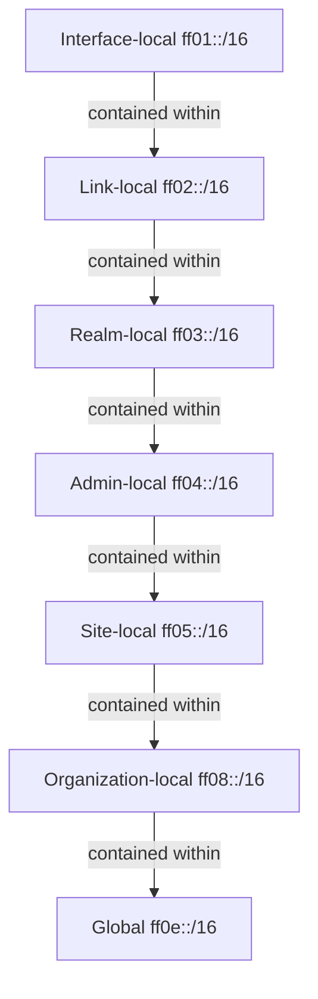

# How to Understand IPv6 Multicast Scope Levels

Author: [nawazdhandala](https://www.github.com/nawazdhandala)

Tags: IPv6, Multicast, Network Scope, Routing, RFC 4291

Description: An explanation of IPv6 multicast scope levels and how they control the geographic or administrative reach of multicast traffic in network deployments.

## What Are Multicast Scopes?

IPv6 multicast addresses include a 4-bit scope field that determines how far multicast traffic travels. Routers use this scope to decide whether to forward multicast packets beyond certain boundaries, preventing multicast traffic from leaking outside its intended reach.

## The Four Commonly Used Scopes

### Scope 1: Interface-Local (Node-Local)

```text
Prefix: ff01::/16
Example: ff01::1 (all nodes, interface-local)
```

Traffic with this scope never leaves the network interface - it stays within the same node. It's used for loopback multicast testing. Routers never forward interface-local multicast.

### Scope 2: Link-Local

```text
Prefix: ff02::/16
Examples: ff02::1 (all nodes), ff02::2 (all routers), ff02::fb (mDNS)
```

Link-local scope is the most commonly used scope. Traffic is confined to a single network link (broadcast domain). Routers do not forward link-local multicast to other links. This is used for neighbor discovery, DHCPv6, and routing protocol hellos.

### Scope 5: Site-Local

```text
Prefix: ff05::/16
Examples: ff05::1:3 (DHCPv6 all servers), ff05::101 (NTP servers)
```

Site-local scope allows multicast within a campus or site. The definition of "site" is administratively determined. Routers configured as site boundaries do not forward site-local multicast beyond those boundaries.

### Scope E (14): Global

```text
Prefix: ff0e::/16
Examples: ff0e::101 (NTP, global)
```

Global scope multicast can travel anywhere on the internet (with appropriate routing configuration). This is used for internet-wide multicast applications like some video streaming protocols.

## Scope Hierarchy



## Scope and Router Behavior

| Scope | Router forwards? | Use case |
|---|---|---|
| Interface-local (1) | Never | Loopback testing |
| Link-local (2) | Never beyond link | NDP, DHCPv6, mDNS, OSPFv3 hellos |
| Site-local (5) | Within site | DHCPv6 servers, NTP |
| Global (e) | Globally (with PIM) | Internet multicast streams |

## Configuring Scope Boundaries on Routers

Cisco IOS example for configuring multicast scope boundaries:

```cisco
! Define a site boundary - don't forward ff05::/16 beyond this interface
interface GigabitEthernet0/0
 ipv6 multicast boundary scope 5
```

Linux `ip6tables` example for enforcing scope boundaries:

```bash
# Block site-local multicast from leaving the site uplink

ip6tables -A FORWARD -d ff05::/16 -o wan0 -j DROP

# Block global multicast from entering the internal network (if not expected)
# ip6tables -A FORWARD -d ff0e::/16 -i wan0 -j DROP
```

## Testing Scope Behavior

```bash
# Send a multicast ping to link-local all-nodes (should reach all hosts on link)
ping6 ff02::1%eth0

# Send a site-local multicast ping (reaches further within the site)
ping6 ff05::1

# Observe which scope multicast groups are joined
ip -6 maddr show dev eth0 | grep 'ff0'

# Check routing configuration for multicast
ip -6 route show table local | grep 'ff'
```

## Common Scope Mistakes

**Mistake**: Using global scope (`ff0e::`) for internal multicast that should stay local.
**Impact**: Multicast traffic may leak to the internet or be blocked by ISP filters.
**Fix**: Use site-local (`ff05::`) or admin-local (`ff04::`) for internal groups.

**Mistake**: Using link-local scope for a service that must reach multiple subnets.
**Impact**: Service discovery (like mDNS) doesn't cross subnet boundaries.
**Fix**: Use site-local scope or deploy proxy services (e.g., Avahi mDNS proxy) at router boundaries.

## Admin-Local and Organization-Local

While less common, these scopes provide fine-grained control:

- **Admin-local (4)**: Smaller than site-local, useful for data centers with multiple sections
- **Organization-local (8)**: Larger than site-local, spans multiple sites within one organization

Organizations using these scopes must configure their routers with matching multicast boundaries.

## Summary

IPv6 multicast scope levels control how far multicast traffic travels: interface-local (loopback), link-local (single segment), site-local (campus), and global (internet). The scope is encoded in the third nibble of the `ff` prefix. Routers enforce scope boundaries by refusing to forward multicast packets to scopes larger than the configured boundary. Use the appropriate scope for your use case - link-local for neighbor discovery, site-local for internal services, and global only for internet multicast.
