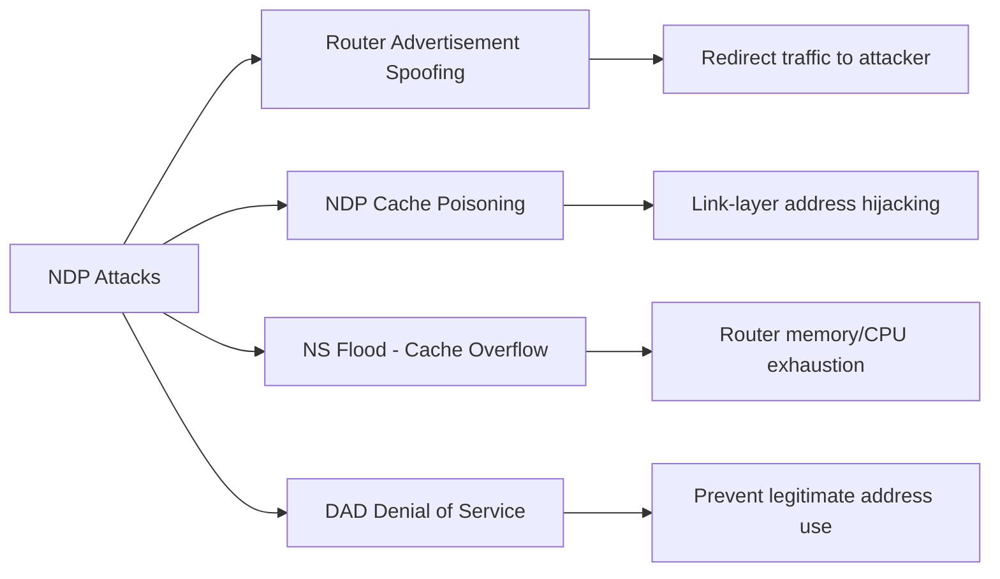

# How to Detect NDP Attacks with SIEM

Author: [nawazdhandala](https://www.github.com/nawazdhandala)

Tags: NDP, IPv6, SIEM, Attack Detection, Security, Suricata, Router Advertisement

Description: Detect NDP-based IPv6 attacks including rogue Router Advertisements, Neighbor Solicitation floods, and NDP cache poisoning using SIEM rules, Suricata IDS, and network monitoring.

## NDP Attack Types



## Attack 1: Rogue Router Advertisement Detection

```bash
# Suricata IDS rule: detect RA from unauthorized source
# /etc/suricata/rules/ipv6-ndp.rules

# All RA messages (ICMPv6 type 134)
alert icmp6 any any -> ff02::1 any (
    msg:"ICMPv6 Router Advertisement Detected";
    itype:134;
    sid:9002001; rev:1;
    classtype:protocol-command-decode;
)

# RA from link-local (expected from routers)
# Flag non-link-local RA sources as suspicious
alert icmp6 !fe80::/10 any -> any any (
    msg:"Suspicious IPv6 Router Advertisement - Non-Link-Local Source";
    itype:134;
    priority:1;
    sid:9002002; rev:1;
    classtype:bad-unknown;
)

# High-frequency RA flooding (DoS)
alert icmp6 any any -> any any (
    msg:"IPv6 RA Flood Detected";
    itype:134;
    threshold: type both, track by_src, count 10, seconds 5;
    sid:9002003; rev:1;
    classtype:attempted-dos;
)
```

## Attack 2: NDP Cache Poisoning Detection

```bash
# Cache poisoning: NA sent unsolicited claiming to own address
# Attacker sends Neighbor Advertisement with O=1 (Override) for victim's address

# Suricata: detect unsolicited NA (NA without prior NS)
alert icmp6 any any -> any any (
    msg:"Possible NDP Cache Poisoning - Unsolicited Neighbor Advertisement";
    itype:136;
    # Override flag set (byte 4 of ICMPv6 data, bit 5 = 0x20)
    icmp6.hdr:5,1,0x20,0x20;
    threshold: type both, track by_src, count 5, seconds 10;
    sid:9002004; rev:1;
    classtype:bad-unknown;
)
```

```bash
# Linux: Monitor for unexpected neighbor table changes
#!/bin/bash
# watch-ndp-changes.sh — Detect NDP cache poisoning

LOGFILE="/var/log/ndp-changes.log"

ip monitor neigh dev eth0 | while read -r line; do
    echo "$(date '+%Y-%m-%d %H:%M:%S') ${line}" >> "${LOGFILE}"

    # Alert on LLADDR change for existing entry
    if echo "${line}" | grep -q "STALE\|REACHABLE"; then
        ADDR=$(echo "${line}" | awk '{print $1}')
        MAC=$(echo "${line}" | awk '{print $5}')

        # Check previous MAC for this address
        PREV_MAC=$(grep "${ADDR}" "${LOGFILE}" | tail -2 | head -1 | awk '{print $7}')

        if [ -n "${PREV_MAC}" ] && [ "${MAC}" != "${PREV_MAC}" ]; then
            echo "$(date): ALERT: MAC changed for ${ADDR}: ${PREV_MAC} → ${MAC}" \
                >> "${LOGFILE}"
            logger -p local0.warning "NDP: MAC changed ${ADDR}: ${PREV_MAC} -> ${MAC}"
        fi
    fi
done
```

## Attack 3: NS Flood Detection

```
# Splunk: detect NDP NS flooding (cache overflow attack)

index=firewall protocol=icmpv6 icmpv6_type=135
| bin _time span=1m
| stats
    count as ns_count,
    dc(src_ip) as unique_sources,
    dc(dst_ip) as unique_targets
    by _time
| eval attack_type=case(
    ns_count > 1000 AND unique_sources < 3, "single_source_ns_flood",
    ns_count > 500 AND unique_sources > 50, "distributed_ns_flood",
    unique_targets > 200 AND ns_count > 500, "prefix_scan_via_ns"
)
| where isnotnull(attack_type)
| table _time, ns_count, unique_sources, unique_targets, attack_type
```

```bash
# Real-time monitoring: NDP incomplete entry threshold
#!/bin/bash
THRESHOLD_WARN=500
THRESHOLD_CRIT=1000
INTERVAL=10

while true; do
    INCOMPLETE=$(ip -6 neigh show nud incomplete | wc -l)
    FAILED=$(ip -6 neigh show nud failed | wc -l)
    TOTAL=$((INCOMPLETE + FAILED))

    if [ ${TOTAL} -gt ${THRESHOLD_CRIT} ]; then
        logger -p local0.crit "NDP CRITICAL: ${TOTAL} incomplete/failed entries (attack likely)"
        # Optional: rate limit NS with nftables
        nft insert rule ip6 filter input icmpv6 type nd-neighbor-solicit \
            limit rate over 100/second drop
    elif [ ${TOTAL} -gt ${THRESHOLD_WARN} ]; then
        logger -p local0.warning "NDP WARNING: ${TOTAL} incomplete/failed entries"
    fi

    sleep ${INTERVAL}
done
```

## Attack 4: DAD DoS Detection

```bash
# DAD DoS: attacker responds to every DAD NS with NA
# Prevents legitimate hosts from acquiring addresses

# Suricata: detect rapid NA responses to DAD (NS to solicited-node multicast)
alert icmp6 any any -> any any (
    msg:"IPv6 DAD Denial of Service - Rapid NA Response";
    itype:136;
    # Solicited flag NOT set (S=0) — unsolicited NA typical in DAD DoS
    icmp6.hdr:5,1,0x40,0x00;
    threshold: type threshold, track by_src, count 20, seconds 10;
    sid:9002005; rev:1;
    classtype:attempted-dos;
)
```

## SIEM Alert Aggregation

```yaml
# Prometheus alerting rules for NDP security
# (Requires custom exporter or textfile collector)

groups:
  - name: ndp_security
    rules:
      - alert: RogueRADetected
        expr: ndp_ra_messages{source_type!="authorized_router"} > 0
        for: 0m
        labels:
          severity: critical
        annotations:
          summary: "Rogue RA from {{ $labels.source_ip }}"

      - alert: NDPCacheOverflow
        expr: ndp_incomplete_entries > 500
        for: 2m
        labels:
          severity: critical
        annotations:
          summary: "NDP cache overflow: {{ $value }} incomplete entries"

      - alert: NDPMACChanged
        expr: ndp_lladdr_changes_total > 0
        for: 0m
        labels:
          severity: high
        annotations:
          summary: "NDP MAC address change detected for {{ $labels.ip_address }}"
```

## Conclusion

NDP attack detection requires monitoring at multiple layers: IDS signatures (Suricata) for real-time packet-level detection, kernel NDP table monitoring for cache overflow and MAC changes, and SIEM correlation for multi-event attack patterns. The most critical rules: RA from non-link-local sources (rogue RA), NA with Override flag at high rate (cache poisoning), INCOMPLETE entry count > 500 (NS flood), and MAC changes for established NDP entries (cache poisoning). Enable RA Guard on switches as a preventive control — detection rules catch what RA Guard misses or what comes through trusted ports.
