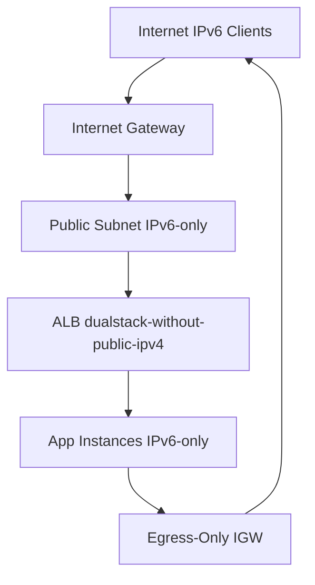

# How to Create IPv6-Only Infrastructure with Terraform

Author: [nawazdhandala](https://www.github.com/nawazdhandala)

Tags: Terraform, IPv6, Infrastructure as Code, Networking, Cloud Architecture

Description: A guide to provisioning fully IPv6-only cloud infrastructure with Terraform, covering VPCs, instances, and DNS without any IPv4 dependencies.

IPv6-only infrastructure eliminates the need for IPv4 address management, NAT gateways, and dual-stack complexity. AWS, GCP, and Hetzner all support IPv6-only deployments. This guide shows how to build a complete IPv6-only stack with Terraform on AWS.

## AWS IPv6-Only Architecture



## Step 1: VPC with IPv6 Only (No IPv4 Required for Instances)

```hcl
# vpc.tf - VPC set up for IPv6-only instance connectivity
resource "aws_vpc" "ipv6_only" {
  cidr_block                       = "10.0.0.0/16"  # Required by AWS but not assigned to instances
  assign_generated_ipv6_cidr_block = true
  enable_dns_support               = true
  enable_dns_hostnames             = true

  tags = { Name = "ipv6-only-vpc" }
}
```

## Step 2: IPv6-Only Subnet

```hcl
# subnet.tf - Subnet configured for IPv6-only instance addressing
resource "aws_subnet" "ipv6_only" {
  vpc_id            = aws_vpc.ipv6_only.id
  cidr_block        = "10.0.1.0/24"  # Required by AWS; instances won't get public IPv4
  ipv6_cidr_block   = cidrsubnet(aws_vpc.ipv6_only.ipv6_cidr_block, 8, 0)
  availability_zone = "us-east-1a"

  # Do NOT assign public IPv4 addresses
  map_public_ip_on_launch = false

  # Assign IPv6 addresses automatically
  assign_ipv6_address_on_creation = true

  # Enable IPv6-only subnet mode (no IPv4 for instances)
  enable_resource_name_dns_aaaa_record_on_launch = true

  tags = { Name = "ipv6-only-subnet" }
}
```

## Step 3: IPv6-Only EC2 Instance

```hcl
# instance.tf - EC2 instance with IPv6 address only (no public IPv4)
resource "aws_instance" "app" {
  ami           = data.aws_ami.ubuntu.id
  instance_type = "t3.micro"
  subnet_id     = aws_subnet.ipv6_only.id

  # Do not associate a public IPv4 address
  associate_public_ip_address = false

  # Instance will receive an IPv6 address from the subnet's /64
  ipv6_address_count = 1

  vpc_security_group_ids = [aws_security_group.app.id]

  tags = { Name = "app-ipv6-only" }
}

output "instance_ipv6" {
  value = aws_instance.app.ipv6_addresses[0]
}
```

## Step 4: Internet Gateway and Default IPv6 Route

```hcl
# igw.tf and routes.tf
resource "aws_internet_gateway" "main" {
  vpc_id = aws_vpc.ipv6_only.id
}

resource "aws_route_table" "ipv6_only" {
  vpc_id = aws_vpc.ipv6_only.id

  # Only IPv6 default route — no IPv4 default route
  route {
    ipv6_cidr_block = "::/0"
    gateway_id      = aws_internet_gateway.main.id
  }

  tags = { Name = "ipv6-only-rt" }
}

resource "aws_route_table_association" "ipv6_only" {
  subnet_id      = aws_subnet.ipv6_only.id
  route_table_id = aws_route_table.ipv6_only.id
}
```

## Step 5: Security Group with IPv6-Only Rules

```hcl
# sg.tf - Security group with only IPv6 rules
resource "aws_security_group" "app" {
  name   = "app-ipv6-only-sg"
  vpc_id = aws_vpc.ipv6_only.id

  # SSH from specific IPv6 admin prefix
  ingress {
    from_port        = 22; to_port = 22; protocol = "tcp"
    ipv6_cidr_blocks = ["2001:db8:admin::/48"]
  }

  # HTTP/HTTPS from all IPv6
  ingress {
    from_port        = 80; to_port = 443; protocol = "tcp"
    ipv6_cidr_blocks = ["::/0"]
  }

  # All outbound IPv6
  egress {
    from_port        = 0; to_port = 0; protocol = "-1"
    ipv6_cidr_blocks = ["::/0"]
  }
}
```

## Step 6: AAAA Record for the IPv6-Only Instance

```hcl
# dns.tf
resource "aws_route53_record" "app_aaaa" {
  zone_id = data.aws_route53_zone.main.zone_id
  name    = "app.example.com"
  type    = "AAAA"
  ttl     = 300
  records = [aws_instance.app.ipv6_addresses[0]]
}
```

## Apply and Verify

```bash
terraform apply

# Verify the instance has no IPv4 public address
INSTANCE_IPV6=$(terraform output -raw instance_ipv6)
echo "Instance IPv6: $INSTANCE_IPV6"

# Connect via IPv6
ssh -6 ubuntu@"$INSTANCE_IPV6"

# Test outbound IPv6 internet access
ssh -6 ubuntu@"$INSTANCE_IPV6" 'curl -6 https://ipv6.icanhazip.com'
```

IPv6-only infrastructure reduces operational complexity and cost (no NAT Gateway fees), while future-proofing deployments as IPv4 exhaustion continues to drive adoption of IPv6-native networking.
