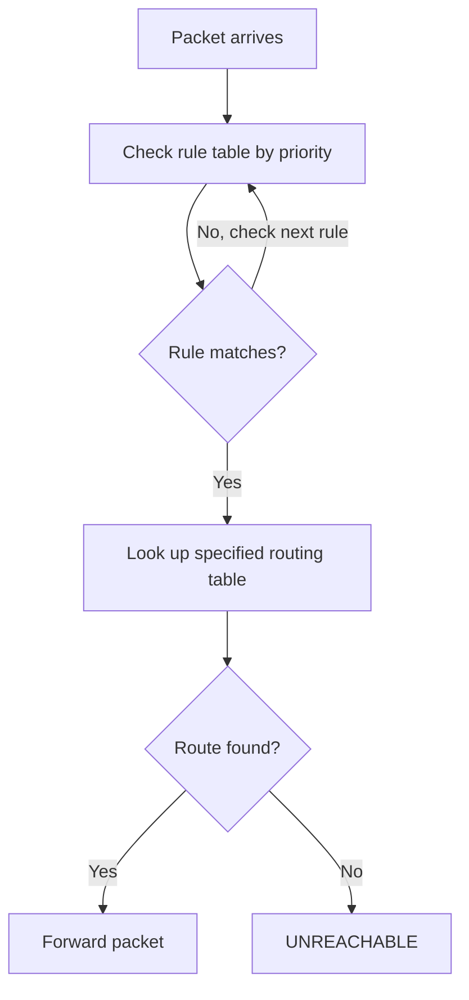

# How to Configure IPv6 Policy-Based Routing on Linux

Author: [nawazdhandala](https://www.github.com/nawazdhandala)

Tags: IPv6, Linux, Policy Routing, ip rule, Networking

Description: Learn how to configure IPv6 policy-based routing (PBR) on Linux using ip rules and multiple routing tables to route traffic based on source address or other criteria.

## Overview

IPv6 Policy-Based Routing (PBR) allows traffic to be routed differently based on attributes beyond the destination address — such as source address, incoming interface, or mark. Linux implements PBR using **routing rules** (`ip rule`) and multiple **routing tables**.

## How PBR Works

The routing decision process:



Default rules (priority 0, 32766, 32767) handle normal routing. Custom rules are inserted with lower priority numbers to take precedence.

## Viewing Current IPv6 Rules

```bash
# Show all IPv6 routing rules
ip -6 rule show

# Default output:
# 0:     from all lookup local
# 32766: from all lookup main
# 32767: from all lookup default
```

## Use Case: Multi-Homed Server with Two ISPs

Route traffic based on source address — packets from `2001:db8:1::/64` use ISP1, packets from `2001:db8:2::/64` use ISP2:

```bash
# Step 1: Create separate routing tables for each ISP
# Table IDs 100 and 200 (or add named entries to /etc/iproute2/rt_tables)
echo "100 isp1" >> /etc/iproute2/rt_tables6
echo "200 isp2" >> /etc/iproute2/rt_tables6

# Step 2: Add default routes in each table
sudo ip -6 route add default via fe80::isp1 dev eth0 table 100
sudo ip -6 route add default via fe80::isp2 dev eth1 table 200

# Step 3: Add connected networks to each table
sudo ip -6 route add 2001:db8:1::/64 dev eth0 table 100
sudo ip -6 route add 2001:db8:2::/64 dev eth1 table 200

# Step 4: Add routing rules to select the table based on source address
sudo ip -6 rule add from 2001:db8:1::/64 lookup 100 priority 100
sudo ip -6 rule add from 2001:db8:2::/64 lookup 200 priority 200
```

## Verifying PBR Rules

```bash
# Show rules
ip -6 rule show
# 100: from 2001:db8:1::/64 lookup isp1
# 200: from 2001:db8:2::/64 lookup isp2
# 32766: from all lookup main

# Simulate routing decision for a source address
ip -6 route get 2001:4860:4860::8888 from 2001:db8:1::10
# Should show route via ISP1 gateway

ip -6 route get 2001:4860:4860::8888 from 2001:db8:2::10
# Should show route via ISP2 gateway
```

## Routing by Incoming Interface

```bash
# Route traffic arriving on eth2 through a specific table
sudo ip -6 rule add iif eth2 lookup 300 priority 300
sudo ip -6 route add default via fe80::3 dev eth3 table 300
```

## Routing by Firewall Mark

Combined with `ip6tables` or `nftables`, you can mark packets and route them:

```bash
# Mark packets destined for port 443 with mark 10
sudo ip6tables -t mangle -A OUTPUT -p tcp --dport 443 -j MARK --set-mark 10

# Route marked packets through table 400
sudo ip -6 rule add fwmark 10 lookup 400 priority 400
sudo ip -6 route add default via fe80::4 dev eth2 table 400
```

## Making PBR Rules Persistent

Use systemd-networkd with `RoutingPolicyRule` sections, or a startup script:

```bash
# /etc/rc.local or a systemd service
ip -6 rule add from 2001:db8:1::/64 lookup 100 priority 100
ip -6 rule add from 2001:db8:2::/64 lookup 200 priority 200
```

```ini
# /etc/systemd/network/10-eth0.network (systemd-networkd)
[RoutingPolicyRule]
From=2001:db8:1::/64
Table=100
Priority=100
Family=IPv6
```

## Summary

IPv6 PBR on Linux uses `ip -6 rule` to map traffic attributes to routing tables, and each table holds its own set of routes. Common use cases include multi-homing, traffic engineering, and VRF-like isolation. Always verify rule behavior with `ip -6 route get <dst> from <src>`.
