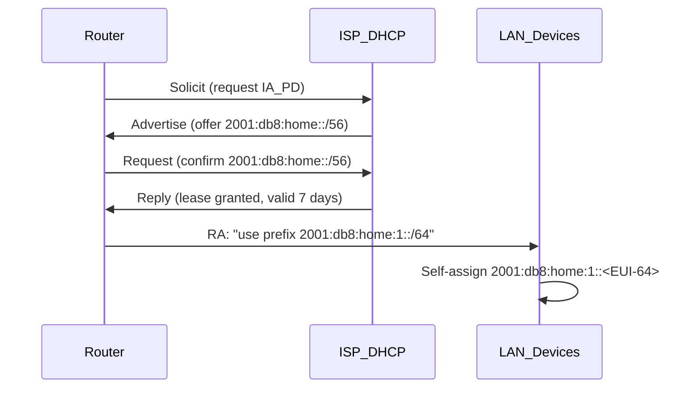

# How to Understand IPv6 Prefix Delegation in Home Networks

Author: [nawazdhandala](https://www.github.com/nawazdhandala)

Tags: IPv6, Prefix Delegation, DHCPv6-PD, Home Networking, SLAAC

Description: Understand how IPv6 Prefix Delegation works in home networks, how your router gets a prefix, and how devices use it to self-configure addresses.

## The Problem Prefix Delegation Solves

In IPv4, your home router gets one public IP address and uses NAT to share it across all devices. In IPv6, NAT is not needed — but you still need a way to give your entire home network a block of IPv6 addresses that belong to your ISP allocation.

This is what DHCPv6 Prefix Delegation (PD) does — it delegates a block of IPv6 addresses to your router.

## How Prefix Delegation Works



## What You Get

A typical ISP delegates a `/56` prefix to residential customers. This gives your router:
- 256 individual `/64` subnets (one per VLAN or network segment)
- Each `/64` supports trillions of device addresses

```
ISP delegates: 2001:db8:home::/56
Your router uses for LAN: 2001:db8:home:1::/64
Your router uses for IoT VLAN: 2001:db8:home:10::/64
Your router uses for Guest: 2001:db8:home:20::/64
```

## How Devices Get IPv6 Addresses

Once the router has a `/64` subnet, it sends Router Advertisement (RA) messages:

```
Router Advertisement (sent by your router):
  - Prefix: 2001:db8:home:1::/64
  - Valid lifetime: 30 days
  - Preferred lifetime: 7 days
  - M flag: 0 (use SLAAC, not DHCPv6)
  - O flag: 1 (use DHCPv6 for options like DNS)
```

Each device that receives this RA:
1. Takes the `/64` prefix from the RA
2. Generates an Interface ID (either EUI-64 from MAC, or a random privacy address)
3. Combines them to form a full `/128` address
4. Verifies the address is unique using DAD (Duplicate Address Detection)

## Understanding the /64 Requirement

IPv6 SLAAC requires a `/64` subnet on every link. This is why ISPs delegate at least a `/60` (16 subnets) or `/56` (256 subnets) — to ensure the router has enough room to assign a full `/64` to each interface.

You cannot use a `/65` or larger for SLAAC — it won't work.

## Checking Your Delegated Prefix

From your router:

```bash
# On OpenWRT: check delegated prefix
ip -6 addr show dev br-lan | grep "scope global"

# Expected: 2001:db8:home:1::1/64
# The /64 here is a sub-prefix of the /56 delegated by ISP
```

From a device on your network:

```bash
# Shows the full IPv6 address your device auto-configured
ip -6 addr show scope global
# or on Mac/Windows: ifconfig en0 / ipconfig
```

## Prefix Delegation Renewal

Prefixes have a lifetime. Your router renews the delegation before expiry:
- **Preferred Lifetime**: After this, new connections prefer other addresses
- **Valid Lifetime**: After this, the address is no longer usable

Most ISPs set valid lifetimes of 7-30 days with preferred lifetimes slightly shorter. Your router renews automatically.

## What If the ISP Changes Your Prefix?

If the ISP reassigns you a different `/56` (after a modem replacement or reconfiguration), all devices update automatically within minutes via new RA messages.

## Conclusion

IPv6 Prefix Delegation is the mechanism that gives your entire home network a proper block of IPv6 addresses from your ISP. Your router requests the block, sub-divides it into `/64` subnets, and sends Router Advertisements so devices can self-configure their addresses automatically — no manual assignment needed.
