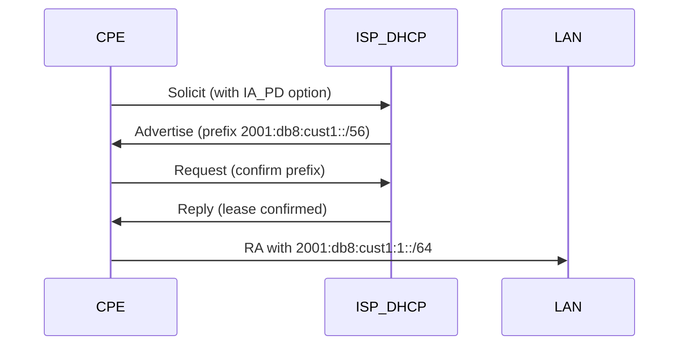

# How to Configure IPv6 Prefix Delegation for ISP Customers

Author: [nawazdhandala](https://www.github.com/nawazdhandala)

Tags: IPv6, Prefix Delegation, DHCPv6-PD, ISP, Router, CPE

Description: Configure DHCPv6 Prefix Delegation (PD) to automatically assign IPv6 prefixes to ISP customer premises equipment (CPE).

## What is DHCPv6 Prefix Delegation?

DHCPv6 Prefix Delegation (RFC 3633) allows an ISP to automatically delegate a block of IPv6 addresses to a customer's router (CPE). The CPE then sub-divides that prefix to assign addresses to internal devices.



## ISC Kea DHCPv6 Server Configuration

Configure Kea to delegate /56 prefixes to residential customers:

```json
{
  "Dhcp6": {
    "interfaces-config": {
      "interfaces": ["eth0"]
    },
    "lease-database": {
      "type": "memfile",
      "persist": true,
      "name": "/var/lib/kea/dhcp6.leases"
    },
    "subnet6": [
      {
        "id": 1,
        "subnet": "2001:db8:0100::/40",
        "pd-pools": [
          {
            "prefix": "2001:db8:0100::",
            "prefix-len": 40,
            "delegated-len": 56,
            "excluded-prefix": "2001:db8:0100::",
            "excluded-prefix-len": 48
          }
        ],
        "option-data": [
          {
            "name": "dns-servers",
            "data": "2001:db8:dns::1, 2001:db8:dns::2"
          }
        ]
      }
    ]
  }
}
```

## ISC DHCP (dhcpd) Alternative

For ISCs older dhcpd, configure PD like this:

```
# dhcpd6.conf
subnet6 2001:db8:0100::/40 {
    prefix6 2001:db8:0100:: 2001:db8:01ff:: /56;

    option dhcp6.name-servers 2001:db8:dns::1;
}
```

## CPE Configuration (Linux/OpenWRT)

The CPE router requests a prefix using DHCPv6-PD. On Linux with `dhclient`:

```bash
# /etc/dhcp/dhclient6.conf
interface "eth0" {
    send dhcp6.ia-pd 1;   # Request prefix delegation
    request dhcp6.name-servers, dhcp6.domain-search;
}
```

On OpenWRT (typical residential router):

```
# /etc/config/network
config interface 'wan6'
    option ifname  'eth0.2'
    option proto   'dhcpv6'
    option reqprefix '56'    # Request a /56 from ISP

config interface 'lan'
    option proto   'static'
    option ip6assign '64'    # Use /64 from delegated prefix for LAN
```

## Verifying Delegation

Check that the CPE received and is using the delegated prefix:

```bash
# On Linux CPE: check received prefix
journalctl -u dhclient6 | grep "prefix"

# Check that the delegated prefix is assigned to LAN interface
ip -6 addr show dev br-lan

# Verify RA is advertising the prefix to LAN clients
radvdump
```

## Radius-Based Prefix Assignment

For ISPs managing prefix delegation centrally via RADIUS:

```
# FreeRADIUS users file - assign specific prefix per customer
customer@isp.com Cleartext-Password := "password"
    Framed-IPv6-Prefix = "2001:db8:cust1::/56",
    Delegated-IPv6-Prefix = "2001:db8:cust1::/56"
```

## Conclusion

DHCPv6 Prefix Delegation is the standard mechanism for ISPs to provide IPv6 to customers. Configuring ISC Kea with appropriate PD pools, combined with customer CPE using `dhcpv6` protocol, enables automatic prefix assignment without manual configuration per customer.
