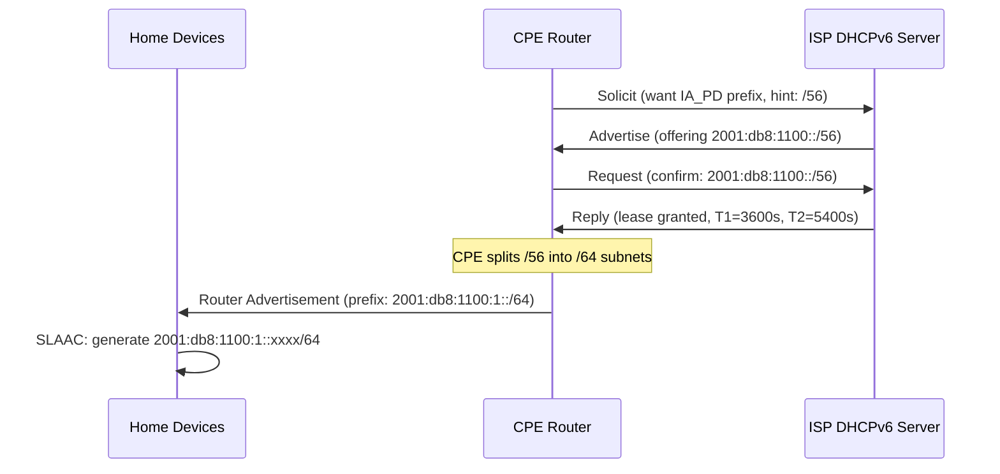

# How to Understand IPv6 Prefix Delegation from ISPs

Author: [nawazdhandala](https://www.github.com/nawazdhandala)

Tags: IPv6, DHCPv6-PD, ISP, Prefix Delegation, RFC 3633

Description: Understand how ISPs deliver IPv6 prefixes to customer routers using DHCPv6 Prefix Delegation (IA_PD), including the message flow, lease timers, and CPE configuration.

## Introduction

IPv6 Prefix Delegation (DHCPv6-PD, RFC 3633) is the mechanism ISPs use to deliver a routable IPv6 prefix to a customer's CPE router automatically. The CPE uses the delegated prefix to configure its internal LAN subnets, enabling all devices behind it to receive globally routable IPv6 addresses without any manual intervention.

## How Prefix Delegation Works



## DHCPv6 Message Exchange

The PD process uses the standard DHCPv6 four-message exchange:

1. **Solicit**: CPE broadcasts to `ff02::1:2` requesting IA_PD with optional prefix hint
2. **Advertise**: ISP server responds with available prefix offer
3. **Request**: CPE confirms acceptance of the offered prefix
4. **Reply**: ISP confirms the lease with T1, T2, preferred, and valid lifetimes

## Lease Timer Semantics

```text
T1 (Renew time):      When CPE sends Renew to the same server
T2 (Rebind time):     When CPE broadcasts Rebind to any server
Preferred lifetime:   When the prefix becomes deprecated (but still valid)
Valid lifetime:       When the prefix expires (hard limit)

Typical values:
T1 = valid_lifetime × 0.5
T2 = valid_lifetime × 0.8
Valid lifetime = 7 days (604800 seconds)
```

## Verifying Prefix Delegation on Linux CPE

```bash
# Check if a prefix was delegated (using dhclient)

sudo dhclient -6 -P -v eth0
# -6 = IPv6 mode
# -P = request prefix delegation
# -v = verbose

# View the delegated prefix
cat /var/lib/dhclient/dhclient6.leases

# Example lease entry:
# lease6 {
#   interface "eth0";
#   ia-pd <IAID> {
#     starts 1742000000;
#     renew 3600;
#     rebind 5400;
#     expires 604800;
#     iaprefix {
#       starts 1742000000;
#       preferred-life 7200;
#       max-life 14400;
#       prefix 2001:db8:1100::/56;
#     }
#   }
# }

# Using wide-dhcpv6
sudo dhcp6c -c /etc/wide-dhcpv6/dhcp6c.conf eth0
ip -6 addr show  # Check LAN interface for delegated /64
```

## ISC DHCP Server Configuration (ISP Side)

```bash
# /etc/dhcp/dhcpd6.conf on ISP DHCPv6 server

# Residential customer pool
subnet6 2001:db8:1000::/36 {
  # Delegation pool: hand out /56 prefixes
  prefix6 2001:db8:1000:: 2001:db8:1fff:: /56;

  # Lease timers
  preferred-lifetime 7200;
  default-lease-time 14400;
  max-lease-time 86400;

  # Options to push to customer CPE
  option dhcp6.name-servers 2001:db8:0::53, 2001:db8:0::54;
  option dhcp6.domain-search "example.isp.com";
}
```

## CPE Linux Router: Distributing the Delegated Prefix

```bash
# /etc/wide-dhcpv6/dhcp6c.conf
# Receives /56 on WAN (eth0), delegates /64 to LAN (eth1)

interface eth0 {
    send ia-pd 1;       # Request prefix delegation
    send rapid-commit;  # Use two-message exchange if supported
};

id-assoc pd 1 {
    prefix-interface eth1 {
        sla-id 1;    # Use subnet :01xx::/64
        sla-len 8;   # /56 + 8 = /64
        ifid 1;      # Gateway = ::1 on the LAN
    };
    prefix-interface eth2 {
        sla-id 2;    # Use subnet :02xx::/64
        sla-len 8;
        ifid 1;
    };
};
```

## Troubleshooting PD Issues

```bash
# Check if WAN interface received a /56 or /48
ip -6 addr show dev eth0

# Check if LAN interface got a /64 configured
ip -6 addr show dev eth1

# Capture DHCPv6-PD traffic
sudo tcpdump -i eth0 -vv "udp port 546 or udp port 547"

# Look for IA_PD option in packets (option type 25)
# Advertise should contain prefix, T1, T2, preferred, valid lifetimes

# Common issues:
# 1. ISP not supporting PD → contact ISP support
# 2. Firewall blocking UDP 546/547 → allow DHCPv6
# 3. CPE config wrong sla-len → fix to match delegation size
# 4. Prefix not routed back to CPE → ISP routing issue
```

## Conclusion

DHCPv6 Prefix Delegation is the elegant mechanism that makes IPv6 "just work" for home users. The CPE requests a prefix, the ISP delegates it with lease timers, and the CPE automatically configures LAN subnets and sends Router Advertisements. Understanding the IA_PD message flow and lease timer semantics is essential for debugging connectivity issues when devices behind a CPE cannot reach the internet over IPv6.
