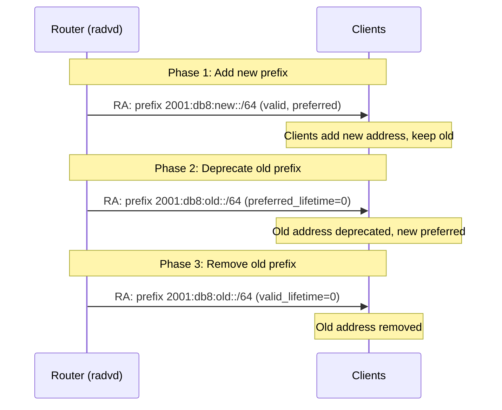

# How to Use NDP for IPv6 Network Renumbering

Author: [nawazdhandala](https://www.github.com/nawazdhandala)

Tags: IPv6, NDP, Renumbering, Router Advertisement, Prefix Deprecation, Networking

Description: Implement graceful IPv6 network renumbering using NDP Router Advertisements, prefix deprecation, and RFC 7084 guidelines.

## IPv6 Renumbering Process

IPv6 was designed to support renumbering without service disruption. The process uses prefix deprecation via Router Advertisements:



## Phase 1: Add New Prefix to radvd

```text
# /etc/radvd.conf - Add new prefix alongside existing

interface eth0 {
    AdvSendAdvert on;
    MaxRtrAdvInterval 10;  # Frequent RAs during transition

    # New prefix - fully active
    prefix 2001:db8:new::/64 {
        AdvOnLink on;
        AdvAutonomous on;
        AdvValidLifetime 86400;
        AdvPreferredLifetime 14400;
    };

    # Old prefix - still active (no changes yet)
    prefix 2001:db8:old::/64 {
        AdvOnLink on;
        AdvAutonomous on;
        AdvValidLifetime 86400;
        AdvPreferredLifetime 14400;
    };
};
```

## Phase 2: Deprecate Old Prefix

```text
# /etc/radvd.conf - Deprecate old prefix (set preferred_lifetime=0)
interface eth0 {
    AdvSendAdvert on;
    MaxRtrAdvInterval 10;

    # New prefix - fully active
    prefix 2001:db8:new::/64 {
        AdvOnLink on;
        AdvAutonomous on;
        AdvValidLifetime 86400;
        AdvPreferredLifetime 14400;
    };

    # Old prefix - deprecated (preferred_lifetime=0)
    prefix 2001:db8:old::/64 {
        AdvOnLink on;
        AdvAutonomous on;
        AdvValidLifetime 7200;      # Still valid for 2 hours
        AdvPreferredLifetime 0;     # Deprecated immediately
    };
};
```

```bash
# Reload radvd after config change
systemctl reload radvd

# Verify RAs being sent with new prefix lifetimes
radvdump  # Dump sent RAs

# On a client: check address states
ip -6 addr show | grep -E "2001:db8:old|2001:db8:new"
# Old: inet6 2001:db8:old::abc/64 scope global deprecated
# New: inet6 2001:db8:new::abc/64 scope global
```

## Phase 3: Remove Old Prefix

```text
# Wait for all connections using old addresses to complete
# Check: are there active connections to old addresses?
ss -6 -n | grep "2001:db8:old"

# Then remove old prefix from radvd.conf entirely
# Before removing: set valid_lifetime to 0 briefly
# (or simply remove - clients will use valid_lifetime countdown)
```

```bash
# Force clients to immediately remove old address
# Send RA with valid_lifetime=0 for old prefix

python3 << 'EOF'
from scapy.all import *
from scapy.layers.inet6 import *

# Send RA with old prefix valid_lifetime=0
pkt = (Ether(dst="33:33:00:00:00:01") /
       IPv6(src="fe80::router", dst="ff02::1") /
       ICMPv6ND_RA(routerlifetime=0) /
       ICMPv6NDOptPrefixInfo(
           prefix="2001:db8:old::",
           prefixlen=64,
           validlifetime=0,
           preferredlifetime=0,
           L=1, A=1,
       ))
sendp(pkt, iface="eth0", count=3, verbose=False)
print("Sent RA deprecating old prefix")
EOF
```

## Monitoring Renumbering Progress

```bash
#!/bin/bash
# monitor-renumbering.sh - Track renumbering across hosts

NEW_PREFIX="2001:db8:new::"
OLD_PREFIX="2001:db8:old::"

echo "=== Renumbering Monitor ==="

# Check which prefix clients are using (from router's ARP/NDP cache)
ip -6 neigh show | while read LINE; do
    IP=$(echo ${LINE} | awk '{print $1}')
    if [[ "${IP}" == ${OLD_PREFIX}* ]]; then
        echo "Still on OLD: ${IP}"
    elif [[ "${IP}" == ${NEW_PREFIX}* ]]; then
        echo "On NEW: ${IP}"
    fi
done | sort | uniq -c | sort -rn
```

## Renumbering via DHCPv6

For managed networks using DHCPv6, renumbering uses lease lifetime management:

```json
// ISC Kea - Add new subnet, let old subnet expire naturally
{
    "Dhcp6": {
        "subnet6": [
            {
                "id": 1,
                "subnet": "2001:db8:new::/64",
                "pools": [{"pool": "2001:db8:new::100-2001:db8:new::200"}],
                "preferred-lifetime": 14400,
                "valid-lifetime": 86400
            },
            {
                "id": 2,
                "subnet": "2001:db8:old::/64",
                "pools": [{"pool": "2001:db8:old::100-2001:db8:old::200"}],
                "preferred-lifetime": 0,
                "valid-lifetime": 3600
            }
        ]
    }
}
```

## Conclusion

IPv6 renumbering uses RA prefix lifetime manipulation: advertise new prefix, deprecate old prefix (preferred_lifetime=0), then expire old prefix (valid_lifetime=0 or simply stop advertising). Clients honor `deprecated` state by preferring new addresses for new connections while completing existing sessions on old addresses. Allow time between phases equal to the preferred_lifetime so connections can migrate naturally. Monitor the NDP cache to verify all clients have adopted the new prefix before completing the cutover.
