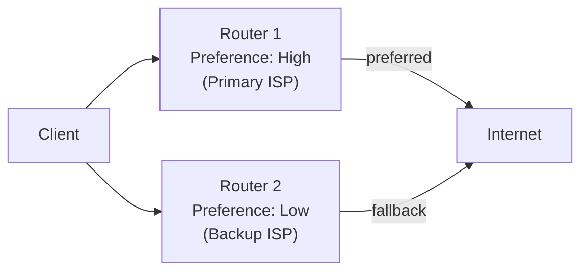

# How to Configure IPv6 Router Preference (High, Medium, Low)

Author: [nawazdhandala](https://www.github.com/nawazdhandala)

Tags: IPv6, Router Preference, RFC4191, radvd, Routing, Networking

Description: Configure IPv6 router preference levels in Router Advertisements to control which default gateway clients select in multi-router environments, enabling primary/backup failover.

## Introduction

RFC 4191 defines the Default Router Preference field in IPv6 Router Advertisements, allowing routers to signal their preference to clients as High, Medium, or Low. This enables clients to select the primary router in multi-router environments without manual configuration or routing protocols.

## How Router Preference Works

When multiple routers send RAs on the same segment, clients build a list of default gateways. The preference field tells the client which gateway to use first:

- **High**: Use this router preferentially
- **Medium**: Use if no High-preference router is available (default)
- **Low**: Last resort; use only if no Medium or High router is available



## Configuring Router Preference in radvd

```text
# /etc/radvd.conf - Primary router with High preference

interface eth1 {
    AdvSendAdvert on;

    # Set this router as the high-preference default gateway
    AdvDefaultPreference high;

    MinRtrAdvInterval 30;
    MaxRtrAdvInterval 100;
    AdvDefaultLifetime 1800;

    prefix 2001:db8:1:1::/64 {
        AdvOnLink on;
        AdvAutonomous on;
        AdvValidLifetime 86400;
        AdvPreferredLifetime 14400;
    };
};
```

```text
# /etc/radvd.conf on backup router - Low preference

interface eth1 {
    AdvSendAdvert on;

    # Low preference: clients only use this if high-preference router is absent
    AdvDefaultPreference low;

    MinRtrAdvInterval 30;
    MaxRtrAdvInterval 100;
    AdvDefaultLifetime 1800;

    prefix 2001:db8:1:1::/64 {
        AdvOnLink on;
        AdvAutonomous on;
        AdvValidLifetime 86400;
        AdvPreferredLifetime 14400;
    };
};
```

## Configuring on Cisco IOS

```
! Set high preference on the primary router's LAN interface
Router-Primary(config)# interface GigabitEthernet0/0
Router-Primary(config-if)# ipv6 nd router-preference High

! Set low preference on the backup router's LAN interface
Router-Backup(config)# interface GigabitEthernet0/0
Router-Backup(config-if)# ipv6 nd router-preference Low
```

## Configuring on Juniper Junos

```
# Primary router
set protocols router-advertisement interface ge-0/0/1.0 default-preference high

# Backup router
set protocols router-advertisement interface ge-0/0/1.0 default-preference low
```

## Verifying Router Preference on Clients

```bash
# On a Linux client, check the default router list
ip -6 route show default

# With detailed preference information:
# default via fe80::1 dev eth0 proto ra metric 100 pref high
# default via fe80::2 dev eth0 proto ra metric 100 pref low

# The kernel selects the route with lowest metric (highest preference)
```

## Dynamic Preference Change (Failover)

One pattern for active failover is to dynamically lower the primary router's preference when an upstream link fails:

```bash
#!/bin/bash
# failover_ra.sh
# Change RA preference based on WAN link health

WAN_GW="2001:db8:isp::1"
RADVD_CONF="/etc/radvd.conf"

if ping6 -c 3 -W 2 "$WAN_GW" > /dev/null 2>&1; then
    # WAN is up - use High preference
    sed -i 's/AdvDefaultPreference.*/AdvDefaultPreference high;/' "$RADVD_CONF"
else
    # WAN is down - lower preference so backup router is used
    sed -i 's/AdvDefaultPreference.*/AdvDefaultPreference low;/' "$RADVD_CONF"
fi

# Reload radvd to send updated preference
kill -HUP $(cat /var/run/radvd/radvd.pid) 2>/dev/null
```

## Limitations of Router Preference

- Only three preference levels (not granular like routing metrics)
- Clients can still select a Low-preference router if the High-preference one's RA expires
- Not all older devices/OS versions support RFC 4191 preference (they treat all routers as equal)
- For more sophisticated load balancing, use routing protocols (OSPFv3, BGP) instead

## Conclusion

IPv6 Router Preference provides a simple mechanism for primary/backup default gateway selection in multi-router environments. Configure the primary router as High, backups as Medium or Low, and clients will automatically favor the best available gateway. For critical deployments, combine router preference with health-check scripts that dynamically adjust the preference level based on upstream link availability.
