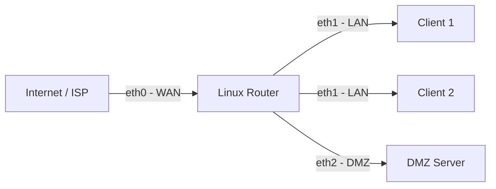

# How to Configure IPv6 Routing on a Linux Router

Author: [nawazdhandala](https://www.github.com/nawazdhandala)

Tags: IPv6, Linux, Router, Radvd, Forwarding, Networking

Description: A complete guide to turning a Linux machine into a functional IPv6 router with forwarding, Router Advertisements, and static routing.

## Overview

A Linux machine can serve as a fully functional IPv6 router with the right configuration. This guide walks through enabling forwarding, configuring interfaces, sending Router Advertisements to LAN clients, and setting up static or dynamic routes.

## Lab Topology



## Step 1: Enable IPv6 Forwarding

```bash
# /etc/sysctl.d/99-ipv6-router.conf

# Enable forwarding globally

net.ipv6.conf.all.forwarding = 1

# Disable RA acceptance globally (routers should not reconfigure from RA)
net.ipv6.conf.all.accept_ra = 0
net.ipv6.conf.default.accept_ra = 0

# Accept RA on WAN interface to get default route from ISP
net.ipv6.conf.eth0.accept_ra = 2
```

```bash
sudo sysctl --system
```

## Step 2: Configure Interface Addresses

```bash
# Assign IPv6 addresses to router interfaces
sudo ip -6 addr add 2001:db8:1::1/64 dev eth1   # LAN interface
sudo ip -6 addr add 2001:db8:2::1/64 dev eth2   # DMZ interface
# eth0 receives its address from the ISP via DHCPv6 or SLAAC
```

For persistent configuration with systemd-networkd:

```ini
# /etc/systemd/network/20-eth1.network
[Match]
Name=eth1

[Network]
Address=2001:db8:1::1/64
IPv6Forwarding=yes
IPv6AcceptRA=no
```

## Step 3: Install and Configure radvd

`radvd` sends Router Advertisements to LAN clients so they can auto-configure addresses:

```bash
sudo apt install radvd  # Debian/Ubuntu
sudo dnf install radvd  # Fedora/RHEL
```

```bash
# /etc/radvd.conf
interface eth1 {
    AdvSendAdvert on;
    MinRtrAdvInterval 30;
    MaxRtrAdvInterval 100;
    AdvDefaultLifetime 1800;

    prefix 2001:db8:1::/64 {
        AdvOnLink on;           # Prefix is on-link
        AdvAutonomous on;       # Clients use SLAAC
        AdvPreferredLifetime 3600;
        AdvValidLifetime 7200;
    };

    # Advertise DNS server to clients (RDNSS option, RFC 8106)
    RDNSS 2001:4860:4860::8888 2001:4860:4860::8844 {
        AdvRDNSSLifetime 1800;
    };
};

interface eth2 {
    AdvSendAdvert on;
    prefix 2001:db8:2::/64 {
        AdvOnLink on;
        AdvAutonomous on;
    };
};
```

```bash
sudo systemctl enable --now radvd
sudo radvd --configtest  # Verify config syntax
```

## Step 4: Configure Static Routes

```bash
# Add a static route to a remote network via a neighbor router
sudo ip -6 route add 2001:db8:10::/48 via fe80::neighbor dev eth0

# Verify
ip -6 route show
```

## Step 5: Verify the Router is Working

```bash
# On the Linux router
ip -6 addr show          # Confirm addresses on all interfaces
ip -6 route show         # Confirm routing table
sysctl net.ipv6.conf.all.forwarding  # Confirm = 1

# On a LAN client, verify it received an address via SLAAC
ip -6 addr show dev eth0
# Should show 2001:db8:1::<EUI-64 or random> scope global

# Ping the router's LAN address from the client
ping6 2001:db8:1::1

# Ping a remote host through the router
ping6 2001:4860:4860::8888
```

## Step 6: Firewall the Router

```bash
# Basic ip6tables rules for the router

# Allow established traffic
ip6tables -A FORWARD -m state --state ESTABLISHED,RELATED -j ACCEPT

# Allow LAN to reach the internet
ip6tables -A FORWARD -i eth1 -o eth0 -j ACCEPT

# Allow DMZ to reach specific servers
ip6tables -A FORWARD -i eth2 -o eth0 -p tcp --dport 443 -j ACCEPT

# Drop all other forwarded traffic
ip6tables -A FORWARD -j DROP
```

## Summary

A Linux IPv6 router requires: (1) `net.ipv6.conf.all.forwarding=1` in sysctl, (2) IPv6 addresses on each interface, (3) `radvd` to send Router Advertisements to clients, and (4) routing table entries for remote networks. Combine with ip6tables for a production-grade IPv6 gateway.
