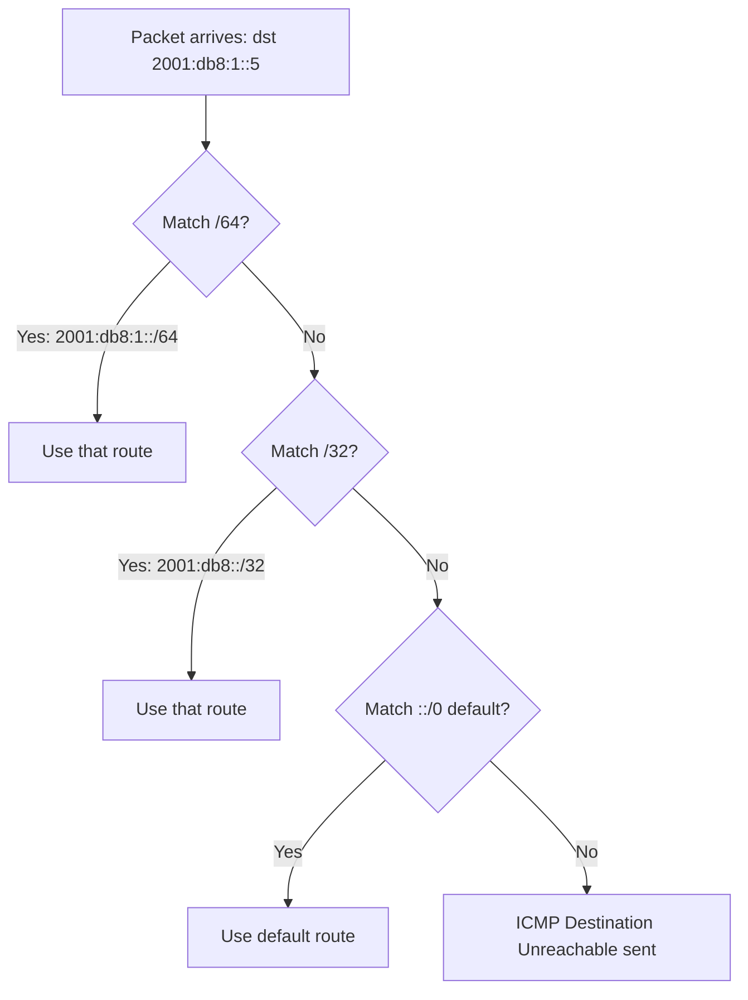

# How to Understand IPv6 Routing Table Structure

Author: [nawazdhandala](https://www.github.com/nawazdhandala)

Tags: IPv6, Routing, Networking, Linux, Routing Table

Description: Learn the structure of the IPv6 routing table, how entries are organized, and the key fields that control packet forwarding decisions.

## Overview

The IPv6 routing table is the data structure used by the kernel to determine where to forward each packet. Understanding its structure helps you diagnose routing issues and design networks correctly.

## IPv6 Routing Table Components

Each entry in the IPv6 routing table contains the following fields:

| Field | Description |
|-------|-------------|
| **Destination** | The IPv6 prefix this route matches (e.g., `2001:db8::/32`) |
| **Next Hop** | The next-hop router address to forward packets to |
| **Interface** | The outgoing network interface |
| **Metric** | Route cost - lower is preferred |
| **Protocol** | How the route was learned (kernel, static, ospf, bgp, etc.) |
| **Flags** | U=Up, G=Gateway, H=Host route, etc. |

## Viewing the IPv6 Routing Table on Linux

```bash
# Show full IPv6 routing table

ip -6 route show

# Show with more detail including protocol and metric
ip -6 route show table all

# Example output:
# 2001:db8::/32 dev eth0 proto kernel scope link src 2001:db8::1 metric 256
# ::/0 via fe80::1 dev eth0 proto ra metric 1024 expires 1800sec
# fe80::/64 dev eth0 proto kernel scope link src fe80::aabb:ccff:fedd:1234
# ::1 dev lo proto kernel scope host
```

## Route Types in the IPv6 Table

```text
# Connected route (directly attached subnet)
2001:db8::/64 dev eth0 proto kernel scope link src 2001:db8::1

# Static route (manually configured)
2001:db8:1::/48 via 2001:db8::1 dev eth0 proto static metric 100

# Default route via Router Advertisement
::/0 via fe80::1 dev eth0 proto ra metric 1024

# Loopback route
::1 dev lo proto kernel scope host
```

## Multiple Routing Tables

Linux supports multiple routing tables (0–255). The main tables for IPv6 are:

```bash
# Show the main routing table (default)
ip -6 route show table main

# Show the local table (host routes and loopback)
ip -6 route show table local

# Show all tables
ip -6 route show table all
```

## Route Lookup Process

When a packet arrives, the kernel uses **longest prefix match** to select the best route:



## Route Flags Explained

```bash
# Get route details with flags
ip -6 route show detail

# Key flags:
# proto kernel = added by kernel for connected interfaces
# proto static = added manually with ip route add
# proto ra     = learned from Router Advertisement
# proto ospf   = learned from OSPFv3
# scope link   = destination is on local link (no gateway needed)
# scope global = destination requires gateway
```

## IPv6 vs IPv4 Routing Table Differences

| Feature | IPv4 | IPv6 |
|---------|------|------|
| Address size | 32-bit | 128-bit |
| Default route | 0.0.0.0/0 | ::/0 |
| Link-local routes | Rare | Always present (fe80::/64) |
| Multicast routes | Optional | Built-in (ff00::/8) |
| Loopback | 127.0.0.0/8 | ::1/128 |

## Summary

The IPv6 routing table follows the same logical structure as IPv4 but with 128-bit addresses and additional mandatory entries for link-local and multicast prefixes. Use `ip -6 route show` to inspect routes, and understand that longest prefix match determines the forwarding path for every packet.
