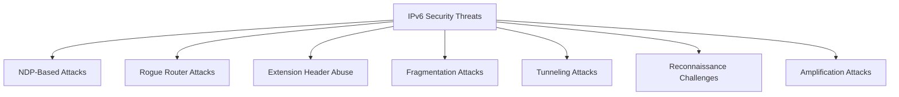

# How to Understand IPv6 Security Threats and Attack Vectors

Author: [nawazdhandala](https://www.github.com/nawazdhandala)

Tags: IPv6, Security, Attack Vectors, Threats, Networking

Description: Understand the key IPv6 security threats and attack vectors that differ from IPv4, including NDP spoofing, rogue routers, and extension header abuse.

## Overview

IPv6 introduces new attack surfaces alongside the old ones. While some IPv4 attacks still apply, IPv6's design features (NDP, SLAAC, multicast) create unique threat categories that require specific mitigations.

## IPv6 Threat Categories



## 1. NDP-Based Attacks

**Neighbor Solicitation/Advertisement Spoofing** (equivalent to ARP poisoning in IPv4):

```bash
# An attacker can send crafted NA messages to redirect traffic
# Monitor for suspicious NA messages:
sudo tcpdump -i eth0 -n "icmp6 and ip6[40] == 136"
# Type 136 = Neighbor Advertisement

# Mitigation: RA-Guard and Dynamic IPv6 Source Guard on switches
```

## 2. Rogue Router Attacks

An attacker sends Router Advertisement messages to become the default gateway:

```bash
# Detect rogue RA messages
sudo tcpdump -i eth0 -n "icmp6 and ip6[40] == 134"
# Type 134 = Router Advertisement

# Any RA from an unexpected source address is suspicious
# Mitigation: RA-Guard (RFC 6105) on managed switches
```

## 3. Extension Header Abuse

IPv6 extension headers can be used to evade security devices:

| Attack | Description |
|--------|-------------|
| Header chain manipulation | Craft headers that confuse firewalls into skipping payload inspection |
| Fragment + extension header | Split payload across fragments to bypass signature detection |
| Hop-by-hop header DoS | Force all routers to process HbH headers — CPU exhaustion |

## 4. Fragmentation Attacks

IPv6 allows hosts (not routers) to fragment. Attackers exploit this:

```
# Atomic fragment attack (RFC 6946)
# Send a tiny fragment that matches no real fragment — forces reassembly buffer consumption

# Overlapping fragment attack
# Send fragments that overlap to confuse reassembly and evade IDS
```

## 5. Tunneling Attacks

IPv6-in-IPv4 tunnels can bypass security controls:

```bash
# Teredo, 6in4, ISATAP can carry IPv6 traffic through IPv4-only firewalls
# If not needed, block these protocols:

# Block 6in4 tunnels (protocol 41)
sudo ip6tables -A INPUT -p 41 -j DROP
sudo iptables  -A INPUT -p 41 -j DROP

# Block Teredo (UDP 3544)
sudo iptables -A INPUT -p udp --dport 3544 -j DROP
```

## 6. Reconnaissance

IPv6's large address space (2^64 per subnet) prevents traditional subnet scanning:

```bash
# A /64 subnet has 18,446,744,073,709,551,616 addresses
# Traditional sequential scan is impossible

# But attackers use:
# - DNS brute force for AAAA records
# - NDP cache inspection (show neighbor table)
# - Traffic monitoring for active addresses
# - Multicast group membership disclosure

# Check your own NDP cache for active hosts
ip -6 neigh show
```

## 7. Amplification via Multicast

IPv6 multicast can amplify attacks:

```bash
# An attacker sends ICMPv6 echo request to all-nodes multicast
ping6 -I eth0 ff02::1   # All nodes on the link respond

# Mitigation: Filter ICMPv6 echo requests to multicast on perimeter
ip6tables -A INPUT -p icmpv6 --icmpv6-type echo-request -d ff02::1 -j DROP
```

## Common Mitigation Controls

| Threat | Mitigation |
|--------|-----------|
| NDP spoofing | Dynamic IPv6 Source Guard, SEcure Neighbor Discovery (SEND) |
| Rogue RA | RA-Guard (RFC 6105), radvd monitoring |
| Extension header abuse | Drop unknown extension headers at perimeter |
| Fragmentation | Drop fragments at perimeter (except internally) |
| Tunneling | Block protocol 41 and UDP 3544 on untrusted links |
| Recon | Use random IIDs (RFC 7217), privacy extensions |

## Summary

IPv6 security threats span NDP spoofing (like ARP poisoning), rogue router attacks via RA messages, extension header abuse for firewall evasion, fragmentation exploitation, and tunneling to bypass controls. A layered defense using RA-Guard, IPv6 Source Guard, perimeter filtering, and monitoring is required to address IPv6's unique attack surface.
