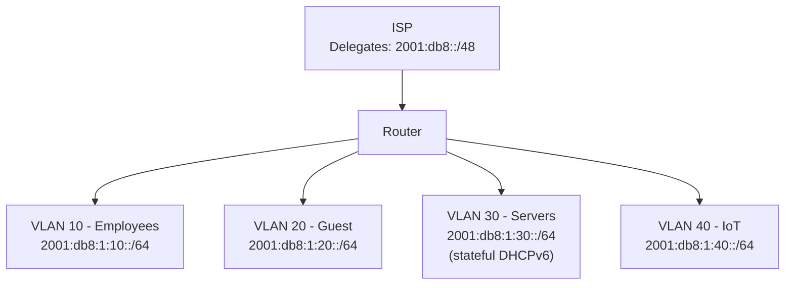

# How to Configure IPv6 on a Small Office Router

Author: [nawazdhandala](https://www.github.com/nawazdhandala)

Tags: IPv6, Small Office, Router, DHCPv6, SLAAC, Networking

Description: Configure IPv6 on a small office router with multiple VLANs, DHCPv6 prefix delegation from the ISP, and SLAAC distribution to employee and guest networks.

## Introduction

A small office IPv6 setup typically involves obtaining a prefix from the ISP, segmenting it across multiple VLANs (employee, guest, IoT, DMZ), and providing stateless or stateful address configuration to each segment. This guide uses a Linux-based router with VLANs.

## Network Design



## Step 1: Configure VLAN Interfaces

```bash
# Create VLAN interfaces (assumes eth1 is trunk interface)

sudo ip link add link eth1 name eth1.10 type vlan id 10
sudo ip link add link eth1 name eth1.20 type vlan id 20
sudo ip link add link eth1 name eth1.30 type vlan id 30
sudo ip link add link eth1 name eth1.40 type vlan id 40

# Bring them up
for vlan in eth1.10 eth1.20 eth1.30 eth1.40; do
    sudo ip link set "$vlan" up
done

# Assign IPv6 addresses from the delegated /48
sudo ip -6 addr add 2001:db8:1:10::1/64 dev eth1.10
sudo ip -6 addr add 2001:db8:1:20::1/64 dev eth1.20
sudo ip -6 addr add 2001:db8:1:30::1/64 dev eth1.30
sudo ip -6 addr add 2001:db8:1:40::1/64 dev eth1.40
```

## Step 2: Configure radvd for Multiple VLANs

```text
# /etc/radvd.conf

# Employee VLAN - SLAAC with privacy addresses encouraged
interface eth1.10 {
    AdvSendAdvert on;
    AdvManagedFlag off;
    AdvOtherConfigFlag off;
    prefix 2001:db8:1:10::/64 {
        AdvOnLink on;
        AdvAutonomous on;
        AdvValidLifetime 86400;
        AdvPreferredLifetime 14400;
    };
    RDNSS 2001:db8:1:10::53 {
        AdvRDNSSLifetime 600;
    };
    DNSSL corp.example.com {
        AdvDNSSLLifetime 600;
    };
};

# Guest VLAN - SLAAC, public DNS
interface eth1.20 {
    AdvSendAdvert on;
    AdvManagedFlag off;
    AdvOtherConfigFlag off;
    prefix 2001:db8:1:20::/64 {
        AdvOnLink on;
        AdvAutonomous on;
        AdvValidLifetime 3600;      # Shorter for guests
        AdvPreferredLifetime 1800;
    };
    RDNSS 2606:4700:4700::1111 2001:4860:4860::8888 {
        AdvRDNSSLifetime 600;
    };
};

# Server VLAN - stateful DHCPv6
interface eth1.30 {
    AdvSendAdvert on;
    AdvManagedFlag on;              # Stateful DHCPv6
    AdvOtherConfigFlag on;
    prefix 2001:db8:1:30::/64 {
        AdvOnLink on;
        AdvAutonomous off;          # No SLAAC for servers
    };
};

# IoT VLAN - SLAAC, longer lifetimes
interface eth1.40 {
    AdvSendAdvert on;
    AdvManagedFlag off;
    AdvOtherConfigFlag off;
    MinRtrAdvInterval 300;
    MaxRtrAdvInterval 600;
    prefix 2001:db8:1:40::/64 {
        AdvOnLink on;
        AdvAutonomous on;
        AdvValidLifetime 604800;    # 1 week for IoT devices
        AdvPreferredLifetime 86400;
    };
    RDNSS 2001:db8:1:40::53 {
        AdvRDNSSLifetime 1200;
    };
};
```

## Step 3: Inter-VLAN Firewall Rules

```bash
# Allow forwarding (general)
sudo ip6tables -A FORWARD -m state --state ESTABLISHED,RELATED -j ACCEPT

# Employee and Server can communicate
sudo ip6tables -A FORWARD -i eth1.10 -o eth1.30 -j ACCEPT
sudo ip6tables -A FORWARD -i eth1.30 -o eth1.10 -j ACCEPT

# Employee can access internet
sudo ip6tables -A FORWARD -i eth1.10 -o eth0 -j ACCEPT

# Guest can only access internet (not internal VLANs)
sudo ip6tables -A FORWARD -i eth1.20 -o eth0 -j ACCEPT
sudo ip6tables -A FORWARD -i eth1.20 -o eth1.10 -j DROP
sudo ip6tables -A FORWARD -i eth1.20 -o eth1.30 -j DROP

# IoT cannot initiate connections to employee or server VLANs
sudo ip6tables -A FORWARD -i eth1.40 -o eth1.10 -j DROP
sudo ip6tables -A FORWARD -i eth1.40 -o eth1.30 -j DROP
sudo ip6tables -A FORWARD -i eth1.40 -o eth0 -j ACCEPT

# Block all other forward traffic by default
sudo ip6tables -A FORWARD -j DROP
```

## Verification

```bash
# Verify addresses are assigned on all VLAN interfaces
ip -6 addr show

# Verify radvd is advertising on all interfaces
sudo systemctl status radvd
sudo tcpdump -i eth1.10 "icmp6 and ip6[40] == 134" -c 1 -v
```

## Conclusion

A small office IPv6 setup with multiple VLANs is manageable with Linux, radvd, and ip6tables. Each VLAN gets its own /64 from the delegated prefix, with appropriate RA settings for its use case: SLAAC for employees, shorter lifetimes for guests, stateful DHCPv6 for servers, and power-saving RA intervals for IoT. Firewall rules enforce isolation between segments while allowing internet access.
