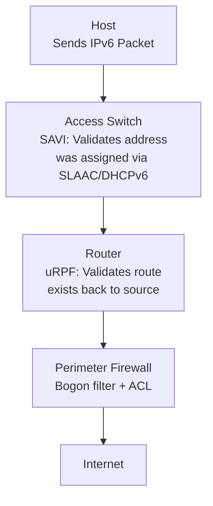

# How to Understand IPv6 Source Address Validation

Author: [nawazdhandala](https://www.github.com/nawazdhandala)

Tags: IPv6, Security, SAVI, Source Validation, Spoofing Prevention

Description: Learn the mechanisms available for validating IPv6 source addresses at different network layers, from switch-level SAVI to router-level uRPF and host-level filtering.

## Overview

IPv6 source address validation ensures that packets entering a network segment have source addresses that were legitimately assigned to the sending host. This prevents spoofing attacks at the source. SAVI (Source Address Validation Improvement, RFC 7039) provides the framework, with specific mechanisms for SLAAC (RFC 6620), DHCPv6 (RFC 7513), and mixed environments.

## The Problem: IPv6 Source Address Spoofing

Without source address validation, any host on a network segment can send packets with any source address:

```bash
# Example: Host sends packet with spoofed source

python3 -c "
from scapy.all import *
# Spoof a packet claiming to come from the router
pkt = IPv6(src='fe80::1', dst='2001:db8::victim')/TCP(dport=80, flags='S')
send(pkt)
"
# Without SAVI, this packet reaches the destination unchallenged
```

## Validation Layers



## Layer 1: SAVI (Switch-Level)

SAVI monitors address assignment protocols and builds a binding table that maps interface → valid IPv6 address:

### SAVI-SLAAC (RFC 6620)

For SLAAC-configured addresses:

```text
Cisco Catalyst: SAVI-SLAAC via IPv6 ND Inspection

ipv6 nd inspection policy SAVI-SLAAC
  validate source-mac

interface GigabitEthernet0/1
  ipv6 nd inspection attach-policy SAVI-SLAAC
```

SAVI-SLAAC listens for Neighbor Solicitations (DAD) and builds a binding for each validated address.

### SAVI-DHCPv6 (RFC 7513)

For DHCPv6-assigned addresses:

```text
! Cisco: DHCPv6 Snooping provides SAVI for DHCPv6 addresses
ipv6 dhcp snooping
ipv6 dhcp snooping vlan 10

! Trust the uplink port (where DHCP server is)
interface GigabitEthernet0/48
  ipv6 dhcp snooping trust

! Untrust client ports (validates DHCPv6 source)
interface range GigabitEthernet0/1-24
  ! Default: untrusted - will validate source
```

### SAVI Binding Table

```text
! View SAVI binding table
show ipv6 snooping binding

! Sample output:
! IPv6 Address          Interface         VLAN  State         Lifetme
! 2001:db8:1::a100      Gi0/1             10    REACHABLE     3535 s
! 2001:db8:1::b200      Gi0/2             10    REACHABLE     3200 s
```

## Layer 2: uRPF (Router-Level)

Unicast Reverse Path Forwarding validates that a route exists back to the source address via the interface the packet arrived on:

### Strict Mode (Most Secure)

```text
! Cisco: Strict uRPF - best for single-homed customers
interface GigabitEthernet0/0
  ipv6 verify unicast source reachable-via rx

! The router checks its FIB:
! "Is there a route to the source address via this same interface?"
! If NO → packet is dropped (spoofed source)
```

### Loose Mode (For Multi-Homed)

```text
! Cisco: Loose uRPF - for networks with asymmetric routing
interface GigabitEthernet0/0
  ipv6 verify unicast source reachable-via any
  ! Just checks: "Is there ANY route to the source?" (not necessarily via this interface)
```

### uRPF on Linux

```bash
# Linux: Enable reverse path filtering for IPv6
# Note: IPv6 rp_filter is limited - use explicit routing tables

# Create routing table for uRPF check
ip -6 route add 2001:db8:cust::/48 dev eth1 table 100

# Add ip rule: if source is not in our expected range, drop
ip -6 rule add from 2001:db8:other::/32 blackhole priority 100
```

## Layer 3: Perimeter Filtering (Firewall/ACL)

```bash
# ip6tables: Combined source address validation at perimeter
# Only allow traffic from assigned prefix on the interface serving that prefix

# For traffic coming in on eth1 (customer network)
ip6tables -A INPUT -i eth1 ! -s 2001:db8:cust::/48 -j DROP
ip6tables -A FORWARD -i eth1 ! -s 2001:db8:cust::/48 -j DROP
```

## Troubleshooting Source Validation

```bash
# Test if uRPF is dropping legitimate traffic
# Enable uRPF logging
interface GigabitEthernet0/0
  ipv6 verify unicast source reachable-via rx allow-default
  ! allow-default: don't drop if only match is default route (for asymmetric routing)

# Check uRPF drops on Cisco
show ipv6 interface GigabitEthernet0/0 | include RPF

# Linux: Check if rp_filter is interfering
sysctl net.ipv6.conf.eth1.accept_source_route
```

## Summary

IPv6 source address validation operates at three layers: SAVI at the access switch (monitors SLAAC/DHCPv6 to build address-to-port bindings and drops unauthorized sources), uRPF at the router (strict mode verifies route to source exists via incoming interface), and ACLs/firewall rules at the perimeter (explicitly permit only assigned prefixes per interface). The most effective deployment combines all three layers. SAVI is the strongest control as it validates addresses at the point of attachment.
