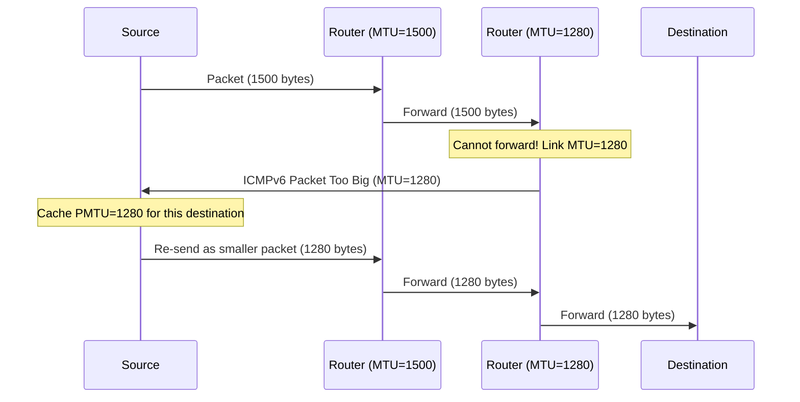

# How to Understand Why Only the Source Can Fragment in IPv6

Author: [nawazdhandala](https://www.github.com/nawazdhandala)

Tags: IPv6, Fragmentation, Router, Performance, RFC 8200

Description: Understand the design rationale behind IPv6's source-only fragmentation model, why intermediate router fragmentation was eliminated, and the performance benefits this provides.

## Introduction

IPv6 eliminated the ability of intermediate routers to fragment packets. Only the original source of a packet can fragment it. This is one of the most significant architectural differences from IPv4, where any router in the path could fragment a packet if it needed to traverse a link with a smaller MTU. The rationale involves performance, security, and architectural clarity.

## IPv4 Router Fragmentation Problems

In IPv4, any router could fragment packets:

```text
IPv4 fragmentation problems:
  1. Router overhead: Fragmentation requires allocating buffers,
     copying data, creating multiple packets - expensive in hardware

  2. Performance impact: Hardware fast paths often can't fragment;
     packets that need fragmentation get punted to the CPU

  3. Reassembly at destination: Only the destination reassembles
     → Intermediate nodes don't need state, but destination must
       maintain fragment buffers

  4. Fragment attacks: Teardrop attack, overlapping fragments,
     Fragrouter attacks - all exploited router fragmentation

  5. Poor path visibility: Source doesn't know the actual path MTU
     unless DF bit is set and ICMP "Fragmentation Needed" is returned
```

## Why IPv6 Eliminated Router Fragmentation

```text
RFC 8200 rationale:

1. Performance: Eliminating router fragmentation allows all routers
   to process packets entirely in hardware at line rate.
   No packet requires buffer allocation or copying for fragmentation.

2. Simplicity: Routers become pure forwarders.
   They don't need logic for: buffer allocation, fragment creation,
   or tracking the state of fragmented packets.

3. Path MTU Discovery: By requiring ICMPv6 "Packet Too Big" instead
   of router fragmentation, the source learns the actual path MTU
   and sends appropriately-sized packets forever after.

4. Security: Eliminates an entire class of router-level attacks
   based on triggering fragmentation behavior in routers.

5. Correctness: The source knows the full context of what it is
   sending (protocol, upper-layer checksums, etc.) and can create
   correct fragments. Routers lack this context.
```

## The Trade-Off: Source Complexity

The price for simpler routers is more complex sources:

```text
IPv6 source requirements:
  1. Implement Path MTU Discovery (RFC 8201)
  2. Cache PMTU per destination
  3. Handle ICMPv6 "Packet Too Big" messages
  4. Create correct Fragment Headers when needed
  5. Keep fragment Identification values unique per 5-tuple

IPv4 sources (when DF=0):
  1. Can just send packets any size
  2. Routers handle size mismatches transparently
  3. No PMTUD required (though recommended)
```

## How ICMPv6 "Packet Too Big" Replaces Router Fragmentation



## Practical Consequences

```bash
# Check if your system is handling PMTU correctly

# Look for ICMPv6 Packet Too Big messages being received
sudo tcpdump -i eth0 "icmp6 and ip6[40] == 2"

# View the PMTU cache
ip -6 route show cache

# Check PMTU discovery setting
cat /proc/sys/net/ipv6/conf/all/path_mtu_discovery
# 1 = enabled (should always be enabled)

# Simulate what happens without PMTUD:
# Set a small interface MTU (test only)
sudo ip link set eth0 mtu 1280
# Large packets to destinations will now trigger Packet Too Big

# View PMTU discovery statistics
cat /proc/net/snmp6 | grep Pmtu
```

## When Source Fragmentation Is Used

```text
Sources fragment when PMTUD is not used (e.g., UDP applications):

Option 1: Keep packets ≤ 1280 bytes (minimum IPv6 MTU)
  → Works on all paths, no fragmentation needed
  → Wastes capacity on high-MTU paths

Option 2: Use Path MTU Discovery
  → Discovers exact path MTU, maximizes efficiency
  → Requires proper ICMPv6 path (firewalls must not block Packet Too Big)

Option 3: Fragment at the source
  → Source creates fragments using Fragment Header
  → Works but fragments may be dropped by middleboxes (30-50% drop rate)
  → Should be last resort

For TCP: MSS (Maximum Segment Size) handles this automatically
  → TCP negotiates MSS during SYN exchange
  → TCP sender never exceeds MSS
  → PMTUD updates MSS dynamically during the connection
```

## Conclusion

IPv6's source-only fragmentation model was a deliberate architectural choice to improve router performance and eliminate router complexity at the cost of source complexity. This trade-off makes sense at scale: routers are few and must be fast; endpoints are many and can afford more logic. The ICMPv6 Packet Too Big mechanism provides an elegant feedback loop that allows sources to learn and cache path MTU values, ultimately enabling more efficient packet sizing than IPv4's router-fragmentation model. The key operational implication is that ICMPv6 Packet Too Big messages must never be filtered or blocked.
