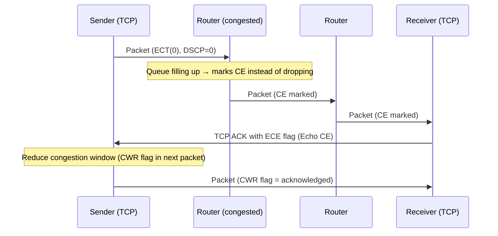

# How to Use the IPv6 Traffic Class for ECN (Explicit Congestion Notification)

Author: [nawazdhandala](https://www.github.com/nawazdhandala)

Tags: IPv6, ECN, Traffic Class, Congestion Control, QoS

Description: Learn how the lower 2 bits of the IPv6 Traffic Class byte implement Explicit Congestion Notification (ECN) to signal congestion without dropping packets.

## Introduction

The lower 2 bits of the IPv6 Traffic Class byte implement ECN (Explicit Congestion Notification), defined in RFC 3168. ECN enables network devices to signal congestion to endpoints by marking packets instead of dropping them. This allows TCP senders to reduce their transmission rate before packets are actually dropped, improving throughput and reducing retransmissions in congested networks.

## ECN Field Layout

```yaml
Traffic Class byte (8 bits):
  [7][6][5][4][3][2] [1][0]
  |<---- DSCP ----->|<ECN>|

ECN codepoints (2 bits):
  00 = Not-ECT (Not ECN-Capable Transport) - default
  01 = ECT(1)  (ECN-Capable Transport, codepoint 1)
  10 = ECT(0)  (ECN-Capable Transport, codepoint 0)
  11 = CE      (Congestion Experienced) - set by routers at congestion
```

## How ECN Works End-to-End



## ECN vs Traditional Drop

```text
Without ECN:
  Congested router → drop packet
  TCP detects packet loss → slow start → reduces window drastically
  Recovery is slow

With ECN:
  Congested router → set CE bit (instead of dropping)
  TCP receiver echoes CE in ACK (ECE flag)
  TCP sender reduces window gently (CWR flag)
  No packet loss → no retransmission → lower latency
  Smoother throughput reduction and recovery
```

## Enabling ECN on Linux

```bash
# Check current ECN setting

cat /proc/sys/net/ipv4/tcp_ecn
# 0 = disabled
# 1 = enabled (negotiate ECN on all TCP connections)
# 2 = passive (accept ECN if requested, don't initiate)

# Enable ECN for all TCP connections (IPv4 and IPv6)
sudo sysctl -w net.ipv4.tcp_ecn=1
sudo sysctl -w net.ipv4.tcp_ecn_fallback=1  # Fall back if ECN causes issues

# Make permanent
echo "net.ipv4.tcp_ecn=1" | sudo tee -a /etc/sysctl.conf

# Enable ECN for IPv6-specific paths
# ECN is protocol-agnostic; same sysctl controls both IPv4 and IPv6
```

## Verifying ECN Negotiation

```bash
# Capture TCP SYN packets and check for ECN flags
# ECN-capable SYN has both ECE and CWR flags set
sudo tcpdump -i eth0 -vv "tcp[13] & 0xC0 == 0xC0"

# Example tcpdump output showing ECN negotiation:
# 2001:db8::1.54321 > 2001:db8::2.443: Flags [SEC], seq 0, win 65535,
#   options [...]   ← S=SYN, E=ECE, C=CWR → ECN-capable SYN

# Check if ECN is active on established connections
ss -6 -n -t info | grep ecn
# or
cat /proc/net/tcp6  # Look for ECN state flags
```

## Python: Reading ECN Bits

```python
import socket
import struct

def parse_traffic_class(traffic_class_byte: int) -> dict:
    """Parse the IPv6 Traffic Class byte into DSCP and ECN components."""
    dscp = (traffic_class_byte >> 2) & 0x3F
    ecn  = traffic_class_byte & 0x3

    ecn_names = {
        0b00: "Not-ECT (0) - not ECN capable",
        0b01: "ECT(1) - ECN capable (codepoint 1)",
        0b10: "ECT(0) - ECN capable (codepoint 0)",
        0b11: "CE - Congestion Experienced",
    }

    return {
        "traffic_class_hex": f"0x{traffic_class_byte:02X}",
        "dscp": dscp,
        "ecn_bits": format(ecn, '02b'),
        "ecn_name": ecn_names[ecn],
        "congestion_experienced": ecn == 0b11,
    }

# Test with various Traffic Class values
test_values = [
    0x00,  # DSCP=0, ECN=Not-ECT
    0xB8,  # DSCP=46 (EF), ECN=Not-ECT
    0xBA,  # DSCP=46 (EF), ECN=ECT(1) - VoIP capable of ECN
    0xBB,  # DSCP=46 (EF), ECN=CE - congestion experienced
]

for tc in test_values:
    result = parse_traffic_class(tc)
    print(f"TC={result['traffic_class_hex']}: DSCP={result['dscp']:2d}, ECN={result['ecn_name']}")
```

## Router ECN Configuration (Linux)

```bash
# Enable AQM (Active Queue Management) with ECN on an interface
# Use FQ-CoDel which automatically marks instead of drops when ECN capable

sudo tc qdisc add dev eth0 root fq_codel ecn

# Or use CAKE (RFC 8289) with ECN
sudo tc qdisc add dev eth0 root cake bandwidth 100mbit besteffort

# Verify the qdisc is using ECN
tc qdisc show dev eth0
# Should show: fq_codel ... ecn ... or cake ... ecn
```

## Conclusion

ECN's 2-bit field in the IPv6 Traffic Class enables congestion signaling without packet drops, improving network efficiency for ECN-capable TCP connections. Endpoints advertise ECN capability in TCP SYN/SYN-ACK flags, routers mark CE instead of dropping, and TCP reduces its window gracefully. Enable ECN on Linux with `net.ipv4.tcp_ecn=1` and use FQ-CoDel or CAKE AQM algorithms on your router interfaces to take full advantage of ECN's congestion avoidance capabilities.
