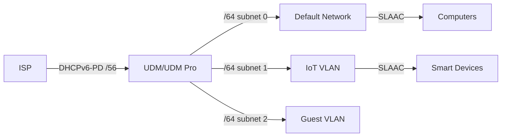

# How to Configure IPv6 on Ubiquiti UniFi Dream Machine - A Practical Guide

Author: [nawazdhandala](https://www.github.com/nawazdhandala)

Tags: IPv6, Ubiquiti, UniFi, Dream Machine, DHCPv6

Description: Configure native IPv6 on Ubiquiti UniFi Dream Machine (UDM) and UDM Pro with DHCPv6-PD, per-VLAN prefix assignment, and RA settings for home and small business networks.

## UniFi Dream Machine IPv6 Architecture

The UDM and UDM Pro support full IPv6 with per-network prefix delegation sub-assignment.



## Configure WAN IPv6

Enable IPv6 on the WAN interface in UniFi Network application.

```text
UniFi Network App → Settings → Internet → Primary (WAN1) → IPv6

IPv6 Connection: DHCPv6

DHCPv6 Prefix Delegation Size: 56
  (use 48 if ISP supports it, 60 if ISP only provides /60)

IPv6 Prefix ID: 0  (for the default network)

Advanced options:
  Use Prefix Delegation: Enabled
  DHCPv6 PD Prefix Length: 56
```

## Configure IPv6 per Network/VLAN

Assign a unique /64 from the delegated prefix to each network.

```text
UniFi Network → Settings → Networks → [Network Name] → Advanced

IPv6 Interface Type: Prefix Delegation
IPv6 Prefix ID: 0    (default network - first /64)
IPv6 Prefix ID: 1    (IoT VLAN - second /64)
IPv6 Prefix ID: 2    (Guest VLAN - third /64)
...
Maximum prefix IDs with /56 delegation: 255 unique /64 networks

RA Settings:
  Router Advertisement: Enable
  RA Priority: High (default network) / Medium (others)

SLAAC: Enabled (devices self-assign addresses)
DHCPv6 for clients: Stateless (SLAAC + DNS via RA)
  or Stateful (DHCPv6 assigns specific addresses)
```

## SSH Configuration Verification

UniFi Dream Machine supports SSH for direct verification.

```bash
# SSH into UDM

ssh root@192.168.1.1    # default admin password

# Check WAN IPv6 address
ip -6 addr show dev eth8   # WAN port varies by model

# Check delegated prefix
ip -6 route show | grep "pref"

# Check LAN prefix per network
ip -6 addr show dev br0     # Default network
ip -6 addr show dev br10    # VLAN 10

# View radvd configuration
cat /run/radvd.conf

# Check radvd is running
systemctl status radvd

# View DHCPv6 client status
systemctl status dhcpc6@eth8
journalctl -u dhcpc6@eth8 | tail -30
```

## IPv6 Firewall on UDM

UniFi has IPv6 firewall rules separate from IPv4 rules.

```text
UniFi Network → Settings → Firewall → IPv6

Default behavior:
  WAN IN: Block all new sessions from internet
  WAN OUT: Allow all (stateful - allows return traffic)
  LAN IN: Allow all (between VLANs)

Add custom rules to allow inbound services:
  Rule: Allow inbound SSH to home server
  Action: Accept
  Protocol: TCP
  Destination: [server IPv6 address]
  Destination Port: 22

  Rule: Allow inbound HTTPS to home server
  Action: Accept
  Protocol: TCP
  Destination: [server IPv6 address]
  Destination Port: 443
```

## Verify IPv6 from LAN Devices

```bash
# From a device on the UniFi LAN

# Check for global IPv6 address from UDM prefix
ip -6 addr show | grep "scope global"
# Expected: 2001:db8:XXXX:0000::/64 (prefix ID 0)

# Check default IPv6 route
ip -6 route show default

# Ping test
ping6 -c 4 2606:4700:4700::1111    # Cloudflare
ping6 -c 4 2001:4860:4860::8888    # Google

# Verify public IPv6 address
curl -6 https://ifconfig.co

# Test IPv6-only site
curl -6 https://ipv6.google.com

# Check IoT VLAN device has different /64 prefix ID
# IoT device should show: 2001:db8:XXXX:0001::/64 (prefix ID 1)
```

## Conclusion

UniFi Dream Machine configures IPv6 under Settings → Internet → WAN → IPv6 using DHCPv6-PD. Set the prefix delegation size to /56 to receive enough address space to assign a unique /64 to each network and VLAN - configure each network's Prefix ID (0, 1, 2...) so UDM automatically carves the /56 into /64s. Enable Router Advertisement on each network so that connected devices receive IPv6 via SLAAC. UniFi's IPv6 firewall blocks all inbound connections by default; add explicit rules for any services you want accessible from the internet. SSH into the UDM to verify DHCPv6-PD lease status and radvd configuration directly when troubleshooting.
