# How to Understand the Differences Between IPv6 and IPv4 Packet Handling

Author: [nawazdhandala](https://www.github.com/nawazdhandala)

Tags: IPv6, IPv4, Packet Handling, Router, Networking

Description: Compare how IPv6 and IPv4 packets are processed by routers, highlighting key differences in fragmentation, checksums, and option processing that affect performance.

## Introduction

IPv6 and IPv4 share the same fundamental forwarding concept but differ significantly in how routers process packets. Understanding these differences helps network engineers optimize performance, configure firewalls correctly, and troubleshoot connectivity issues in dual-stack environments.

## Key Processing Differences

```mermaid
graph TD
    subgraph IPv4 Router Processing
        A1[Receive packet] --> B1[Verify Header Checksum]
        B1 --> C1[Check TTL > 0]
        C1 --> D1[Decrement TTL]
        D1 --> E1[Recalculate checksum]
        E1 --> F1[Check for options]
        F1 --> G1[Fragment if needed]
        G1 --> H1[Forward packet]
    end

    subgraph IPv6 Router Processing
        A2[Receive packet] --> B2[Check Hop Limit > 0]
        B2 --> C2[Decrement Hop Limit]
        C2 --> D2[Check for Hop-by-Hop options]
        D2 --> E2[Forward packet]
    end
```



## Fragmentation: The Biggest Difference

```text
IPv4:
  - Any router on the path CAN fragment packets
  - Fragmentation at intermediate hops is transparent to endpoints
  - Source sets DF (Don't Fragment) bit to disable fragmentation
  - Required for path MTU discovery to work

IPv6:
  - ONLY the source can fragment packets
  - Routers that receive an oversized packet send "Packet Too Big" ICMPv6
  - Source must discover path MTU before sending large packets
  - Fragmentation uses the Fragment Extension Header
  - No equivalent of IPv4's DF bit (fragmentation is always source-only)
```

```python
# Behavior comparison

def router_receive_oversized_packet(protocol: str, mtu: int = 1500):
    """Simulate router behavior when receiving an oversized packet."""
    packet_size = 1600  # Larger than MTU

    if protocol == "IPv4":
        print("IPv4 Router:")
        print(f"  Packet size {packet_size} > link MTU {mtu}")
        print("  Option A: Fragment the packet (if DF bit = 0)")
        print("  Option B: Send ICMP Fragmentation Needed (if DF bit = 1)")
        print("  Result: Packet either fragmented or dropped")

    elif protocol == "IPv6":
        print("IPv6 Router:")
        print(f"  Packet size {packet_size} > link MTU {mtu}")
        print("  NO fragmentation by routers in IPv6!")
        print("  Action: Drop packet and send ICMPv6 Packet Too Big")
        print(f"  ICMPv6 includes: MTU = {mtu}")
        print("  Source must retransmit with fragments or smaller packets")

router_receive_oversized_packet("IPv4")
print()
router_receive_oversized_packet("IPv6")
```

## Header Checksum Processing

```text
IPv4:
  1. Router verifies header checksum (ensures header wasn't corrupted)
  2. Decrements TTL
  3. Recalculates and stores new header checksum
  Cost: 2 checksum operations per hop

IPv6:
  1. Router decrements Hop Limit
  2. No checksum calculation or verification
  Cost: 1 field decrement per hop

Performance impact at 10 Gbps (10M+ packets/sec):
  IPv4: millions of checksum operations per second per interface
  IPv6: zero checksum operations per second for forwarding
```

## Options/Extension Headers

```text
IPv4 Options:
  - All routers must check for options (even if none present)
  - Some options require per-hop processing
  - Options make header length variable (20-60 bytes)
  - Routers cannot easily skip options they don't understand

IPv6 Extension Headers:
  - Most extension headers are processed only at endpoints
  - Exception: Hop-by-Hop Options Header (must be processed by all routers)
  - Hop-by-Hop is optional and rarely used (not present in most packets)
  - If Hop-by-Hop is present, it is FIRST in the chain
```

## Comparison Table

| Behavior | IPv4 | IPv6 |
|---|---|---|
| Header checksum | Verified + recalculated per hop | None |
| Fragmentation by routers | Allowed (when DF=0) | Never |
| Options processing per hop | Required | Only Hop-by-Hop (rare) |
| Header size | Variable 20-60 bytes | Fixed 40 bytes |
| Minimum MTU | 68 bytes (theoretical), 576 practical | 1280 bytes |
| Multicast addresses | Optional (IPv4 optional) | Required for core protocols |
| Broadcast | Exists | Eliminated (replaced by multicast) |
| ARP/NDP | ARP | NDP (uses ICMPv6) |
| DHCP required | Common | Optional (SLAAC available) |

## Practical Performance Implications

```bash
# Measure forwarding performance difference (conceptual)
# IPv6 packets have less per-hop overhead:
#   - No checksum computation
#   - Fixed header → predictable cache access patterns
#   - No fragmentation decisions

# Check forwarding statistics on Linux
ip -s -6 link show eth0
# Shows forwarded packet counts

# Examine forwarding performance
cat /proc/net/snmp6 | grep -E "Ip6InDelivers|Ip6OutForwDatagrams"
```

## Conclusion

IPv6's packet handling is fundamentally simpler and more efficient than IPv4. Routers do less work per packet: no checksum operations, no fragmentation decisions, and no variable-length header parsing. The trade-off is that sources must do more work - they are responsible for all fragmentation and must maintain path MTU state. This architectural shift moves complexity to the network edges (endpoints) and simplifies the core network, enabling higher forwarding rates in modern hardware.
