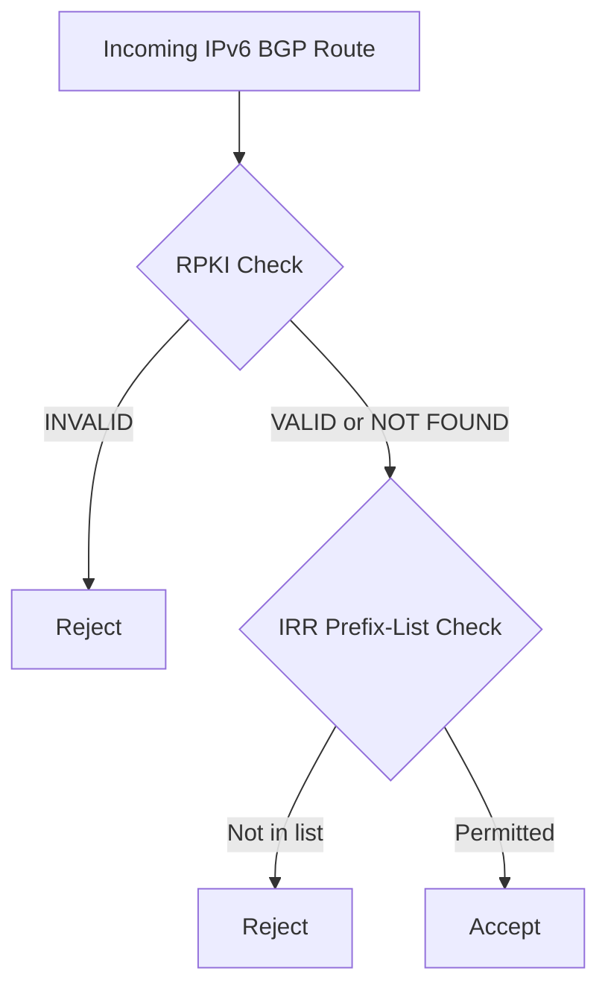

# How to Implement IRR (Internet Routing Registry) Filtering for IPv6

Author: [nawazdhandala](https://www.github.com/nawazdhandala)

Tags: IRR, BGP, IPv6, Routing Security, Network Automation

Description: Implement Internet Routing Registry (IRR) based filtering for IPv6 BGP sessions to automatically reject unauthorized route announcements.

## What is IRR Filtering?

Internet Routing Registries (IRRs) like RIPE, ARIN, and RADB store routing policy objects including route6 objects and AS-SET macros. IRR filtering generates prefix-lists or filter-sets from these objects to permit only registered IPv6 routes from each peer.

## IRR Key Objects

- **route6**: Documents a specific IPv6 prefix and its originating AS
- **aut-num**: Documents an AS's routing policy using RPSL
- **as-set**: A named group of ASNs (e.g., AS-CLOUDFLARE)

## Step 1: Register Your IPv6 Prefixes in IRR

Register route6 objects in your RIR's IRR database:

```
# RIPE NCC route6 object template
route6:     2001:db8::/32
descr:      My IPv6 prefix
origin:     AS64496
mnt-by:     MY-MNT
created:    2026-03-20T00:00:00Z
last-modified: 2026-03-20T00:00:00Z
source:     RIPE
```

## Step 2: Install BGPq4

BGPq4 queries IRR databases and generates router filter configurations:

```bash
# Install bgpq4 on Debian/Ubuntu
sudo apt-get install bgpq4

# Or compile from source
git clone https://github.com/bgpq4/bgpq4
cd bgpq4 && ./configure && make && sudo make install
```

## Step 3: Generate IPv6 Prefix Filters

```bash
# Generate FRRouting prefix-list for a peer's AS-SET
bgpq4 -6 -F "ipv6 prefix-list PEER-AS65001 seq %n permit %p\n" AS-PEERONE

# Generate Cisco IOS format
bgpq4 -6 -Z -F "ipv6 prefix-list PEER-AS65001 seq %n permit %p\n" AS-PEERONE

# Generate BIRD2 format
bgpq4 -6 -b -F "  %p,\n" AS-PEERONE

# For a single ASN (not AS-SET)
bgpq4 -6 -F "ipv6 prefix-list AS65001-IN seq %n permit %p\n" AS65001
```

## Step 4: Apply Generated Filters to Routers

```bash
#!/bin/bash
# irr-update.sh — Regenerate and apply IRR filters

PEERS=(
    "AS65001:AS-PEERONE"
    "AS65002:AS-PEERTWO"
    "AS65003:AS65003"  # Single ASN peer
)

for peer_entry in "${PEERS[@]}"; do
    asn="${peer_entry%%:*}"
    asset="${peer_entry##*:}"
    list_name="PEER-${asn}-IPV6-IN"

    echo "Generating filter for $asn ($asset)..."

    # Generate new prefix-list
    bgpq4 -6 -F "ipv6 prefix-list ${list_name} seq %n permit %p\n" "$asset" > /tmp/${list_name}.conf

    # Apply to FRR
    sudo vtysh -f /tmp/${list_name}.conf

    echo "Applied filter for $asn"
done

# Reload BGP to apply new filters
sudo vtysh -c "clear bgp ipv6 unicast * soft in"
```

## Step 5: FRR Configuration with IRR Filters

```
# /etc/frr/frr.conf
router bgp 64496
  bgp router-id 192.0.2.1

  neighbor 2001:db8:peer1::1 remote-as 65001
  neighbor 2001:db8:peer1::1 description "Peer One"

  address-family ipv6 unicast
    neighbor 2001:db8:peer1::1 activate
    # Apply IRR-generated prefix-list on import
    neighbor 2001:db8:peer1::1 prefix-list PEER-AS65001-IPV6-IN in
    # Apply your own prefix-list on export
    neighbor 2001:db8:peer1::1 prefix-list MY-IPV6-OUT out
  exit-address-family
```

## Step 6: Automate Filter Updates via Cron

IRR data changes when peers update their route6 objects. Refresh filters regularly:

```bash
# Crontab entry — refresh IRR filters every 4 hours
0 */4 * * * /usr/local/bin/irr-update.sh >> /var/log/irr-update.log 2>&1
```

## Combining IRR with RPKI

Best practice is to use both IRR and RPKI:



## Monitoring

Use [OneUptime](https://oneuptime.com) to monitor the outcome of your IRR filter updates. Alert if the BGP accepted prefix count drops significantly after a filter refresh, indicating a possible misconfiguration.

## Conclusion

IRR filtering for IPv6 requires registering route6 objects, using BGPq4 to generate prefix-lists, and automating regular updates. Combined with RPKI, IRR filtering provides comprehensive protection against unauthorized IPv6 route announcements.
