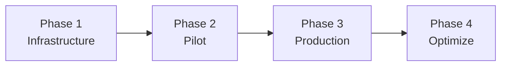

# How to Plan ISP IPv6 Rollout Strategy

Author: [nawazdhandala](https://www.github.com/nawazdhandala)

Tags: IPv6, ISP, Strategy, Rollout, Planning, Network Operations

Description: A phased IPv6 rollout strategy for ISPs covering infrastructure readiness, customer migration, and monitoring milestones.

## Why ISPs Need a Rollout Strategy

Deploying IPv6 across an ISP's network involves multiple teams, vendor dependencies, and customer impact risks. A phased strategy minimizes disruption while steadily building toward full IPv6 deployment.

## Phase Overview



## Phase 1: Infrastructure Readiness (Months 1-3)

**Tasks:**
- Request IPv6 allocation from RIR (ARIN, RIPE NCC, etc.)
- Design hierarchical address plan
- Upgrade core routers/switches to support IPv6 forwarding
- Enable IPv6 on BGP peering sessions and upstream providers
- Deploy DHCPv6/SLAAC infrastructure
- Update IPAM and NOC tools for IPv6 visibility

**Success Criteria:**
- IPv6 reachable between all core PoPs
- IPv6 announced to all upstream providers
- NOC can see IPv6 flows in monitoring tools

## Phase 2: Pilot Deployment (Months 4-6)

**Tasks:**
- Select pilot customer segment (tech-savvy early adopters, business customers)
- Enable IPv6 on BNG for pilot VLAN/group
- Deploy dual-stack to pilot customers
- Train first-line support staff
- Test transition mechanisms (DS-Lite, NAT64) for IPv4-only content

**Pilot Metrics to Track:**

```python
# Weekly pilot metrics report
pilot_metrics = {
    "customers_with_ipv6": 0,
    "ipv6_traffic_pct": 0.0,
    "support_tickets_ipv6": 0,
    "ipv6_specific_issues": []
}

# Sample calculation
total_customers = 1000
customers_with_ipv6 = 847
ipv6_pct = customers_with_ipv6 / total_customers * 100
print(f"IPv6 adoption in pilot: {ipv6_pct:.1f}%")
```

## Phase 3: Production Rollout (Months 7-18)

**Tasks:**
- Roll out by region/city, prioritizing high-density areas first
- Enable IPv6 opt-out (not opt-in) — default-on for all new customers
- Migrate existing customers in batches by DSLAM/OLT
- Monitor for IPv6-related support ticket increases
- Address CPE compatibility issues per model

**Batch migration script example:**

```bash
#!/bin/bash
# Enable IPv6 for a batch of DSLAM ports
DSLAM_HOST="dslam-01.pop1.isp.example.com"
VLAN_LIST="100 101 102 103 104"

for VLAN in $VLAN_LIST; do
    ssh admin@$DSLAM_HOST "configure vlan $VLAN ipv6 enable"
    echo "IPv6 enabled on VLAN $VLAN"
done
```

## Phase 4: Optimization (Months 19+)

**Tasks:**
- Identify and address remaining IPv4-only subscribers
- Evaluate IPv6-only deployment for new neighborhoods
- Reduce IPv4 pool sizes (return addresses or let DS-Lite handle IPv4)
- Publish IPv6 adoption stats publicly (marketing benefit)
- Optimize for IPv6 performance (PMTUD, ECN, TCP tuning)

## Risk Management

| Risk | Mitigation |
|------|-----------|
| CPE incompatibility | Maintain CPE compatibility list; offer replacement program |
| IPv6 performance issues | Monitor RTT and loss; tune buffer/MTU settings |
| Support volume spike | Pre-train support; deploy KB articles before rollout |
| Routing instability | Use BGP dampening; test in lab before production |

## KPIs to Report to Leadership

- % of subscribers with active IPv6 sessions
- IPv6 traffic as % of total traffic
- Number of IPv6-related support tickets (should decrease over time)
- IPv6 peering capacity vs utilization

## Conclusion

A phased IPv6 rollout allows ISPs to build competency, address issues in controlled pilots, and scale confidently to full production. The key success factor is making IPv6 default-on rather than opt-in, combined with proactive CPE compatibility management.
