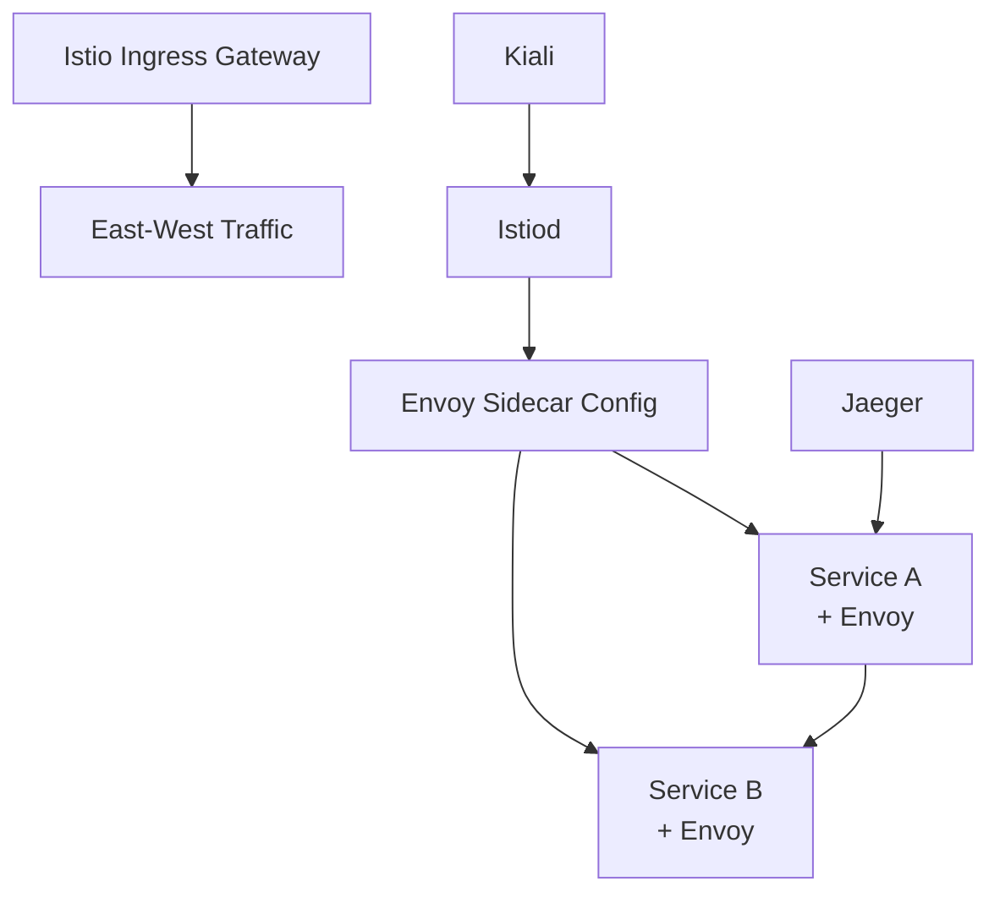

# How to Deploy Istio with OpenTofu

Author: [nawazdhandala](https://www.github.com/nawazdhandala)

Tags: OpenTofu, Istio, Service Mesh, Kubernetes, mTLS, Helm, Infrastructure as Code

Description: Learn how to deploy Istio service mesh on Kubernetes using OpenTofu with the official Helm charts, enabling mTLS, traffic management, and observability for microservices.

---

Istio adds security, traffic management, and observability to Kubernetes services without code changes. Deploying Istio with OpenTofu ensures the control plane and ingress gateways are versioned, reproducible, and configured consistently across clusters.

## Istio Component Architecture



## Install Istio via Helm

```hcl
# istio.tf

# Step 1: CRDs

resource "helm_release" "istio_base" {
  name             = "istio-base"
  repository       = "https://istio-release.storage.googleapis.com/charts"
  chart            = "base"
  version          = "1.20.2"
  namespace        = "istio-system"
  create_namespace = true
}

# Step 2: Control plane
resource "helm_release" "istiod" {
  name       = "istiod"
  repository = "https://istio-release.storage.googleapis.com/charts"
  chart      = "istiod"
  version    = "1.20.2"
  namespace  = "istio-system"

  values = [
    yamlencode({
      pilot = {
        resources = {
          requests = { cpu = "200m", memory = "200Mi" }
          limits   = { cpu = "500m", memory = "1Gi" }
        }
        autoscaleMin = var.environment == "production" ? 2 : 1
        autoscaleMax = 5
      }

      meshConfig = {
        accessLogFile = "/dev/stdout"
        enableTracing = true
        defaultConfig = {
          tracing = { sampling = var.environment == "production" ? 1.0 : 100.0 }
        }
        outboundTrafficPolicy = {
          mode = "REGISTRY_ONLY"  # Block traffic to unregistered services
        }
      }

      global = {
        proxy = {
          resources = {
            requests = { cpu = "10m", memory = "40Mi" }
            limits   = { cpu = "100m", memory = "128Mi" }
          }
        }
        # Add cluster name to proxy metadata
        multiCluster = { clusterName = var.cluster_name }
      }
    })
  ]

  depends_on = [helm_release.istio_base]
}

# Step 3: Ingress Gateway
resource "helm_release" "istio_gateway" {
  name       = "istio-ingressgateway"
  repository = "https://istio-release.storage.googleapis.com/charts"
  chart      = "gateway"
  version    = "1.20.2"
  namespace  = "istio-ingress"

  create_namespace = true

  values = [
    yamlencode({
      replicaCount = var.environment == "production" ? 3 : 2

      service = {
        type = "LoadBalancer"
        annotations = {
          "service.beta.kubernetes.io/aws-load-balancer-type"   = "nlb"
          "service.beta.kubernetes.io/aws-load-balancer-scheme" = "internet-facing"
        }
      }
    })
  ]

  depends_on = [helm_release.istiod]
}
```

## Strict mTLS Policy

```hcl
resource "kubernetes_manifest" "peer_auth" {
  manifest = {
    apiVersion = "security.istio.io/v1beta1"
    kind       = "PeerAuthentication"
    metadata = {
      name      = "default"
      namespace = "istio-system"
    }
    spec = {
      mtls = { mode = "STRICT" }
    }
  }
  depends_on = [helm_release.istiod]
}
```

## Namespace Sidecar Injection

```hcl
resource "kubernetes_namespace" "apps" {
  metadata {
    name   = "apps"
    labels = { "istio-injection" = "enabled" }
  }
}
```

## Kiali Dashboard

```hcl
resource "helm_release" "kiali" {
  name             = "kiali-server"
  repository       = "https://kiali.org/helm-charts"
  chart            = "kiali-server"
  version          = "1.77.0"
  namespace        = "istio-system"

  set {
    name  = "auth.strategy"
    value = "anonymous"  # Use "openid" for production
  }

  set {
    name  = "external_services.tracing.url"
    value = "http://jaeger-query.observability:16686"
  }

  depends_on = [helm_release.istiod]
}
```

## Best Practices

- Install Istio in dependency order: base → istiod → gateways. Use `depends_on` in OpenTofu to enforce this.
- Enable strict mTLS mode cluster-wide via `PeerAuthentication` - then all service-to-service communication is encrypted automatically.
- Set `outboundTrafficPolicy = REGISTRY_ONLY` to block traffic to external services not explicitly registered in ServiceEntry resources.
- Configure sidecar proxy resource limits - unbounded proxies consume significant CPU and memory on high-traffic services.
- Use Kiali for service mesh observability - it shows the dependency graph, traffic flow, and mTLS status in a visual interface.
