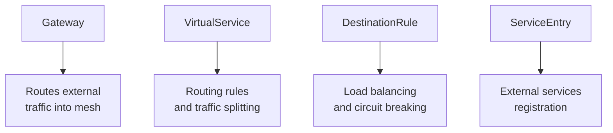

# How to Set Up Traffic Management with Istio and OpenTofu

Author: [nawazdhandala](https://www.github.com/nawazdhandala)

Tags: OpenTofu, Istio, Traffic Management, VirtualService, DestinationRule, Canary, Circuit Breaker, Infrastructure as Code

Description: Learn how to configure Istio traffic management with OpenTofu, including VirtualService routing, DestinationRule policies, canary deployments, circuit breaking, and retry logic.

---

Istio's traffic management features - VirtualService, DestinationRule, and Gateway - give you fine-grained control over how traffic flows between services. OpenTofu manages these CRDs as code, making canary deployments, circuit breakers, and retry policies reproducible.

## Traffic Management Building Blocks



## Canary Deployment with Traffic Splitting

```hcl
# canary.tf

resource "kubernetes_manifest" "virtual_service_canary" {
  manifest = {
    apiVersion = "networking.istio.io/v1beta1"
    kind       = "VirtualService"
    metadata = {
      name      = "api-service"
      namespace = "apps"
    }
    spec = {
      hosts = ["api-service"]
      http = [{
        route = [
          {
            destination = {
              host   = "api-service"
              subset = "stable"
            }
            weight = 90
          },
          {
            destination = {
              host   = "api-service"
              subset = "canary"
            }
            weight = 10
          }
        ]
      }]
    }
  }
}

resource "kubernetes_manifest" "destination_rule" {
  manifest = {
    apiVersion = "networking.istio.io/v1beta1"
    kind       = "DestinationRule"
    metadata = {
      name      = "api-service"
      namespace = "apps"
    }
    spec = {
      host = "api-service"
      subsets = [
        {
          name   = "stable"
          labels = { version = "v1" }
        },
        {
          name   = "canary"
          labels = { version = "v2" }
        }
      ]
    }
  }
}
```

## Circuit Breaker

```hcl
resource "kubernetes_manifest" "circuit_breaker" {
  manifest = {
    apiVersion = "networking.istio.io/v1beta1"
    kind       = "DestinationRule"
    metadata = {
      name      = "database-circuit-breaker"
      namespace = "apps"
    }
    spec = {
      host = "database-service"
      trafficPolicy = {
        connectionPool = {
          tcp = {
            maxConnections = 100
          }
          http = {
            http1MaxPendingRequests  = 50
            http2MaxRequests         = 100
            maxRequestsPerConnection = 10
          }
        }
        outlierDetection = {
          consecutiveGatewayErrors = 5
          interval                 = "10s"
          baseEjectionTime         = "30s"
          maxEjectionPercent       = 50
        }
      }
    }
  }
}
```

## Retry and Timeout Policy

```hcl
resource "kubernetes_manifest" "retry_policy" {
  manifest = {
    apiVersion = "networking.istio.io/v1beta1"
    kind       = "VirtualService"
    metadata = {
      name      = "payment-service"
      namespace = "apps"
    }
    spec = {
      hosts = ["payment-service"]
      http = [{
        timeout = "5s"
        retries = {
          attempts      = 3
          perTryTimeout = "2s"
          retryOn       = "gateway-error,connect-failure,retriable-4xx"
        }
        route = [{
          destination = {
            host   = "payment-service"
            port   = { number = 8080 }
          }
        }]
      }]
    }
  }
}
```

## Header-Based Routing for Testing

```hcl
resource "kubernetes_manifest" "header_routing" {
  manifest = {
    apiVersion = "networking.istio.io/v1beta1"
    kind       = "VirtualService"
    metadata = {
      name      = "api-service-testing"
      namespace = "apps"
    }
    spec = {
      hosts = ["api-service"]
      http = [
        {
          # Route testers with header to canary
          match = [{
            headers = {
              x-test-canary = { exact = "true" }
            }
          }]
          route = [{
            destination = {
              host   = "api-service"
              subset = "canary"
            }
          }]
        },
        {
          # Everyone else to stable
          route = [{
            destination = {
              host   = "api-service"
              subset = "stable"
            }
          }]
        }
      ]
    }
  }
}
```

## Best Practices

- Use weighted traffic splitting to gradually roll out canary deployments - start at 1%, monitor error rates, then increase.
- Configure outlier detection (circuit breaking) for all downstream service dependencies to prevent cascade failures.
- Set per-request timeouts in VirtualService rather than relying on application-level timeouts - mesh timeouts are enforced by the proxy.
- Use header-based routing for testing canary deployments internally before exposing them to traffic.
- Always pair traffic splitting with DestinationRule subsets using deployment labels (e.g., `version: v1`) - this is how Istio identifies which pods receive which traffic.
