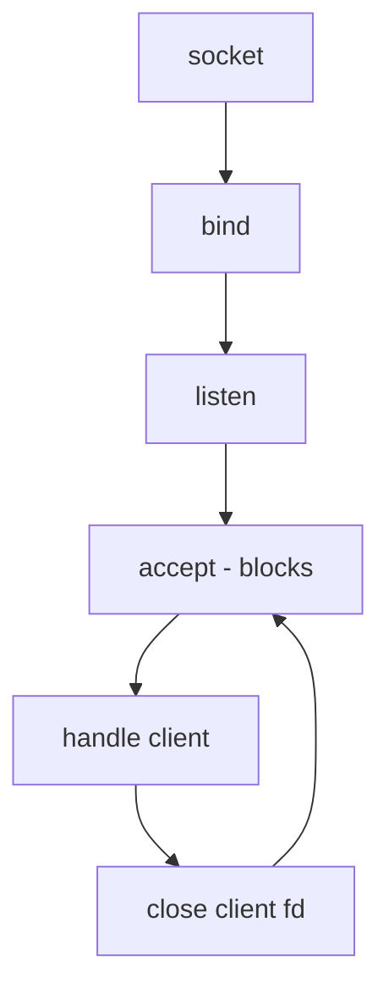

# How to Build an Iterative TCP Server for IPv4

Author: [nawazdhandala](https://www.github.com/nawazdhandala)

Tags: IPv4, TCP, Sockets, Iterative Server, C, POSIX, Networking

Description: Learn how to build an iterative (single-threaded, one-at-a-time) IPv4 TCP server in C and Python - the simplest possible server architecture, ideal for understanding the socket API and...

## What Is an Iterative Server?

An iterative server handles one client at a time, from accept to close, before moving on to the next connection. While it cannot serve multiple clients concurrently, it is the simplest architecture and sufficient for low-traffic services, testing tools, and educational purposes.



## Iterative Echo Server in C

```c
#include <stdio.h>
#include <string.h>
#include <unistd.h>
#include <arpa/inet.h>
#include <sys/socket.h>
#include <netinet/in.h>

#define PORT    9000
#define BACKLOG 5
#define BUFSIZE 4096

/* Process one client to completion: read until EOF, echo each chunk */
void handle_client(int client_fd, const char *client_ip, uint16_t client_port) {
    printf("[+] %s:%d connected\n", client_ip, client_port);

    char buf[BUFSIZE];
    ssize_t n;
    while ((n = recv(client_fd, buf, sizeof(buf), 0)) > 0) {
        /* Echo received data back to the client */
        ssize_t sent = 0;
        while (sent < n) {
            ssize_t s = send(client_fd, buf + sent, (size_t)(n - sent), 0);
            if (s < 0) { perror("send"); goto done; }
            sent += s;
        }
    }

done:
    printf("[-] %s:%d disconnected\n", client_ip, client_port);
    close(client_fd);
}

int main(void) {
    int server_fd = socket(AF_INET, SOCK_STREAM, 0);
    if (server_fd < 0) { perror("socket"); return 1; }

    /* Allow fast restart without waiting for TIME_WAIT */
    int opt = 1;
    setsockopt(server_fd, SOL_SOCKET, SO_REUSEADDR, &opt, sizeof(opt));

    struct sockaddr_in addr = {0};
    addr.sin_family      = AF_INET;
    addr.sin_addr.s_addr = INADDR_ANY;
    addr.sin_port        = htons(PORT);

    if (bind(server_fd, (struct sockaddr *)&addr, sizeof(addr)) < 0) {
        perror("bind"); return 1;
    }
    if (listen(server_fd, BACKLOG) < 0) {
        perror("listen"); return 1;
    }

    printf("Iterative TCP server on 0.0.0.0:%d (one client at a time)\n", PORT);

    while (1) {
        struct sockaddr_in client_addr;
        socklen_t          client_len = sizeof(client_addr);

        /* Block until a client connects */
        int client_fd = accept(server_fd,
                               (struct sockaddr *)&client_addr, &client_len);
        if (client_fd < 0) { perror("accept"); continue; }

        char client_ip[INET_ADDRSTRLEN];
        inet_ntop(AF_INET, &client_addr.sin_addr, client_ip, sizeof(client_ip));
        uint16_t client_port = ntohs(client_addr.sin_port);

        /* Service this client completely before accepting the next */
        handle_client(client_fd, client_ip, client_port);
    }

    close(server_fd);
    return 0;
}
```

## Iterative Server in Python

```python
import socket

HOST    = "0.0.0.0"
PORT    = 9000
BUFSIZE = 4096

def handle_client(conn: socket.socket, addr: tuple) -> None:
    """Process one client connection to completion."""
    ip, port = addr
    print(f"[+] {ip}:{port} connected")
    try:
        while True:
            data = conn.recv(BUFSIZE)
            if not data:
                break           # client closed the connection
            conn.sendall(data)  # echo
    except OSError as e:
        print(f"Error: {e}")
    finally:
        conn.close()
        print(f"[-] {ip}:{port} disconnected")

def main() -> None:
    with socket.socket(socket.AF_INET, socket.SOCK_STREAM) as server:
        server.setsockopt(socket.SOL_SOCKET, socket.SO_REUSEADDR, 1)
        server.bind((HOST, PORT))
        server.listen(5)
        print(f"Iterative echo server on {HOST}:{PORT}")

        while True:
            conn, addr = server.accept()   # blocks until a client connects
            handle_client(conn, addr)      # serve this client to completion

if __name__ == "__main__":
    main()
```

## Comparing Server Architectures

| Architecture | Concurrency | Complexity | Use case |
|-------------|-------------|------------|----------|
| Iterative | 1 client at a time | Minimal | Testing, CLI tools, admin interfaces |
| Multi-threaded | N clients (one thread each) | Medium | Moderate concurrency |
| Thread pool | N clients (bounded threads) | Medium | Predictable resource usage |
| Event-driven (epoll) | Thousands of clients | Higher | High-concurrency servers |

## Compile and Test

```bash
gcc -Wall -o iterative_server iterative_server.c
./iterative_server

# Test: second connection waits in the backlog queue

echo "client 1" | nc 127.0.0.1 9000 &
echo "client 2" | nc 127.0.0.1 9000    # queued until client 1 disconnects
```

## When to Use an Iterative Server

- **Administrative tools**: single-operator interfaces where concurrent access is undesirable.
- **Protocol learning**: easiest architecture to trace and debug.
- **Serialized workflows**: processing pipeline where steps must complete sequentially.
- **Embedded systems**: resource-constrained environments where threading adds too much overhead.

## Conclusion

An iterative TCP server calls `accept()`, services the returned client socket completely inside a `handle_client()` function, closes the socket, and loops back to `accept()`. New connection attempts queue in the kernel backlog (controlled by the `backlog` argument to `listen()`) while the current client is being served. The backlog is not a hard concurrency limit - it is the queue depth before the kernel starts refusing connections. Iterative servers are simple, deterministic, and easy to debug, making them the best starting point for learning socket programming before moving on to threaded or event-driven designs.
