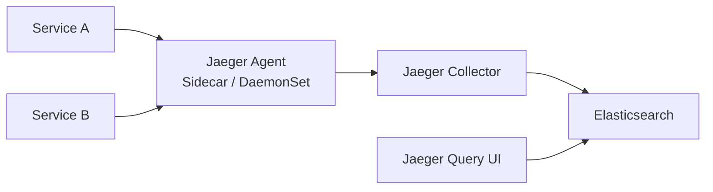

# How to Deploy Jaeger for Distributed Tracing with OpenTofu

Author: [nawazdhandala](https://www.github.com/nawazdhandala)

Tags: OpenTofu, Jaeger, Distributed Tracing, OpenTelemetry, Kubernetes, Helm, Infrastructure as Code

Description: Learn how to deploy Jaeger on Kubernetes using OpenTofu for distributed tracing, including Elasticsearch backend, ingress configuration, and sampling strategies.

---

Jaeger provides distributed tracing for microservices — it traces requests as they flow through services, identifying latency bottlenecks and failures. OpenTofu deploys Jaeger with a scalable Elasticsearch backend and configures sampling appropriate for each environment.

## Jaeger Architecture



## Jaeger Operator Deployment

```hcl
# jaeger.tf
resource "helm_release" "jaeger_operator" {
  name             = "jaeger-operator"
  repository       = "https://jaegertracing.github.io/helm-charts"
  chart            = "jaeger-operator"
  version          = "2.49.0"
  namespace        = "observability"
  create_namespace = true

  set {
    name  = "rbac.clusterRole"
    value = "true"
  }
}
```

## Jaeger Instance with Elasticsearch Backend

```hcl
resource "kubernetes_manifest" "jaeger" {
  manifest = {
    apiVersion = "jaegertracing.io/v1"
    kind       = "Jaeger"
    metadata = {
      name      = "jaeger"
      namespace = "observability"
    }
    spec = {
      strategy = "production"

      storage = {
        type = "elasticsearch"
        options = {
          es = {
            server-urls = "https://elasticsearch-master.logging:9200"
            username    = "elastic"
            tls = {
              ca = "/etc/ssl/certs/ca-certificates.crt"
            }
          }
        }
        secretName = "jaeger-elasticsearch"
      }

      collector = {
        replicas = var.environment == "production" ? 2 : 1
        resources = {
          requests = { cpu = "100m", memory = "128Mi" }
          limits   = { cpu = "500m", memory = "512Mi" }
        }
      }

      query = {
        replicas = 1
        ingress = {
          enabled = true
          annotations = {
            "kubernetes.io/ingress.class"    = "nginx"
            "cert-manager.io/cluster-issuer" = "letsencrypt-prod"
          }
          hosts = ["jaeger.${var.domain}"]
          tls   = [{ secretName = "jaeger-tls", hosts = ["jaeger.${var.domain}"] }]
        }
      }

      sampling = {
        options = {
          default_strategy = {
            type  = var.environment == "production" ? "probabilistic" : "const"
            param = var.environment == "production" ? 0.1 : 1.0
          }
        }
      }
    }
  }

  depends_on = [helm_release.jaeger_operator]
}
```

## OpenTelemetry Collector for Trace Forwarding

```hcl
resource "helm_release" "otel_collector" {
  name       = "opentelemetry-collector"
  repository = "https://open-telemetry.github.io/opentelemetry-helm-charts"
  chart      = "opentelemetry-collector"
  version    = "0.73.1"
  namespace  = "observability"

  values = [
    yamlencode({
      mode = "deployment"

      config = {
        receivers = {
          otlp = {
            protocols = {
              grpc = { endpoint = "0.0.0.0:4317" }
              http = { endpoint = "0.0.0.0:4318" }
            }
          }
        }

        exporters = {
          jaeger = {
            endpoint = "jaeger-collector.observability:14250"
            tls = { insecure = true }
          }
        }

        service = {
          pipelines = {
            traces = {
              receivers  = ["otlp"]
              exporters  = ["jaeger"]
            }
          }
        }
      }
    })
  ]
}
```

## Best Practices

- Use probabilistic sampling (10%) in production to avoid overwhelming Elasticsearch with trace data.
- Use constant sampling (100%) in dev/staging so all requests are traced during development.
- Deploy the OpenTelemetry Collector as a gateway rather than having services send traces directly to Jaeger — it decouples your applications from the tracing backend.
- Set Elasticsearch index retention policies for trace data — production traces are often useful for 7-14 days, not indefinitely.
- Instrument services with OpenTelemetry SDK rather than Jaeger client libraries — OpenTelemetry is vendor-neutral and easier to migrate later.
