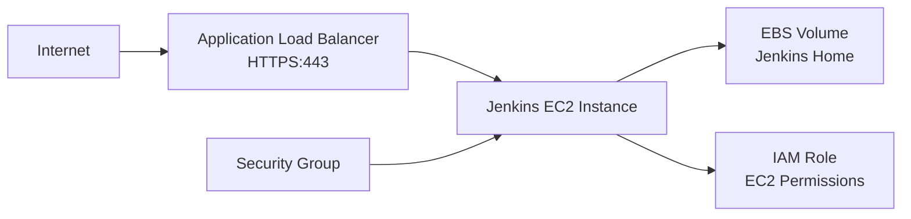

# How to Deploy Jenkins on AWS with OpenTofu

Author: [nawazdhandala](https://www.github.com/nawazdhandala)

Tags: OpenTofu, Jenkins, AWS, CI/CD, EC2, Infrastructure as Code, DevOps

Description: Learn how to deploy a production-ready Jenkins server on AWS using OpenTofu, including EC2 provisioning, EBS storage, security groups, and an Application Load Balancer.

---

Jenkins remains one of the most widely used CI/CD platforms. Deploying it manually on AWS leads to snowflake servers that are hard to replace. With OpenTofu, your Jenkins infrastructure is reproducible, and recovery from failure is as simple as running `tofu apply`.

## Architecture Overview



## VPC and Security Groups

```hcl
# main.tf

terraform {
  required_providers {
    aws = {
      source  = "hashicorp/aws"
      version = "~> 5.30"
    }
  }
}

provider "aws" {
  region = var.aws_region
}

data "aws_vpc" "default" {
  id = var.vpc_id
}

# Security group for the Jenkins instance
resource "aws_security_group" "jenkins" {
  name        = "jenkins-sg"
  description = "Security group for Jenkins server"
  vpc_id      = data.aws_vpc.default.id

  # Allow inbound from ALB only
  ingress {
    from_port       = 8080
    to_port         = 8080
    protocol        = "tcp"
    security_groups = [aws_security_group.alb.id]
  }

  # Allow SSH from bastion or VPN
  ingress {
    from_port   = 22
    to_port     = 22
    protocol    = "tcp"
    cidr_blocks = [var.admin_cidr]
  }

  egress {
    from_port   = 0
    to_port     = 0
    protocol    = "-1"
    cidr_blocks = ["0.0.0.0/0"]
  }
}

resource "aws_security_group" "alb" {
  name        = "jenkins-alb-sg"
  description = "Security group for Jenkins ALB"
  vpc_id      = data.aws_vpc.default.id

  ingress {
    from_port   = 443
    to_port     = 443
    protocol    = "tcp"
    cidr_blocks = ["0.0.0.0/0"]
  }

  egress {
    from_port   = 0
    to_port     = 0
    protocol    = "-1"
    cidr_blocks = ["0.0.0.0/0"]
  }
}
```

## IAM Role for Jenkins

```hcl
# iam.tf
resource "aws_iam_role" "jenkins" {
  name = "jenkins-instance-role"

  assume_role_policy = jsonencode({
    Version = "2012-10-17"
    Statement = [{
      Effect    = "Allow"
      Principal = { Service = "ec2.amazonaws.com" }
      Action    = "sts:AssumeRole"
    }]
  })
}

# Allow Jenkins to assume deployment roles in other accounts
resource "aws_iam_role_policy" "jenkins_assume_roles" {
  name = "AssumeDeploymentRoles"
  role = aws_iam_role.jenkins.id

  policy = jsonencode({
    Version = "2012-10-17"
    Statement = [{
      Effect   = "Allow"
      Action   = "sts:AssumeRole"
      Resource = var.deployment_role_arns
    }]
  })
}

resource "aws_iam_instance_profile" "jenkins" {
  name = "jenkins-instance-profile"
  role = aws_iam_role.jenkins.name
}
```

## EC2 Instance with User Data

```hcl
# ec2.tf
data "aws_ami" "amazon_linux_2023" {
  most_recent = true
  owners      = ["amazon"]

  filter {
    name   = "name"
    values = ["al2023-ami-*-x86_64"]
  }
}

# EBS volume for Jenkins home directory (persists separately from instance)
resource "aws_ebs_volume" "jenkins_home" {
  availability_zone = var.availability_zone
  size              = 100  # GB
  type              = "gp3"
  encrypted         = true

  tags = {
    Name = "jenkins-home"
  }
}

resource "aws_instance" "jenkins" {
  ami                    = data.aws_ami.amazon_linux_2023.id
  instance_type          = var.instance_type
  subnet_id              = var.subnet_id
  vpc_security_group_ids = [aws_security_group.jenkins.id]
  iam_instance_profile   = aws_iam_instance_profile.jenkins.name
  key_name               = var.key_pair_name

  # Bootstrap script to install Jenkins
  user_data = <<-EOF
    #!/bin/bash
    set -e

    # Install Java
    dnf install -y java-17-amazon-corretto

    # Add Jenkins repo and install
    wget -O /etc/yum.repos.d/jenkins.repo https://pkg.jenkins.io/redhat-stable/jenkins.repo
    rpm --import https://pkg.jenkins.io/redhat-stable/jenkins.io-2023.key
    dnf install -y jenkins

    # Mount the EBS volume for Jenkins home
    mkfs -t xfs /dev/xvdf || true
    mkdir -p /var/lib/jenkins
    mount /dev/xvdf /var/lib/jenkins
    echo "/dev/xvdf /var/lib/jenkins xfs defaults,nofail 0 2" >> /etc/fstab
    chown jenkins:jenkins /var/lib/jenkins

    # Start Jenkins
    systemctl enable jenkins
    systemctl start jenkins
  EOF

  tags = {
    Name = "jenkins-server"
  }
}

resource "aws_volume_attachment" "jenkins_home" {
  device_name = "/dev/xvdf"
  volume_id   = aws_ebs_volume.jenkins_home.id
  instance_id = aws_instance.jenkins.id
}
```

## Best Practices

- Separate the EBS volume from the instance so you can replace the EC2 instance without losing Jenkins data.
- Use an Application Load Balancer with ACM certificate for HTTPS termination rather than configuring SSL in Jenkins directly.
- Assign an IAM role to the instance rather than storing AWS credentials in Jenkins - use the role to assume per-environment deployment roles.
- Enable automated EBS snapshots using AWS Backup or Data Lifecycle Manager to protect Jenkins configuration.
- Consider migrating to Jenkins on Kubernetes for better scalability and resource utilization.
