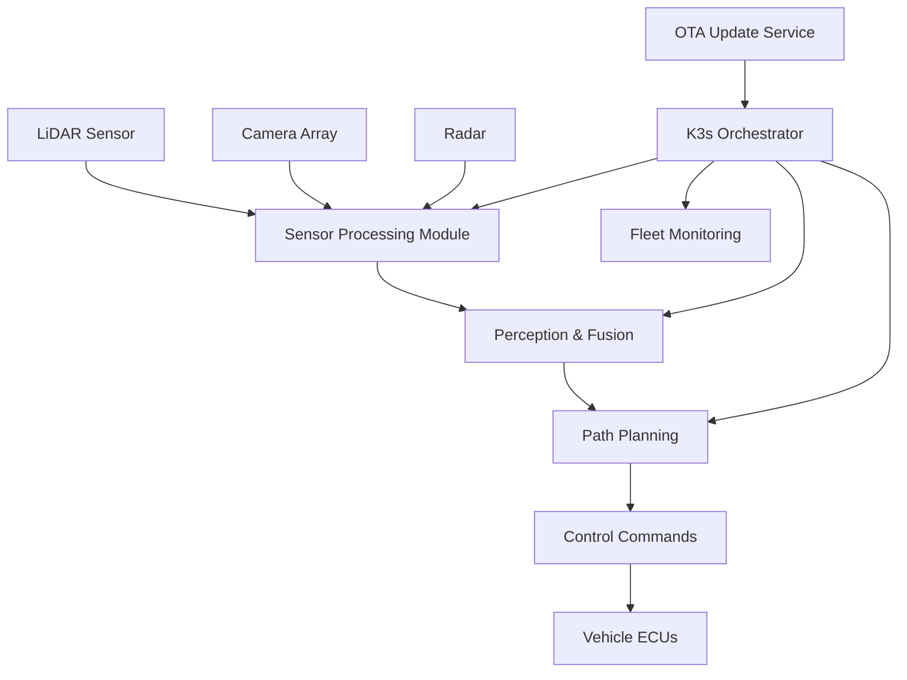

# How to Configure K3s for Autonomous Vehicle Edge Computing

Author: [nawazdhandala](https://www.github.com/nawazdhandala)

Tags: k3s, Kubernetes, Autonomous Vehicle, Edge Computing, AI, GPU, Real-Time, IoT

Description: Learn how to configure K3s for autonomous vehicle compute platforms, managing sensor fusion, perception, and AI inference workloads with real-time requirements.

## Introduction

Autonomous vehicles contain powerful onboard computers that run complex AI workloads: sensor fusion (LiDAR, cameras, radar), object detection, path planning, and control systems. K3s provides container orchestration for these workloads, enabling modular, updatable software stacks on vehicle compute platforms. This guide covers configuring K3s for automotive edge computing scenarios.

## Autonomous Vehicle Compute Architecture



## Step 1: Automotive-Grade Hardware Setup

Common autonomous vehicle compute platforms:

```bash
# NVIDIA DRIVE AGX Orin (automotive-grade)

# - 275 TOPS AI performance
# - Up to 256GB RAM
# - Automotive temperature rated (-40 to +105°C)
# - ISO 26262 ASIL-B support

# NVIDIA Jetson AGX Orin (development/lower-cost AVs)
# - 275 TOPS
# - 64GB LPDDR5

# Verify CUDA availability
nvidia-smi
nvcc --version

# Check for automotive-specific drivers
dpkg -l | grep nvidia-drive
```

## Step 2: Install K3s with Real-Time Considerations

Autonomous vehicles require near-real-time performance for safety-critical systems:

```yaml
# /etc/rancher/k3s/config.yaml
# Autonomous vehicle K3s configuration

disable:
  - traefik
  - local-storage

# Reserve substantial resources for safety-critical processes
kubelet-arg:
  # Reserve resources for OS and safety monitors
  - "system-reserved=cpu=2000m,memory=4Gi"
  - "kube-reserved=cpu=500m,memory=1Gi"
  - "max-pods=30"
  # Static CPU management for deterministic workloads
  - "cpu-manager-policy=static"
  # NUMA-aware scheduling
  - "topology-manager-policy=best-effort"
  # Enforce container memory limits strictly
  - "enforce-node-allocatable=pods"

node-label:
  - "role=av-compute"
  - "vehicle-id=VEHICLE-001"
  - "platform=nvidia-orin"
  - "ai-capable=true"
  - "gpu-available=true"
```

```bash
# Install K3s
curl -sfL https://get.k3s.io | sh -

# Verify GPU is accessible
kubectl describe node | grep -A 10 "Capacity:"
# Should show: nvidia.com/gpu: 1
```

## Step 3: Deploy Sensor Data Acquisition

```yaml
# sensor-acquisition.yaml
---
apiVersion: apps/v1
kind: Deployment
metadata:
  name: lidar-processor
  namespace: av-stack
spec:
  replicas: 1
  selector:
    matchLabels:
      app: lidar-processor
  template:
    metadata:
      labels:
        app: lidar-processor
    spec:
      nodeSelector:
        role: av-compute
      # Request dedicated CPUs for real-time processing
      runtimeClassName: nvidia
      containers:
        - name: lidar-proc
          image: myregistry/lidar-processor:v4.2
          imagePullPolicy: IfNotPresent
          resources:
            requests:
              cpu: "4"       # Dedicated CPUs via CPU manager
              memory: 8Gi
              nvidia.com/gpu: "1"
            limits:
              cpu: "4"
              memory: 8Gi
              nvidia.com/gpu: "1"
          env:
            - name: LIDAR_DEVICE
              value: "/dev/velodyne0"
            - name: PROCESSING_MODE
              value: "real-time"
            - name: OUTPUT_TOPIC
              value: "/sensors/lidar/points"
          securityContext:
            privileged: true
          volumeMounts:
            - name: lidar-device
              mountPath: /dev/velodyne0
            - name: shared-memory
              mountPath: /dev/shm
      volumes:
        - name: lidar-device
          hostPath:
            path: /dev/velodyne0
        - name: shared-memory
          emptyDir:
            medium: Memory
            sizeLimit: 4Gi
```

## Step 4: Deploy Perception and Fusion Stack

```yaml
# perception-stack.yaml
---
apiVersion: apps/v1
kind: Deployment
metadata:
  name: object-detection
  namespace: av-stack
spec:
  replicas: 1
  template:
    spec:
      nodeSelector:
        role: av-compute
      runtimeClassName: nvidia
      containers:
        - name: detector
          image: myregistry/av-object-detector:v3.1
          imagePullPolicy: IfNotPresent
          resources:
            limits:
              nvidia.com/gpu: "1"
              memory: 12Gi
          env:
            - name: MODEL_PATH
              value: "/models/detection/centerpoint-v2"
            - name: INFERENCE_BACKEND
              value: "tensorrt"
            - name: MAX_LATENCY_MS
              value: "50"  # 50ms max latency for safety
            - name: INPUT_LIDAR_TOPIC
              value: "/sensors/lidar/points"
            - name: INPUT_CAMERA_TOPIC
              value: "/sensors/cameras/front"
            - name: OUTPUT_DETECTIONS_TOPIC
              value: "/perception/objects"
          volumeMounts:
            - name: av-models
              mountPath: /models
      volumes:
        - name: av-models
          hostPath:
            path: /data/av-models
            type: DirectoryOrCreate
```

## Step 5: Deploy Path Planning Module

```yaml
# path-planning.yaml
apiVersion: apps/v1
kind: Deployment
metadata:
  name: path-planner
  namespace: av-stack
spec:
  replicas: 1
  template:
    spec:
      nodeSelector:
        role: av-compute
      containers:
        - name: planner
          image: myregistry/av-path-planner:v2.5
          imagePullPolicy: IfNotPresent
          resources:
            requests:
              cpu: "2"
              memory: 2Gi
            limits:
              cpu: "2"
              memory: 4Gi
          env:
            - name: PLANNING_ALGORITHM
              value: "lattice-planner"
            - name: PLANNING_HORIZON_SECONDS
              value: "8"
            - name: INPUT_MAP_TOPIC
              value: "/localization/hdmap"
            - name: INPUT_OBJECTS_TOPIC
              value: "/perception/objects"
            - name: OUTPUT_TRAJECTORY_TOPIC
              value: "/planning/trajectory"
            # Safety constraints
            - name: MAX_SPEED_KMH
              value: "120"
            - name: SAFETY_MARGIN_METERS
              value: "3.0"
```

## Step 6: OTA Update Management

```yaml
# ota-update-plan.yaml
apiVersion: upgrade.cattle.io/v1
kind: Plan
metadata:
  name: av-stack-update
  namespace: system-upgrade
spec:
  # Channel server for AV software updates
  channel: https://ota.autonomy-corp.com/api/vehicle-updates
  serviceAccountName: system-upgrade
  # Upgrade one vehicle at a time (concurrency for fleet management)
  concurrency: 1
  nodeSelector:
    matchLabels:
      role: av-compute
  upgrade:
    image: myregistry/av-updater
  # Pre-upgrade checks
  prepare:
    image: myregistry/av-safety-check
    command: ["/bin/sh", "-c"]
    args:
      - |
        # Ensure vehicle is parked before update
        if vehicle-state-check --parked; then
          echo "Vehicle is safely parked, proceeding with update"
        else
          echo "Vehicle is in motion, aborting update"
          exit 1
        fi
```

## Step 7: Safety Monitor Sidecar

```yaml
# safety-monitor.yaml
# Deploy as sidecar with perception pods for safety monitoring
apiVersion: v1
kind: Pod
metadata:
  name: perception-with-monitor
  namespace: av-stack
spec:
  containers:
    # Main perception container
    - name: perception
      image: myregistry/perception:v3.1
      # ...

    # Safety watchdog sidecar
    - name: safety-watchdog
      image: myregistry/safety-watchdog:v1.0
      imagePullPolicy: IfNotPresent
      resources:
        requests:
          cpu: "1"  # Dedicated CPU for safety monitor
          memory: 256Mi
        limits:
          cpu: "1"
          memory: 256Mi
      env:
        - name: WATCHDOG_TIMEOUT_MS
          value: "100"  # 100ms max response time
        - name: PERCEPTION_HEALTH_ENDPOINT
          value: "http://localhost:8080/health"
        - name: VEHICLE_SAFE_STOP_API
          value: "http://vehicle-controller:9090/safe-stop"
        - name: MAX_DETECTION_LATENCY_MS
          value: "200"
```

## Step 8: Fleet Telemetry

```yaml
# telemetry-agent.yaml
apiVersion: apps/v1
kind: DaemonSet
metadata:
  name: vehicle-telemetry
  namespace: av-stack
spec:
  selector:
    matchLabels:
      app: telemetry
  template:
    spec:
      containers:
        - name: telemetry
          image: myregistry/av-telemetry:v1.5
          imagePullPolicy: IfNotPresent
          env:
            - name: VEHICLE_ID
              valueFrom:
                configMapKeyRef:
                  name: vehicle-config
                  key: vehicle-id
            - name: FLEET_ENDPOINT
              value: "https://fleet.autonomy-corp.com/api/telemetry"
            - name: UPLOAD_INTERVAL_SECONDS
              value: "10"
            # Only upload when connected (cellular/WiFi)
            - name: OFFLINE_BUFFER_ENABLED
              value: "true"
            - name: OFFLINE_BUFFER_SIZE_MB
              value: "500"
```

## Conclusion

K3s on autonomous vehicle compute platforms enables modular, containerized AV software stacks with proper orchestration, lifecycle management, and OTA update capabilities. The critical considerations for AV deployments are reserving sufficient resources for safety-critical processes, using CPU pinning for deterministic real-time workloads, and implementing safety watchdogs as sidecars. K3s's ability to manage GPU resources via the NVIDIA device plugin makes it well-suited for the AI-intensive workloads at the heart of autonomous driving systems.
